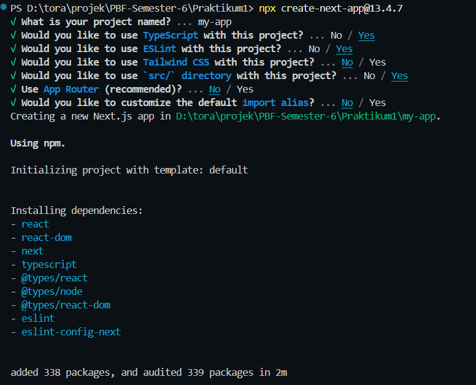
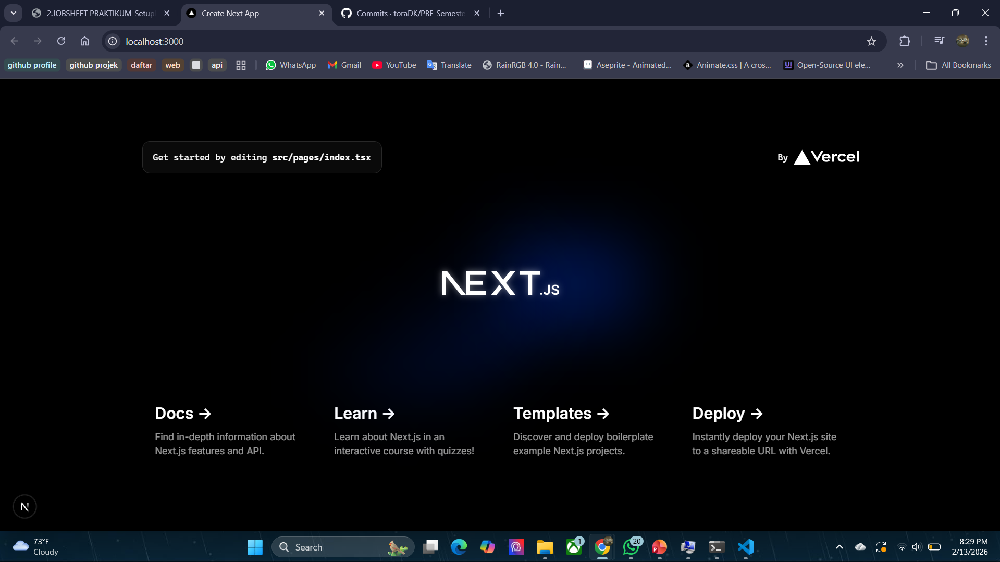
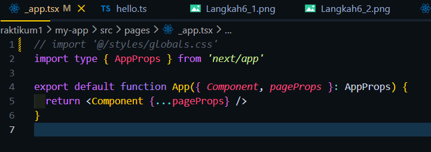
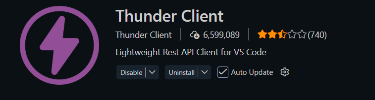
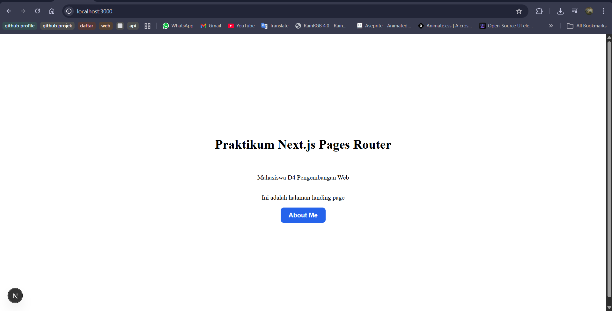

## Praktikum 1 - Setup Project Next.js menggunakan Pages Router

#### Langkah 1 – Pengecekan Lingkungan

#### Langkah 2 – Membuat Project Next.js

#### Langkah 3 – Menjalankan Server Development

#### Langkah 4 – Mengenal Struktur Folder

#### Langkah 5 – Modifikasi Halaman Utama

### Langkah 6 – Modifikasi API

### Langkah 7 – Modifikasi Background

### Langkah 8 – Setup ext pada VSCode (opsional)

## Tugas Praktikum
#### Tugas 1

#### Tugas 2
