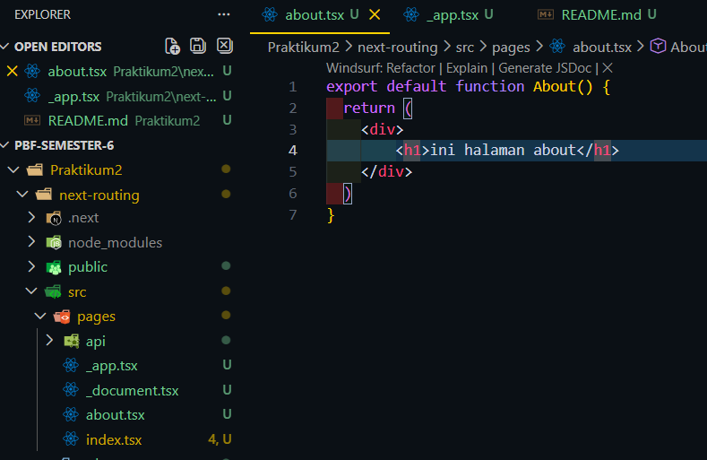
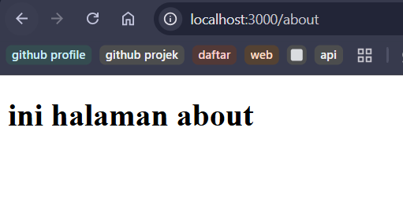
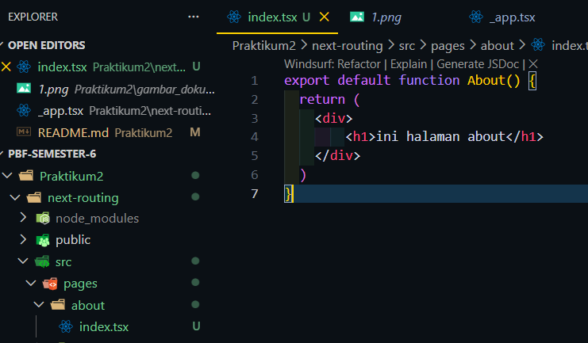
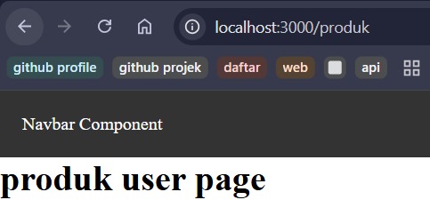
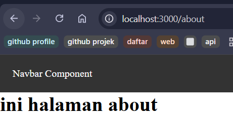
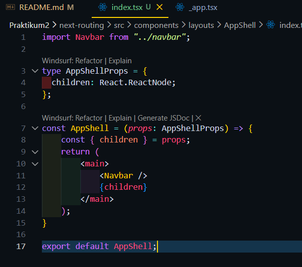
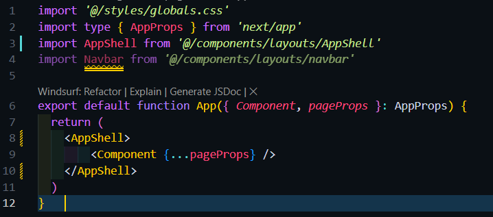
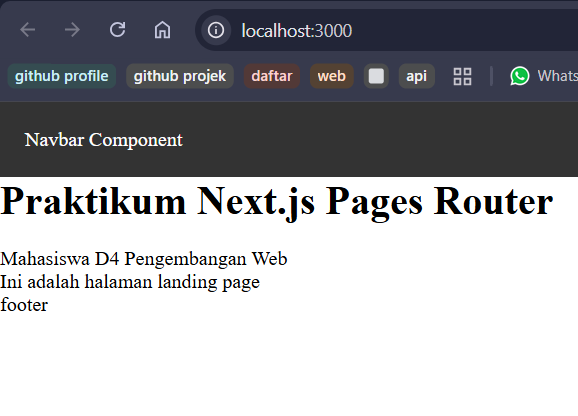
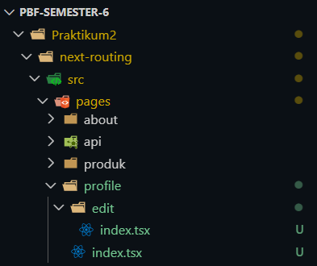
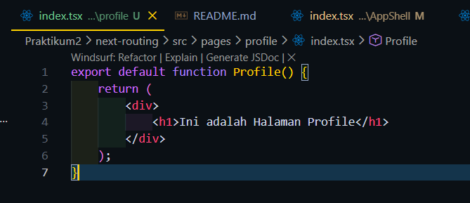

### Page dan Layout
1. Routing Dasar

2. Routing Menggunakan Folder

3. Nested Routing

4. Dynamic Routing

5. Membuat Komponen Navbar
-> Membuat Komponen Navbar

->Hasil

6. Membuat Layout Global

7. Implementasi Layout di _app.tsx

Tugas1-Halaman profile dan edit profile
->kode

->Hasil

