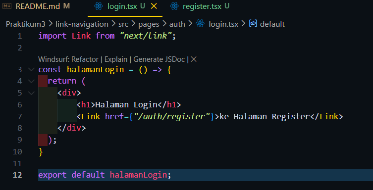
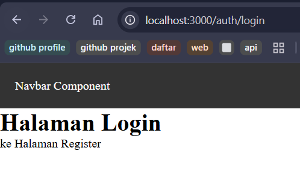
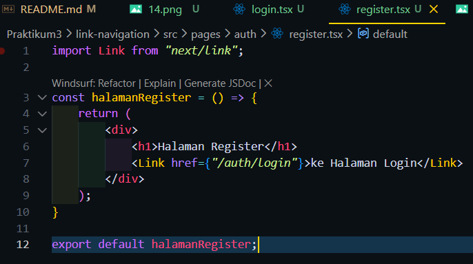
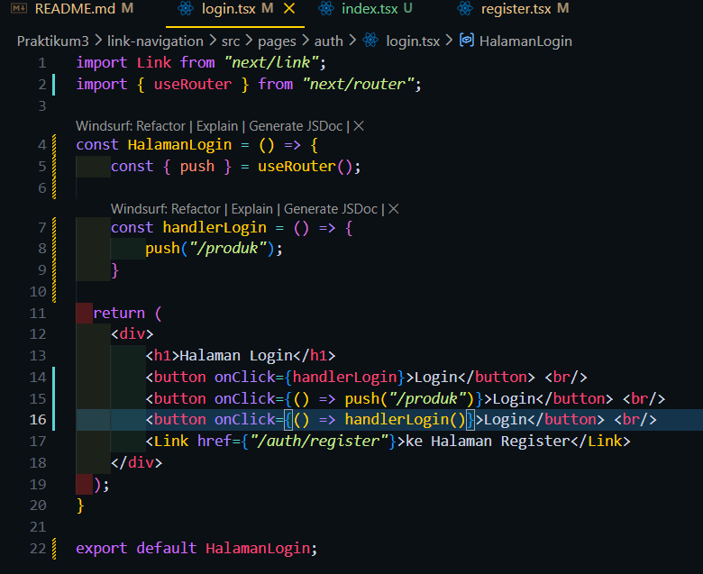
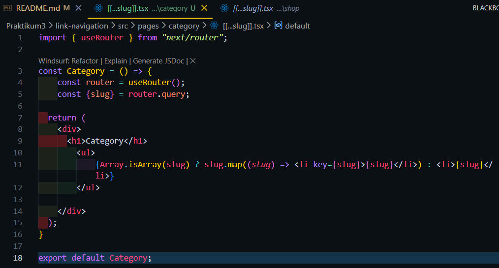
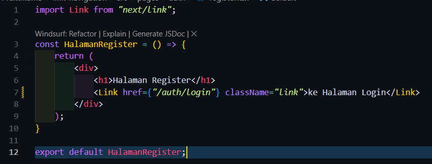
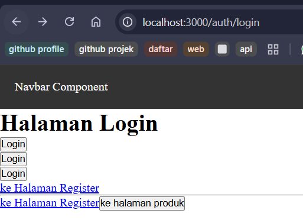
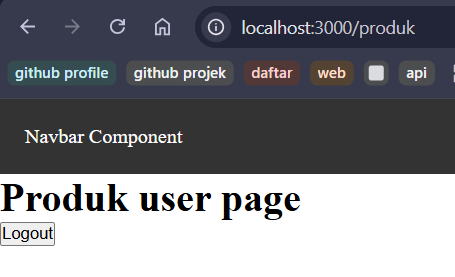
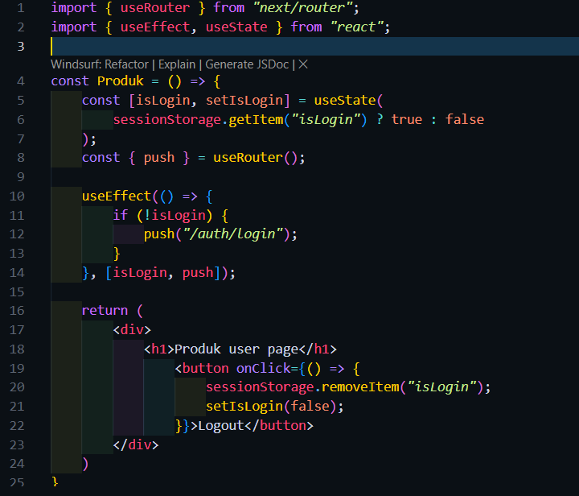

1. Langkah 1 – Menjalankan Project

2. Langkah 2 – Membuat Catch-All Route

3. Langkah 3 – Pengujian Catch-All Route
->kode

->Hasil

->kode

->Hasil

4. Langkah 4 – Optional Catch-All Route

5. Langkah 5 – Validasi Parameter

6. Langkah 6 – Membuat Halaman Login & Register
->Login
-> Kode

-> Hasil

->Register
-> Kode

-> Hasil

7. Langkah 7 – Navigasi Imperatif (router.push)

8. Langkah 8 – Simulasi Redirect (Belum Login)

Tugas1
->kode

Tugas2
->kode

->hasil

Tugas3

