1. Bagian 1 – Setup Halaman Static
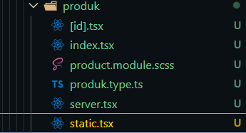
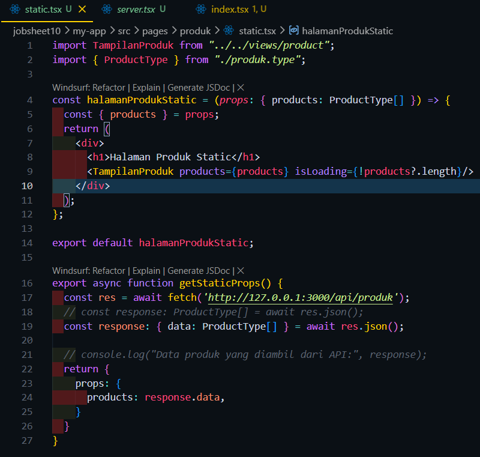
Hasil :

2. Bagian 3 – Build Production Mode
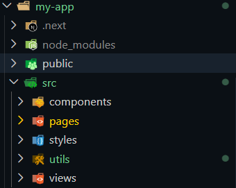
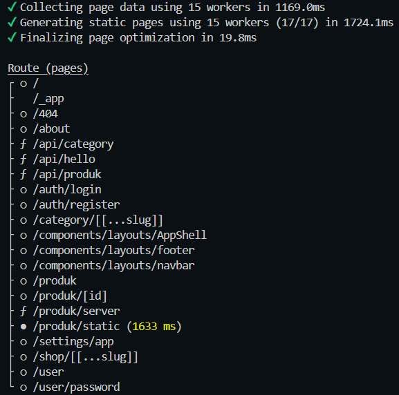
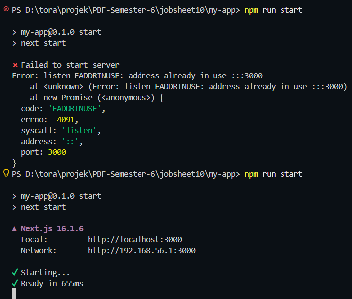
Hasil :

3. Bagian 4 – Pengujian Perubahan Data
Uji 1 – Tambah Data di Database
Tamabah data di firebase
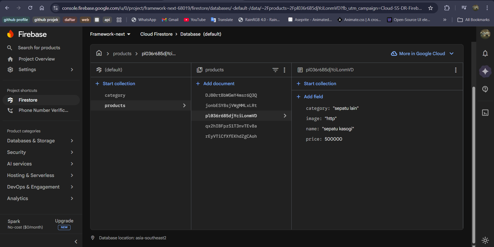
Hasil /products (CSR)
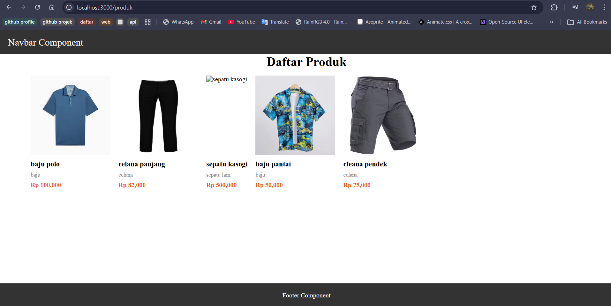
Hasil /products/server (SSR)
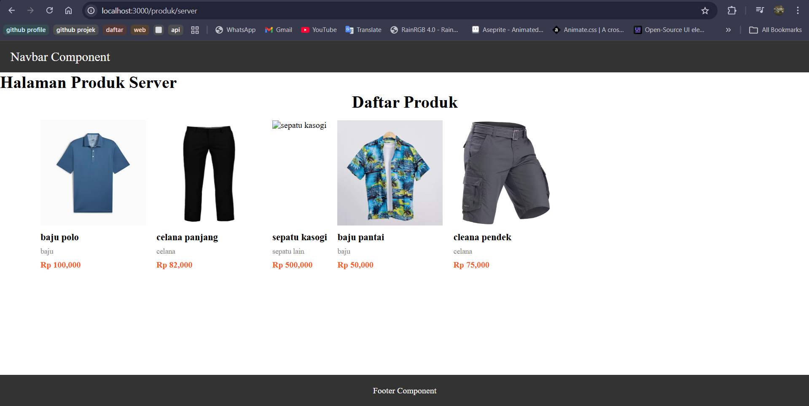
Hasil /products/static (SSG)
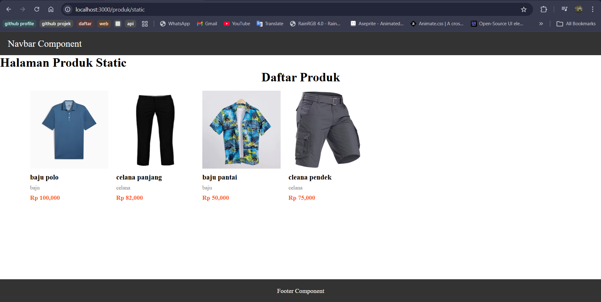

Uji 2 – Build Ulang
build ulang
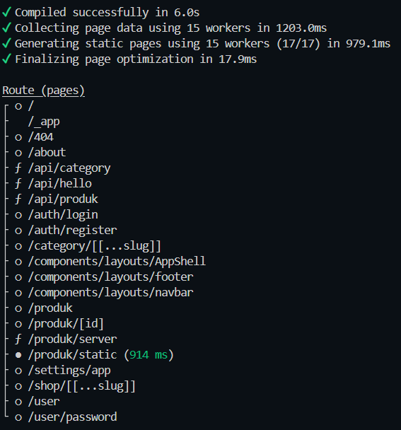
Hasil /products/static (SSG) Setelah di build
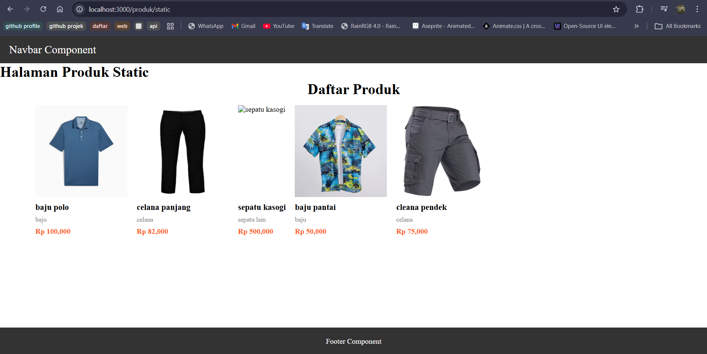