Bagian 1 – Membuat Dynamic Route
Edit di kode pages/prodduk/index.tsx
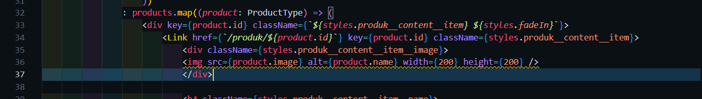
Kode pages/produk/[product].tsx
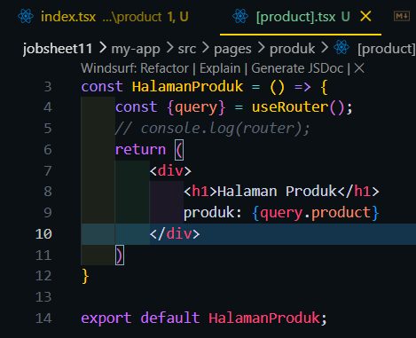

Hasil :
Halaman /produk
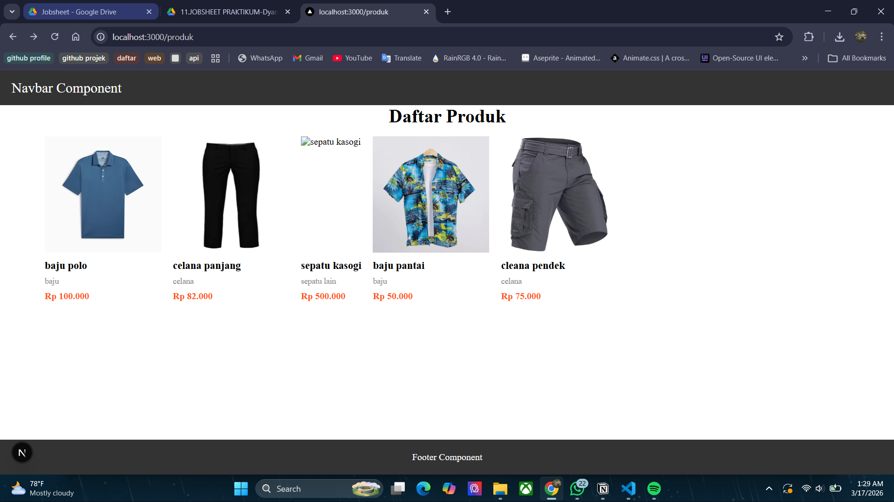
Saat gambar di klik
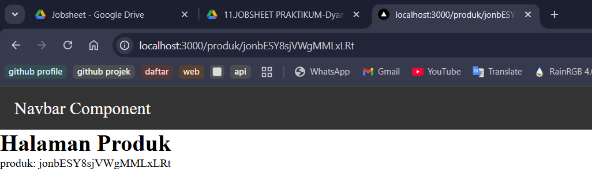

Bagian 2 – Implementasi CSR (Client Rendering)
Modifikasi file [produk].tsx
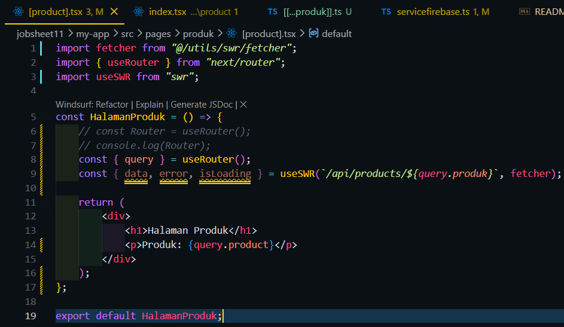
Rename nama file produk.ts menjadi [[...produk]].ts
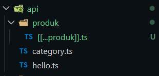
Modifikasi file servicefirebase.ts
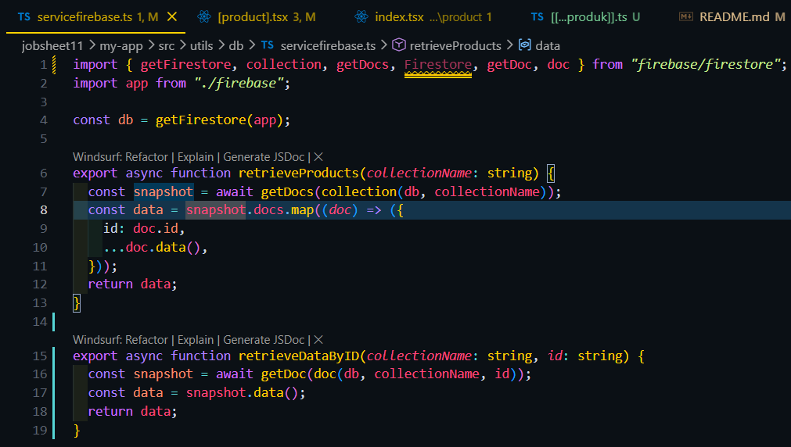
Modifikasi file [[...produk]].ts
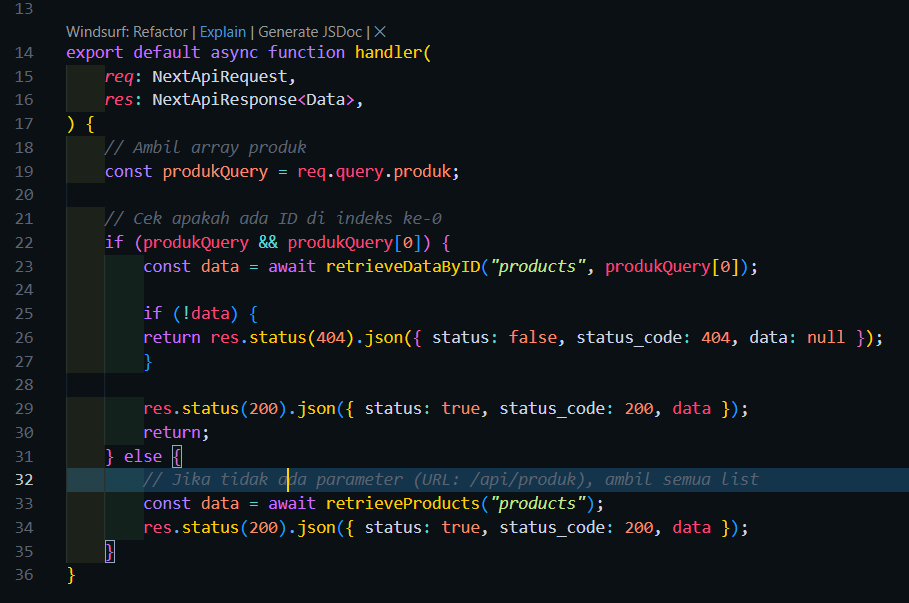
alamat url http://localhost:3000/api/produk/DJ80rtBbWGmY4msr6Q3Q
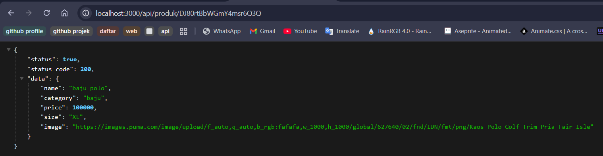
alamat url http://localhost:3000/api/produk/123
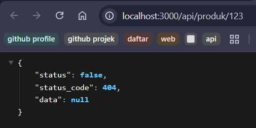
Modifikasi file detailProduct.module.scss
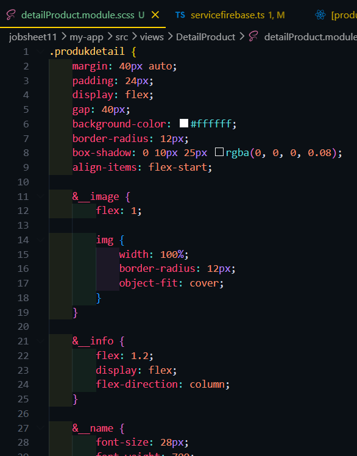
Modfikasi views/DetailProduct/index.tsx
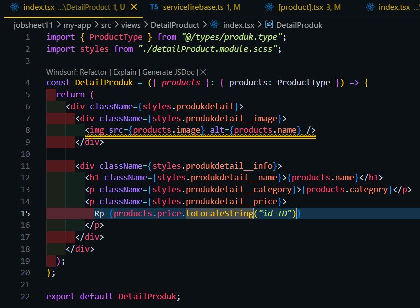
Modifikasi views/pages/produk/[product].tsx
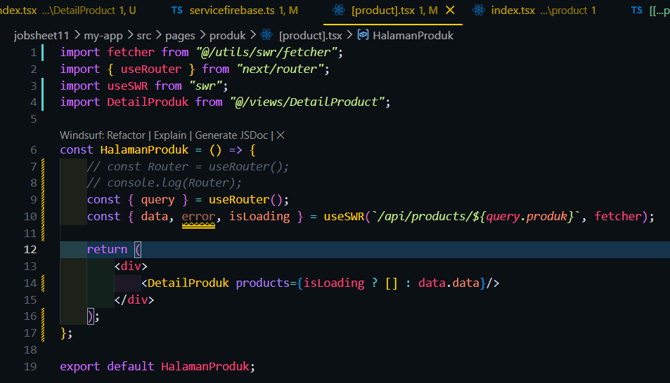
Modfikasi views/DetailProduct/index.tsx
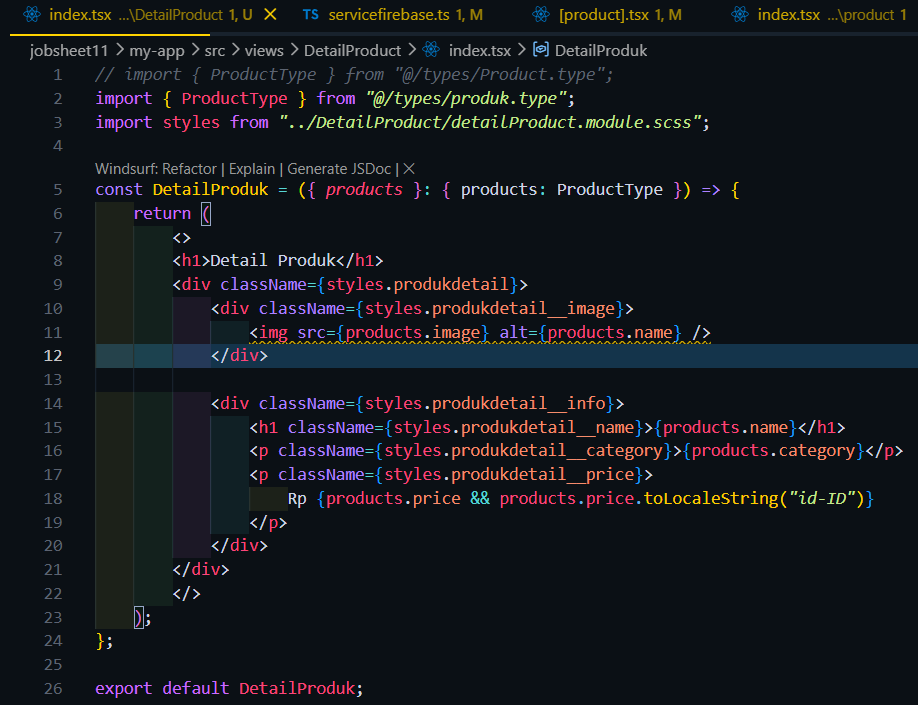
modifikasi file detailProduct.module.scss agar title ditengah
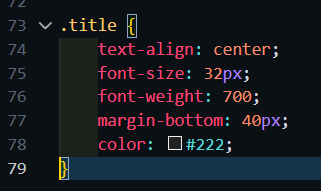
Hasil :
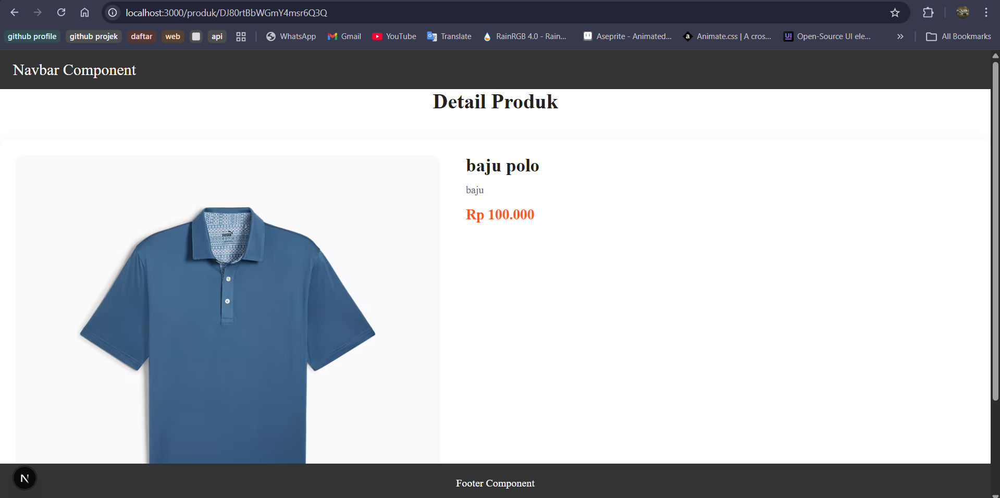

Bagian 3 – Implementasi SSR
Edit kode [product].tsx
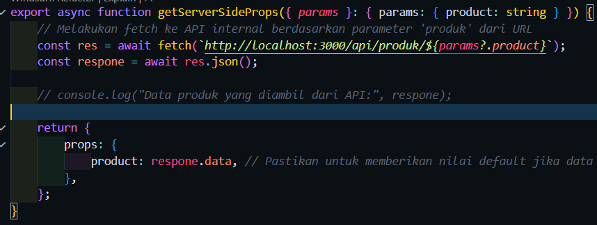
Hasil :
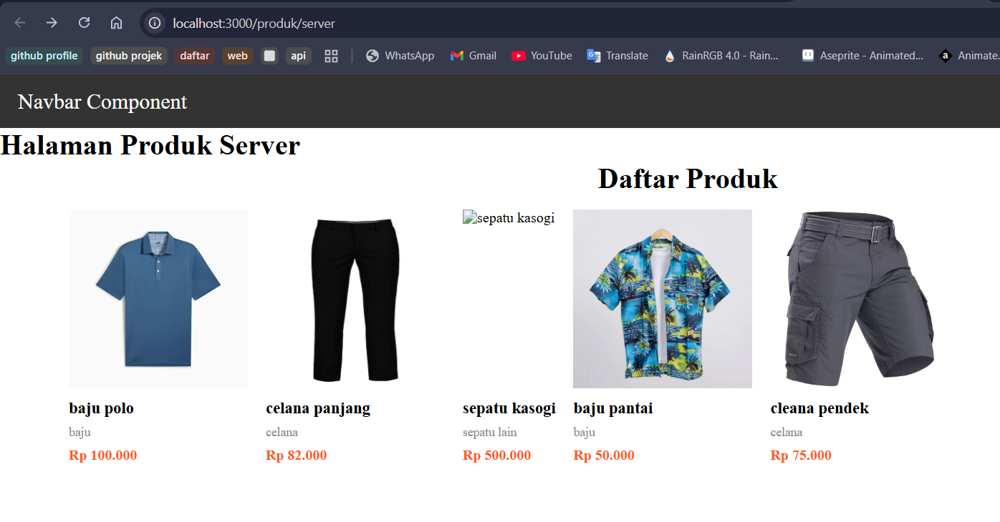
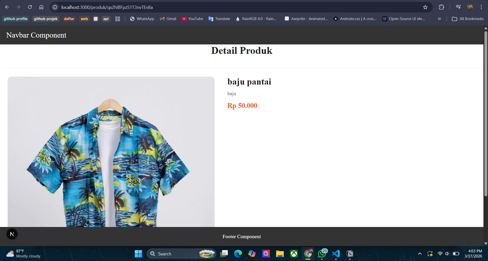

Bagian 4 – Implementasi Static Site Generation (Dynamic SSG)
Edit kode [product].tsx
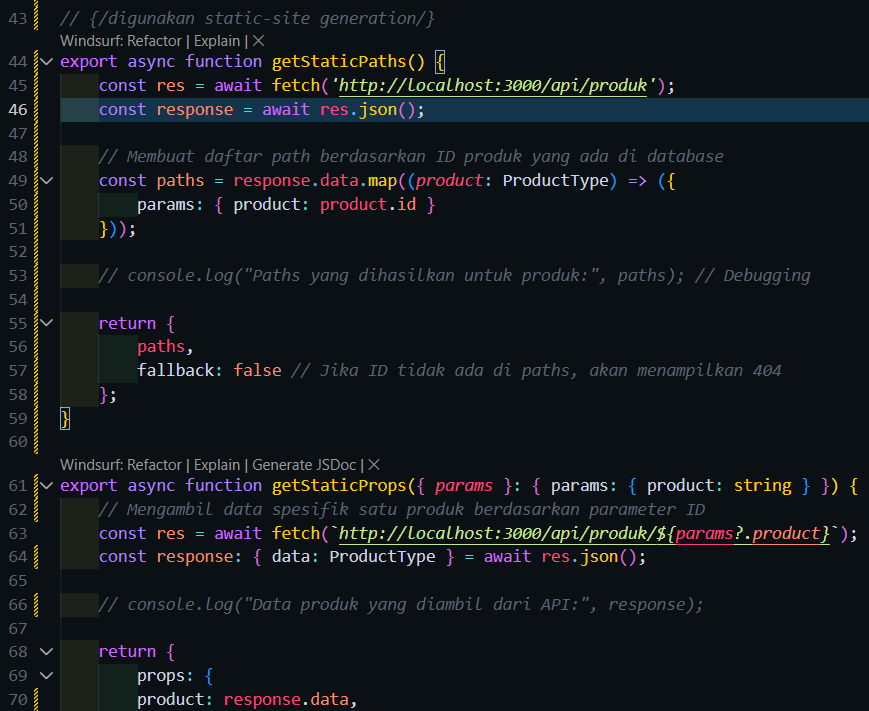
Edit kode DetailProdduct/index.tsx
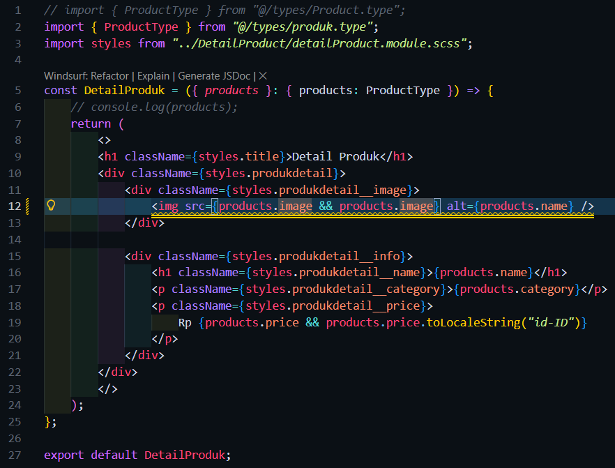
Hasil :
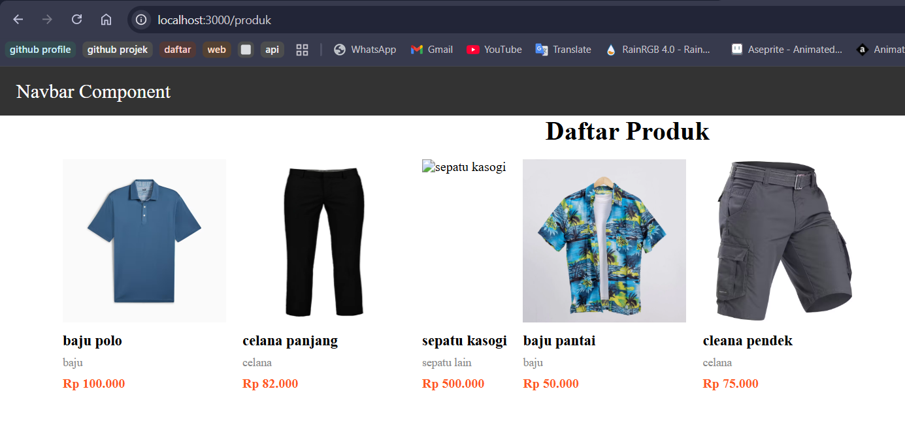
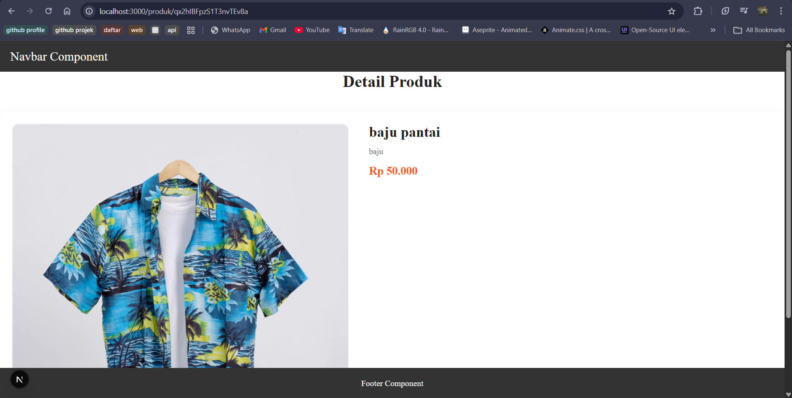