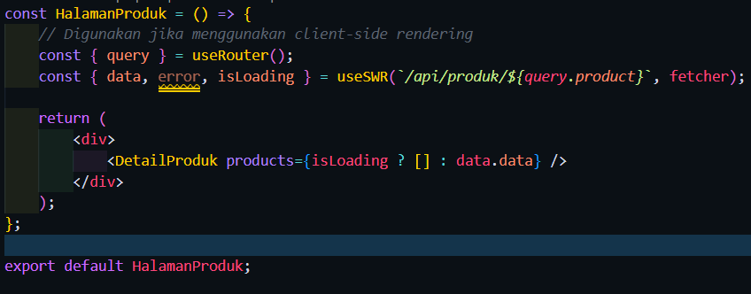
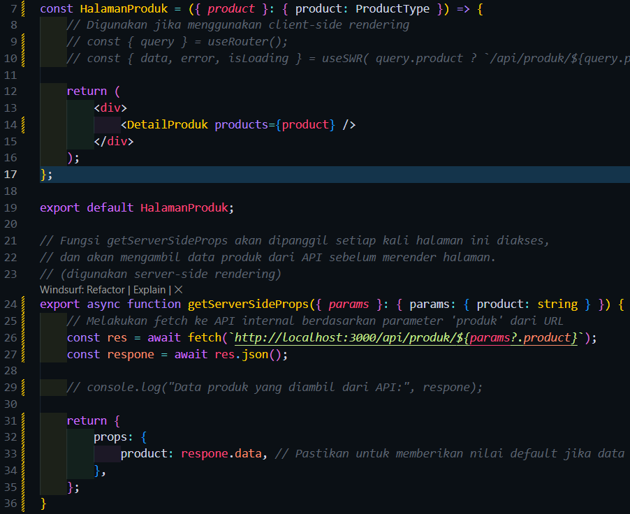
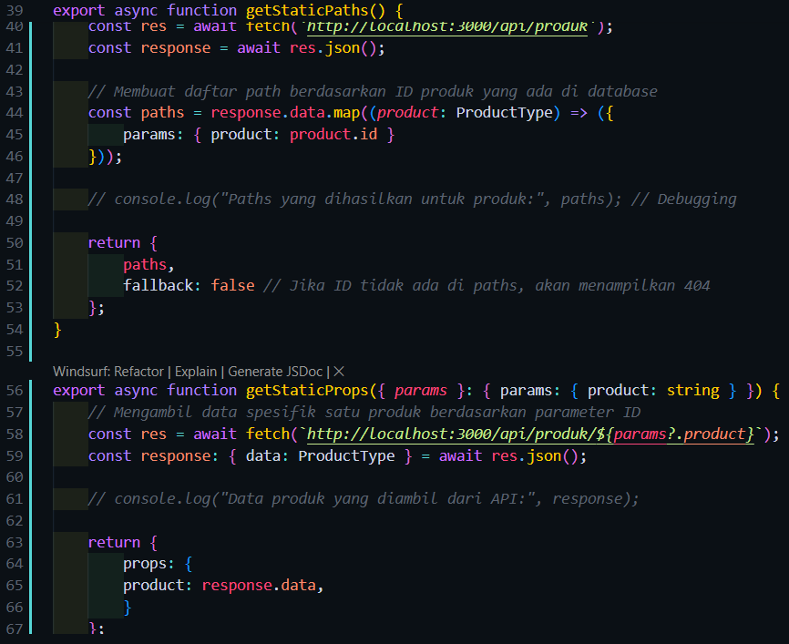
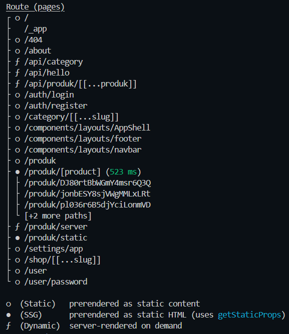
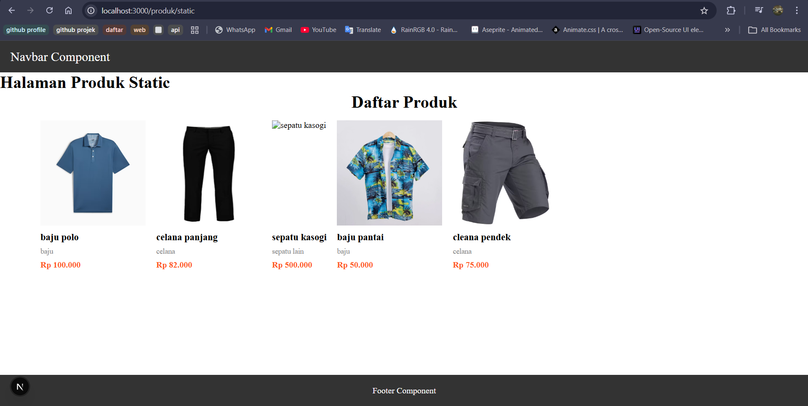
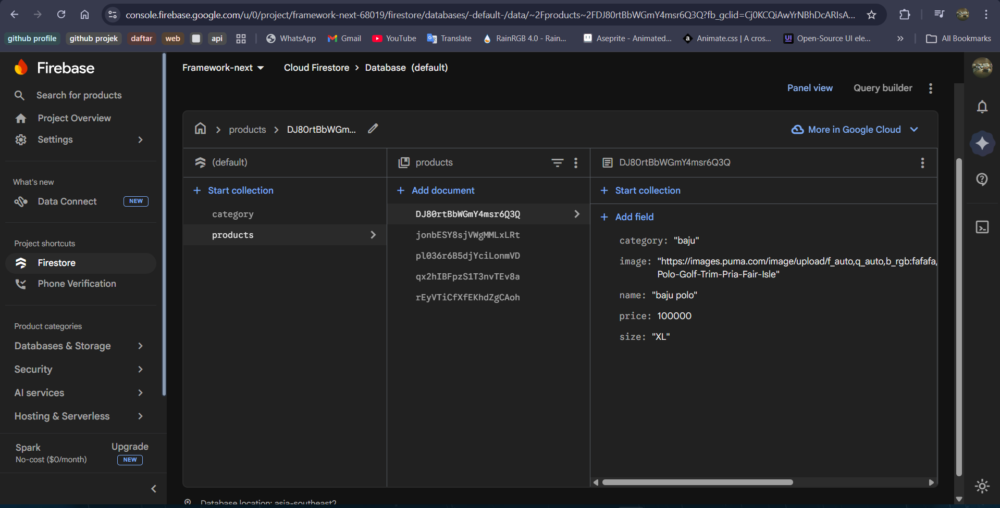
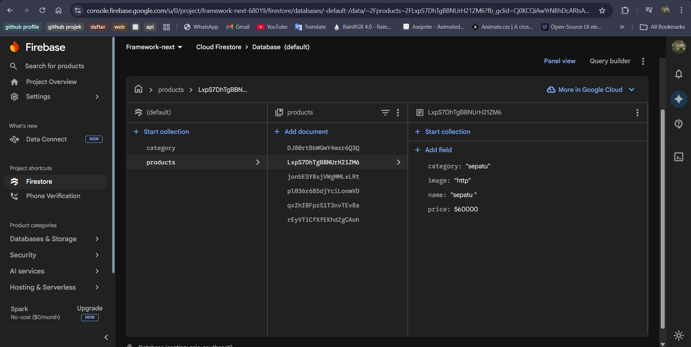
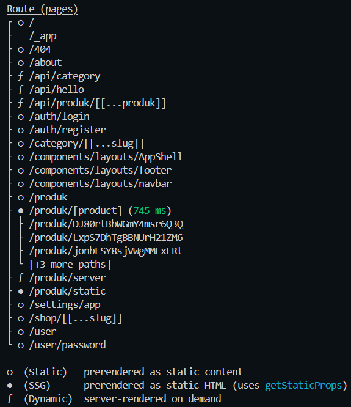
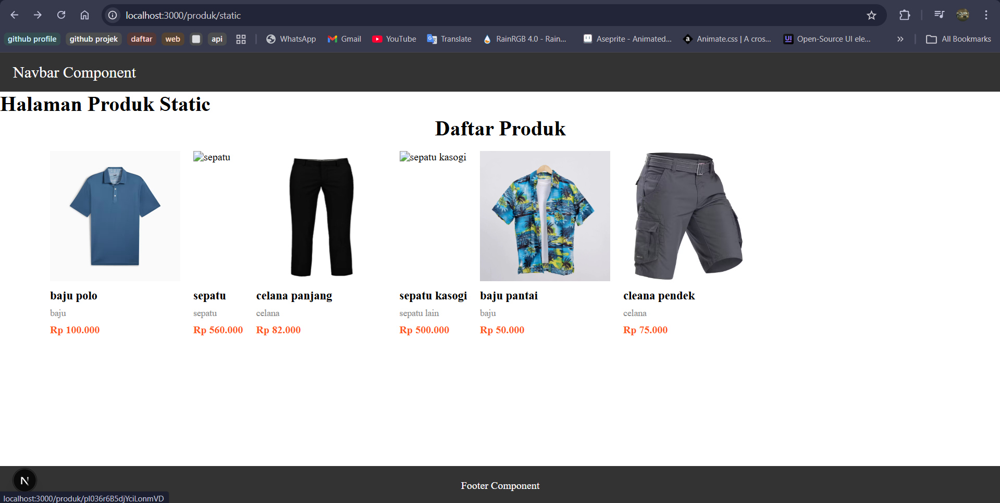

Bagian 1 – Membuat Dynamic Route 
Edit di kode pages/prodduk/index.tsx 
 
Kode pages/produk/[product].tsx 
  

Hasil : 
Halaman /produk 
 
Saat gambar di klik 
  

Bagian 2 – Implementasi CSR (Client Rendering) 
Modifikasi file [produk].tsx 
 
Rename nama file produk.ts menjadi [[...produk]].ts 
 
Modifikasi file servicefirebase.ts 
 
Modifikasi file [[...produk]].ts 
 
alamat url http://localhost:3000/api/produk/DJ80rtBbWGmY4msr6Q3Q 
 
alamat url http://localhost:3000/api/produk/123 
 
Modifikasi file detailProduct.module.scss 
 
Modfikasi views/DetailProduct/index.tsx 
 
Modifikasi views/pages/produk/[product].tsx 
 
Modfikasi views/DetailProduct/index.tsx 
 
modifikasi file detailProduct.module.scss agar title ditengah 
 
Hasil : 
  

Bagian 3 – Implementasi SSR 
Edit kode [product].tsx 
 
Hasil : 
 
  

Bagian 4 – Implementasi Static Site Generation (Dynamic SSG) 
Edit kode [product].tsx 
 
Edit kode DetailProdduct/index.tsx 
 
Hasil : 
 
  

Pengujian 
Uji 1 – CSR 
Kode pada [product].tsx untuk CSR 
 
Hasil : 
  

Uji 2 – SSR 
Kode pada [product].tsx untuk SSR 
 
Hasil : 
  

Uji 3 – SSG 
Kode SSG pada [product].tsx 
 
Hasil Build 
 
Tampilan Web 
 
Data sebelum ditambah pada firestore 
 
Data Baru 
 
Hasil data baru tidak akan muncul 
 
Build Ulang 
 
Hasil Build ulang 
  

Tabel Perbandingan
| Aspek | CSR | SSR | SSG |
| :---: | :--- | :--- | :--- |
| Loading | Terasa lambat di awal (muncul loading spinner), tapi navigasi antar halaman sangat cepat. | Terasa sedikit lambat setiap kali pindah halaman karena server harus memproses data dulu. | Loading sangat cepat sebab halaman langsung muncul karena sudah berbentuk file HTML statis. |
| Build Required | Tidak perlu build ulang saat data berubah karena data diambil saat aplikasi berjalan | Tidak perlu build ulang saat data berubah karena data diambil setiap ada request | Wajib build ulang untuk memperbarui data statis |
| SEO | Kurang Optimal. Crawler mesin pencari terkadang sulit membaca konten yang dirender via JavaScript. | Sangat Bagus. Konten sudah utuh saat dikirim ke browser, sangat mudah diindeks Google. | Sangat Bagus. Konten statis adalah favorit mesin pencari karena kecepatan aksesnya. |
| Perubahan Data | Dinamis dan Real-time. Perubahan di database langsung terlihat saat data di-fetch ulang. | Dinamis. Data selalu paling baru karena diambil setiap kali halaman diakses. | Statis. Data hanya berubah jika dilakukan build ulang (atau lewat interval waktu tertentu di ISR). |

Pertanyaan Analisis
1. Mengapa getStaticPaths wajib pada dynamic SSG?
-> semua halaman harus diubah menjadi file HTML statis saat proses build. Karena rute dinamis seperti [product].tsx tidak memiliki nama file yang tetap, Next.js perlu mengetahui daftar ID atau parameter apa saja yang ada di database.Tanpa getStaticPaths, Next.js tidak akan tahu berapa banyak file HTML yang harus dibuat untuk folder tersebut.
2. Mengapa CSR membutuhkan loading state?
-> browser awalnya menerima file HTML yang hampir kosong. Pengambilan data baru dilakukan setelah halaman dimuat di browser menggunakan JavaScript seperti useSWR. Selama proses menunggu data dari API atau Firebase selesai, variabel data akan bernilai undefined, sehingga dibutuhkan loading state agar aplikasi tidak crash dan pengguna tahu bahwa data sedang diproses.
3. Mengapa SSG tidak menampilkan produk baru tanpa build ulang?
-> Karena pada SSG, data diambil menjadi file HTML statis pada saat menjalankan perintah npm run build. Jika ada data baru di Firebase setelah proses tersebut, file HTML yang sudah terlanjur dibuat tidak akan berubah secara otomatis. Next.js hanya akan menyajikan file yang sudah ada di server kecuali jika melakukan build ulang
4. Mana metode terbaik untuk halaman detail e-commerce?
-> SSR metode yang bagus karena jika harga atau stok produk berubah sangat cepat setiap detik misalnya maka data selalu diambil yang paling baru setiap kali halaman diakses.
5. Apa risiko menggunakan SSG untuk produk yang sering berubah?
-> nformasi seperti stok atau harga mungkin sudah berubah di database, tetapi user masih melihat data lama yang ada di file HTML statis
-> User mungkin bisa memesan produk yang sebenarnya sudah habis karena tampilan masih menunjukkan stok tersedia.