#### Implementasi ISR Otomatis
Bagian 1 – Tambahkan revalidate 
menambahkan revalidate agar setiap 10 detik halaman akan dicek ulang 
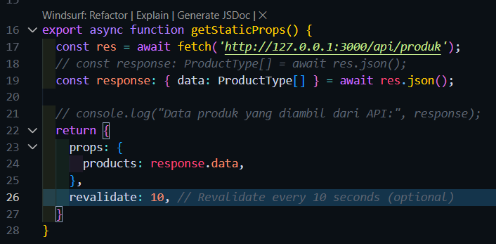  

Bagian 2 – Pengujian ISR 
build  
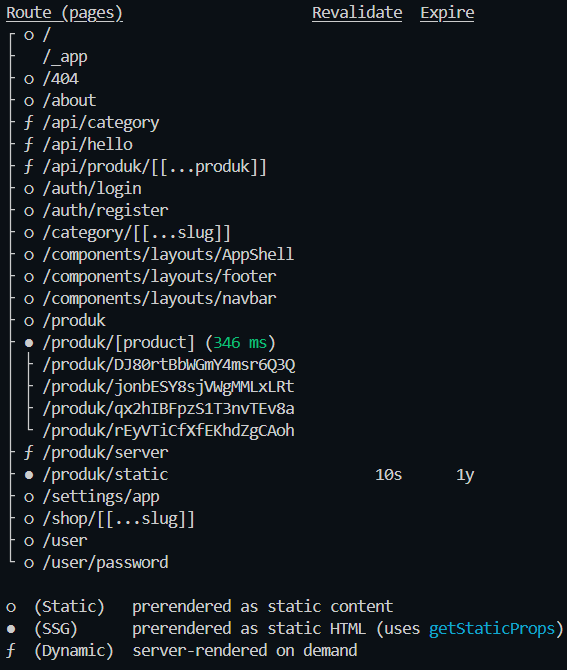 
Hasil Awal 
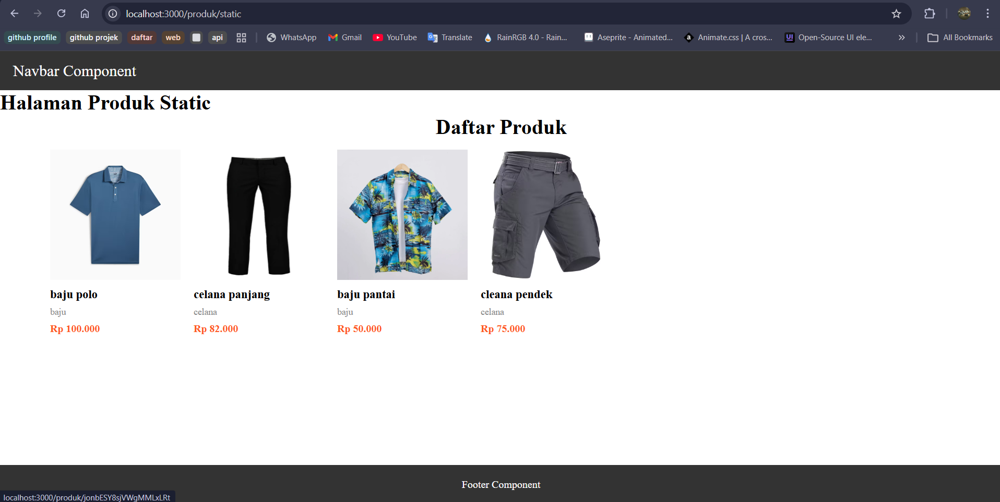 
Data pada firestore sebelum ada data baru 
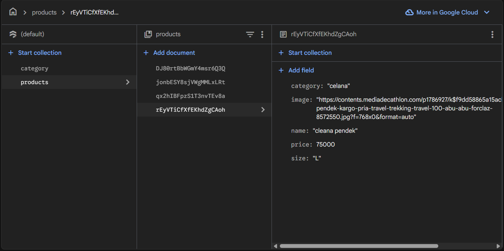 
tambah data baru di firestore 
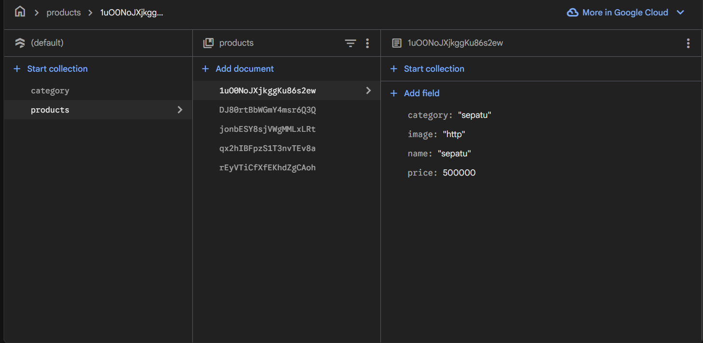 
Hasil tampilan website setelah 10 detik 
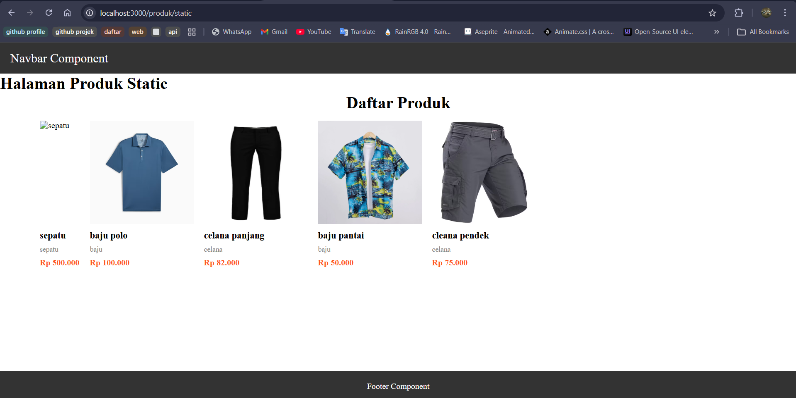  

#### On-Demand Revalidation
Bagian 1 – Buat API Revalidate 
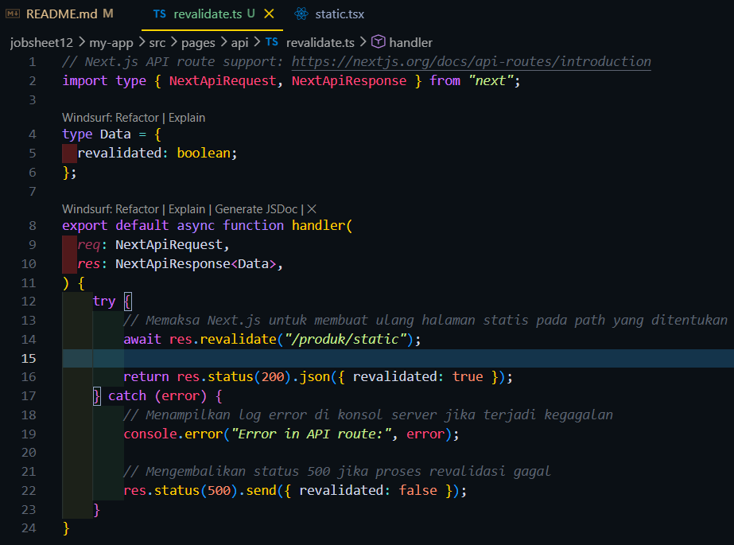  

Bagian 2 – Tambahkan Parameter Data 
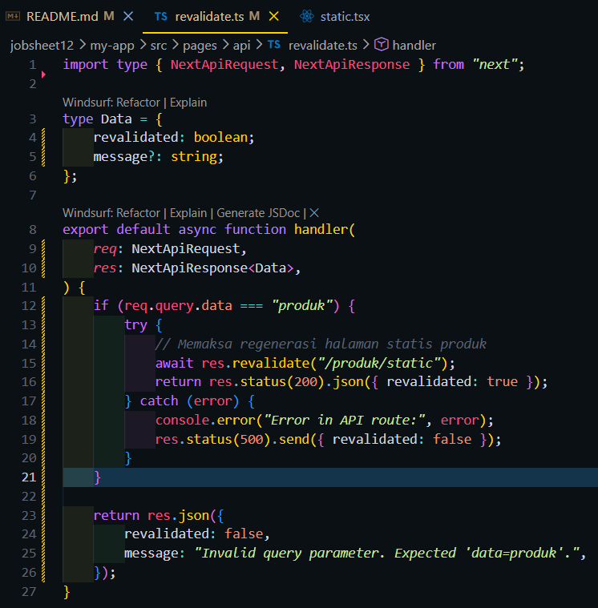 
Hasil url http://localhost:3000/api/revalidate?data=produk 
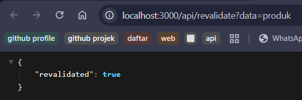 
hadil url http://localhost:3000/api/revalidate?data= 
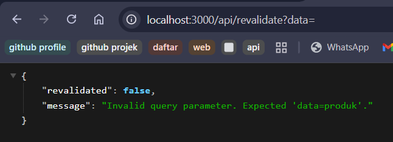  

Bagian 3 – Tambahkan Token Security 
Menambahkan token revalidate ke file .env 
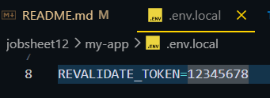 
edit kde revalidate 
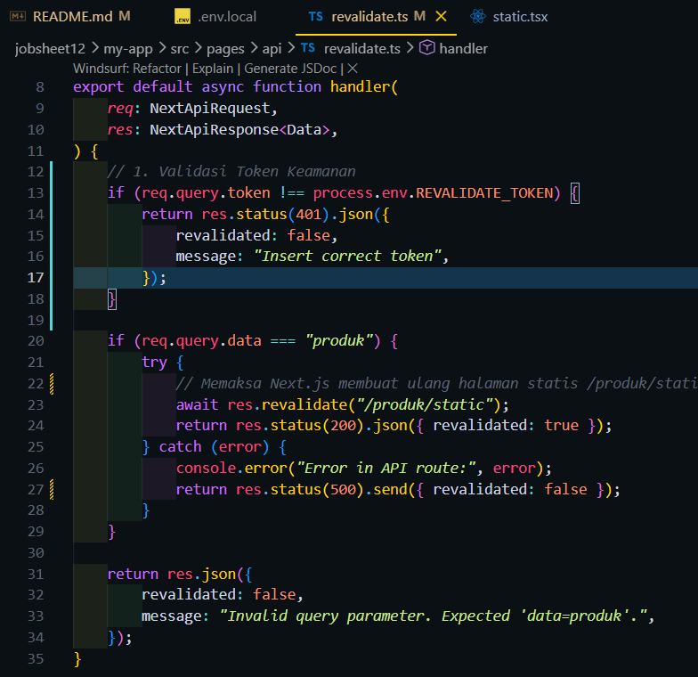  

E. Pengujian Manual Revalidation 
Hasil jika memasukkan parameter token dengan benar di url 
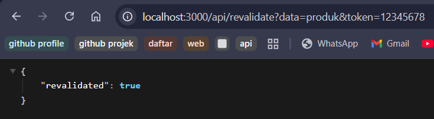 
Hasil jika memasukkan parameter token yang salah di url 
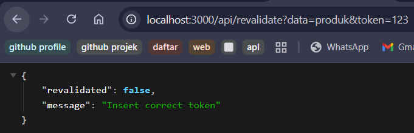 
Hasil jika tanpa memasukkan parameter token di url 
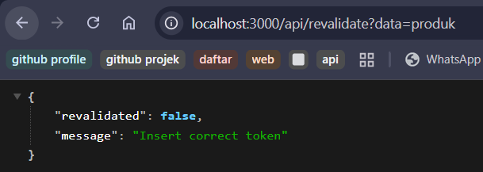  

H. Pertanyaan Analisis
1. Mengapa ISR lebih fleksibel dibanding SSG?
 -> SSG bersifat kaku karena halaman hanya dibuat sekali saat proses build. Jika ada perubahan data, maka harus melakukan build ulang seluruh aplikasi.
 -> ISR lebih fleksibel karena memungkinkan memperbarui halaman statis secara individu di latar belakang tanpa build ulang penuh.
2. Apa perbedaan revalidate waktu dan on-demand?
 -> Revalidate   : Halaman akan diperbarui otomatis secara berkala setiap waktu yang ditentukan jika ada pengunjung.
 -> On-Demand    : Menggunakan API Route manual seperti res.revalidate(). Halaman hanya akan diperbarui saat memicu endpoint tersebut, misalnya tepat setelah mengklik tombol simpan di Firebase.
3. Mengapa endpoint revalidation harus diamankan?
 -> Jika endpoint ini terbuka untuk publik, orang jahat bisa melakukan serangan DoS dengan memanggil URL tersebut ribuan kali secara terus-menerus, yang bisa membuat server crash karena kelelahan memproses render ulang.
4. Apa risiko jika token tidak digunakan?
 -> siapa pun dapat mengetahui URL API sehingga dapat memicu pembaruan data.Sehingga bisa jadi ada orang yang iseng memanggil URL tersebut ribuan kali secara terus-menerus dan dapat membuat server crash karena kelelahan memproses render ulang.
5. Kapan ISR lebih cocok dibanding SSR?
 -> ISR: Cocok jika memprioritaskan kecepatan akses seperti loading dan SEO, namun toleran terhadap sedikit keterlambatan perubahan data.
 -> SSR: Lebih cocok jika halaman tersebut sangat personal seperti keranjang belanja atau datanya berubah setiap detik dan harus 100% akurat saat itu juga seperti harga saham atau tiket konser.