Bagian 1 – Install NextAuth 
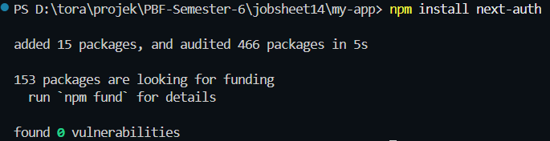  

Bagian 2 – Konfigurasi API Auth\ 
membuat file [...nextauth].tsx 
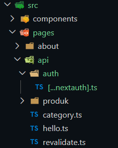 
Modifikasi file [...nextauth].tsx 
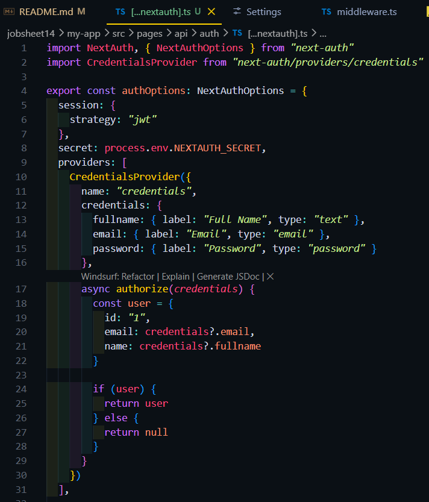  

Bagian 3 – Tambahkan Secret 
Generate nilai random base64 
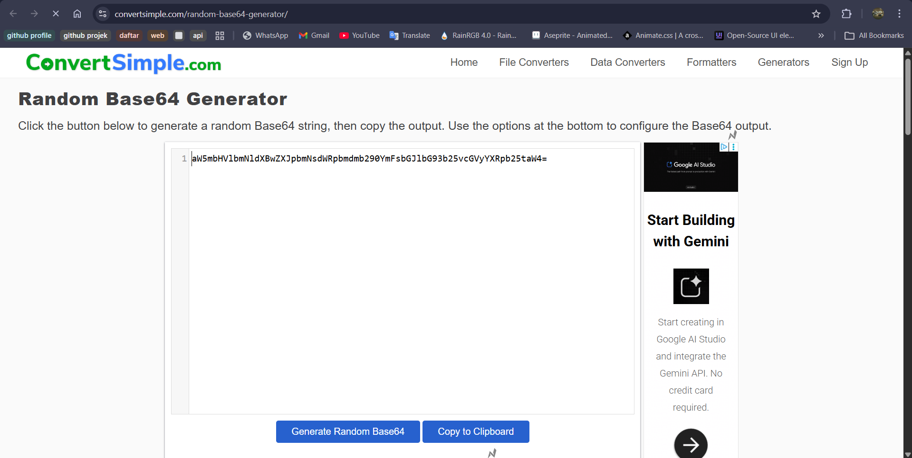 
copy hasil generate nilai random base64 ke file .env 
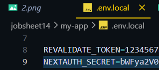  

Bagian 4 – Tambahkan SessionProvider 
memodifikasi file _app.tsx 
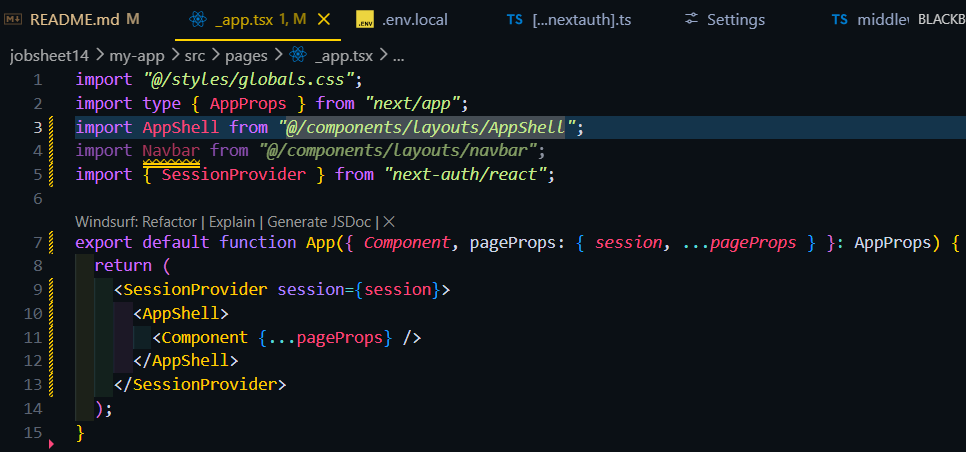  

Bagian 5 – Tambahkan Tombol Login & Logout 
Edit file index.tsx pada folder component/navbar 
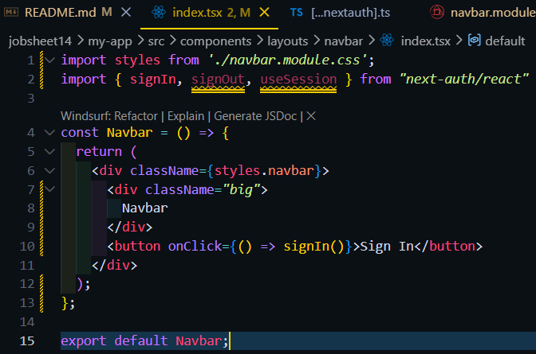 
edit file navbar.module.css 
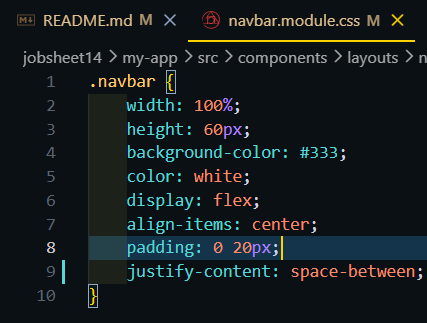 
Hasil : 
 
edit file index.tsx untuk mendapatkan session nya 
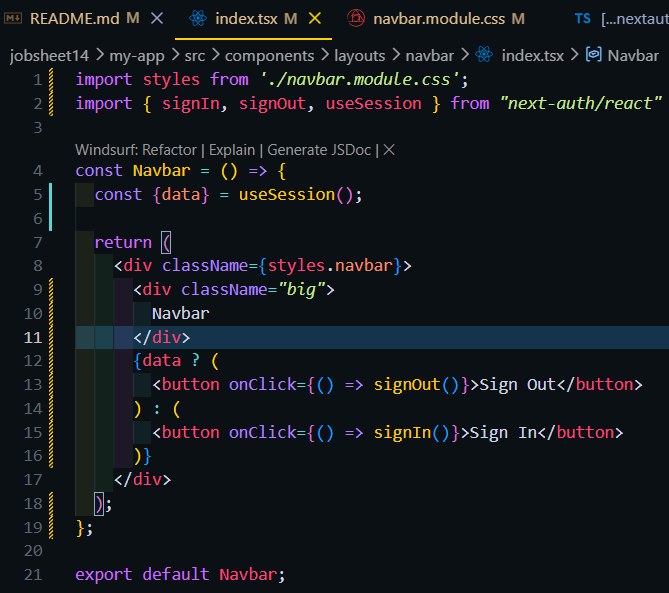 
Hasil : 
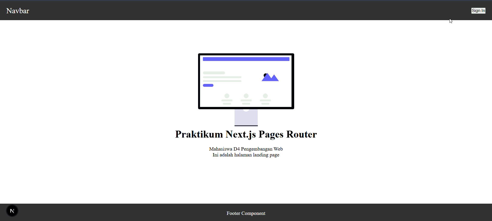  

Langkah 6 – Menambahkan Data Tambahan (Full Name) 
Edit kode pada file [...nextauth].ts 
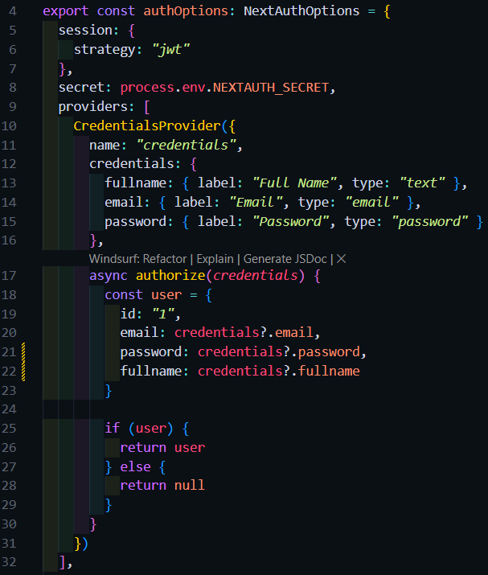 
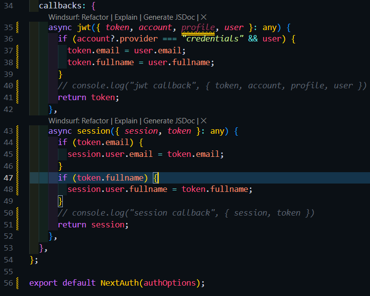 
Modifikasi style navbar 
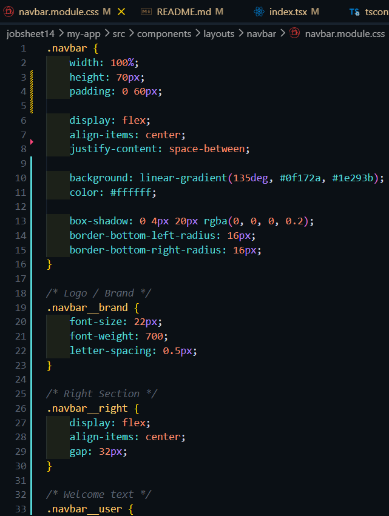 
Modifikasi component navbar 
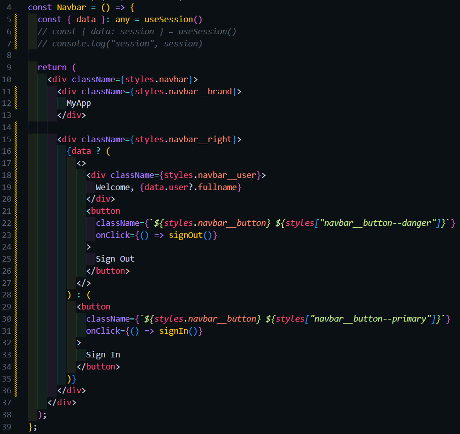 
Hasil : 
  

##### Proteksi Halaman Profile
Langkah 7 – Buat Halaman Profile 
file profile/index.tsx 
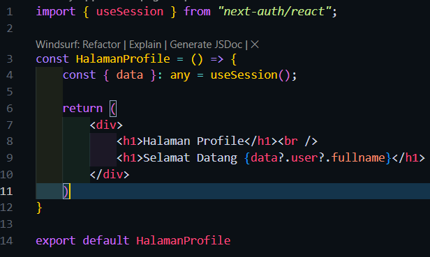 
Hasil : 
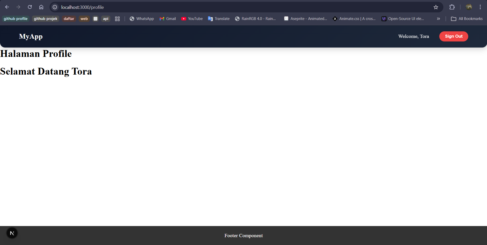  

Langkah 8 – Buat Middleware Authorization 
Isi file baru withAuth.ts 
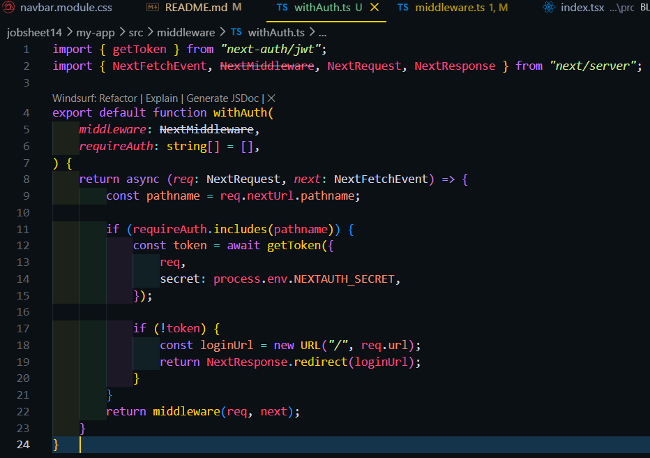 
Perubahan kode pada middleware.ts 
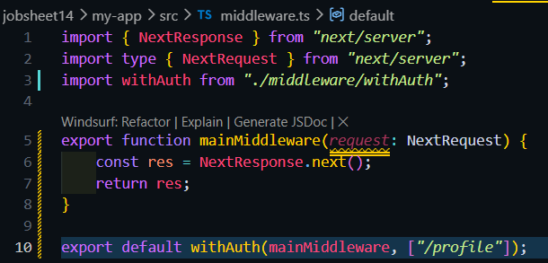  

Pengujian  
Uji 1 – Belum Login 
 

Uji 2 – Sudah Login 
 

Uji 3 – Logout 
  

i. Pertanyaan Analisis
1. Mengapa session menggunakan JWT?
 ->agar data session tidak disimpan di server. Jadi Semua data user yang diperlukan (seperti email atau nama) sudah "terbungkus" di dalam token yang disimpan di browser
2. Apa perbedaan authorize() dan callback jwt()?
 -> authorize(): Terjadi di pintu masuk. Fungsi ini hanya dipanggil saat user menekan tombol "Sign In". Tugasnya adalah memeriksa apakah email dan password yang dimasukkan benar.
 -> callback jwt(): Terjadi setelah login berhasil dan setiap kali token diperbarui. Tugasnya adalah menentukan data apa saja dari hasil authorize() yang ingin "dimasukkan" ke dalam token permanen.
3. Mengapa middleware perlu getToken()?
 -> Middleware menggunakan getToken() untuk membaca dan memvalidasi cookie JWT yang dikirimkan oleh browser.
 -> Tanpa getToken(), middleware tidak akan tahu siapa yang sedang mengakses halaman tersebut. Jika getToken() menghasilkan null, middleware langsung tahu bahwa user belum login dan akan melakukan redirect ke halaman login atau home.
4. Apa risiko jika NEXTAUTH_SECRET tidak digunakan?
 -> orang lain bisa membuat JWT palsu sendiri
 -> Tanpa secret yang kuat, data di dalam JWT bisa dimanipulasi.
5. Apa perbedaan autentikasi dan otorisasi dalam sistem ini?
 -> Autentikasi adalah proses untuk mengetahui siapa user yang sedang login. 
 -> Otorisasi adalah proses untuk menenetukan peran pada user.Peran ini berguna untuk menentukan apa saja yang boleh dilakukan user di sistem sesudah login