Langkah 1 – Membuat Register View
edit kode pages/auth/register/index.tsx
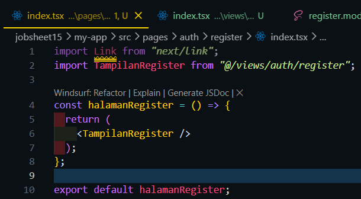
Membuat file baru dan isi kode pada file views/auth/register/index.tsx
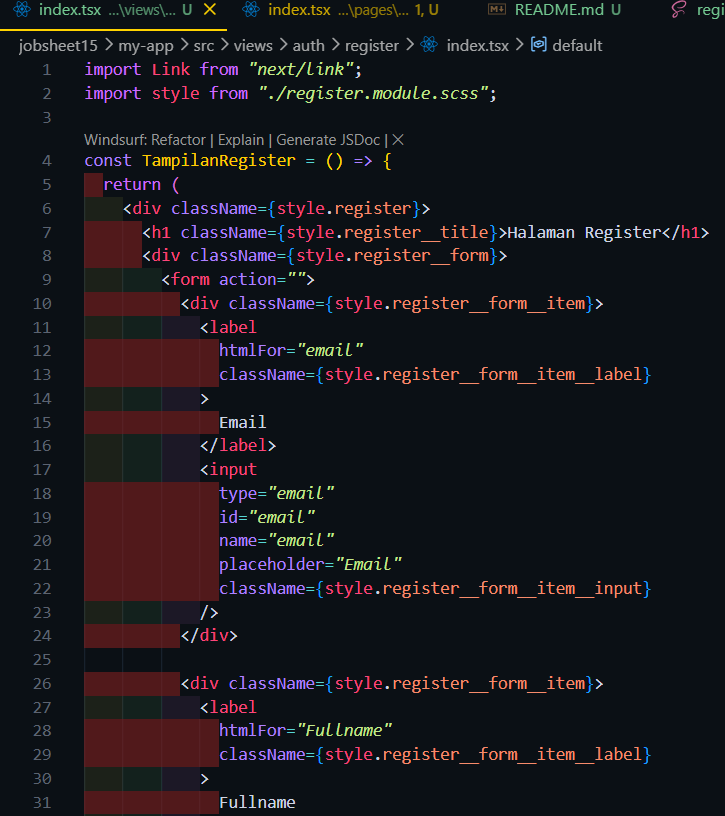
Menambahkan styling pada view register
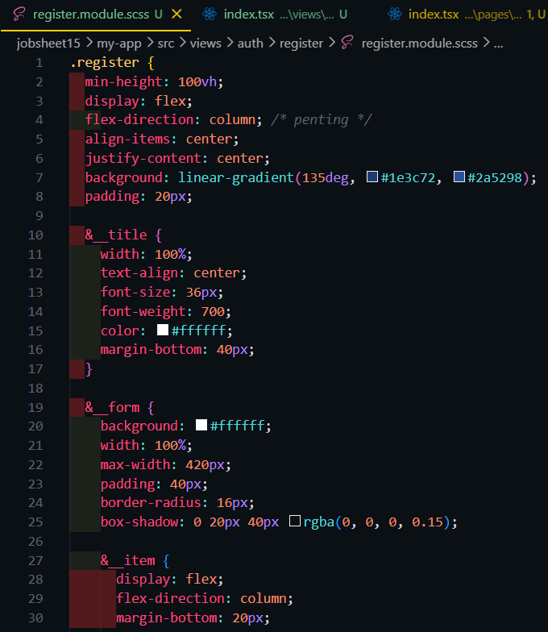
Hasil :
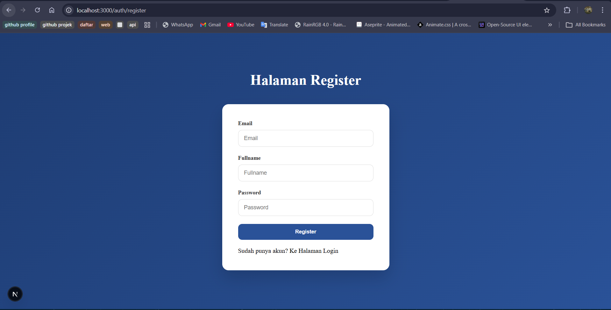

Langkah 2 – Membuat API Register
edit file servicefirebase.ts

membuat file register.ts

edit view register
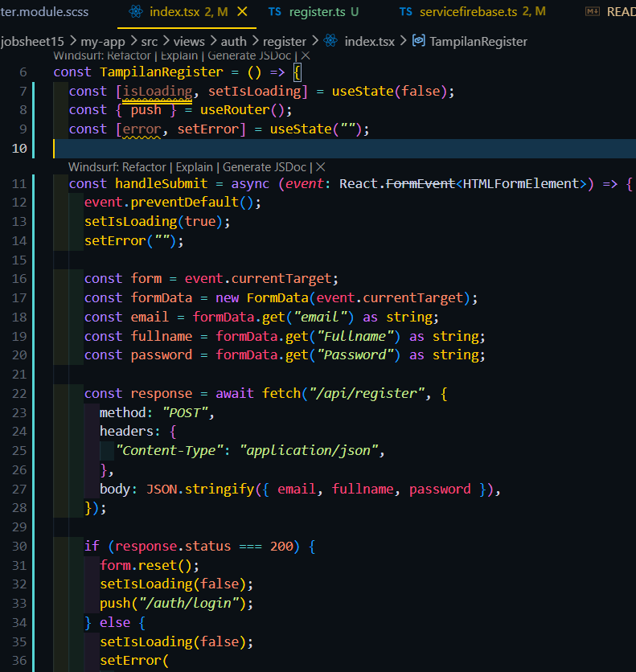
Hasil :

Langkah 3 – Install bcrypt
menginstall bcrypt
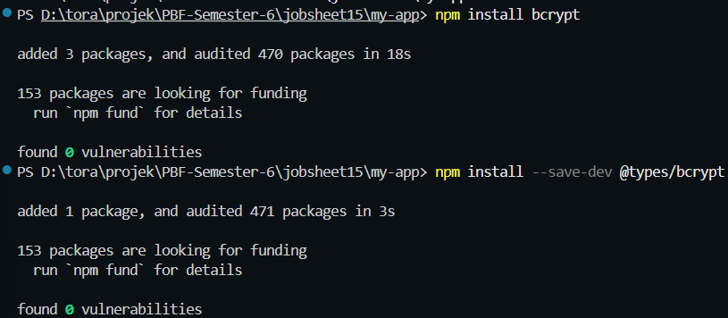
modifikasi file servicefirebase.ts
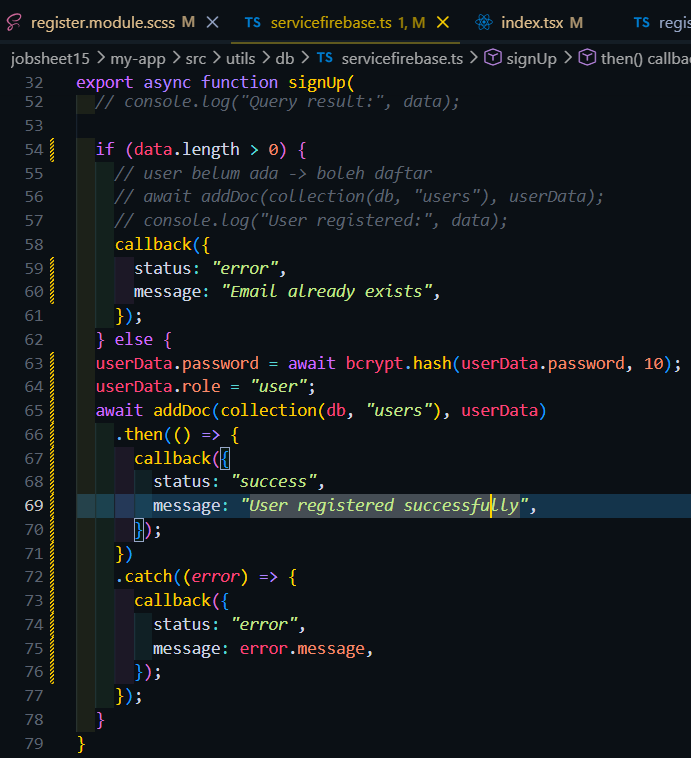
###### melakukan beberapa perubahan agar sistem tidak memproses inputan user saat data yang dimasukkan sama dengan yang ada di database
view register
perubahan pada pesan error
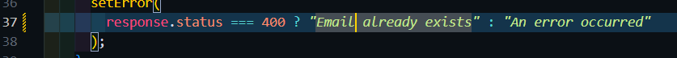
Menampilkan pemberitahuan kepada user saat ada error
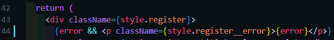
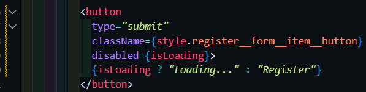
styling error di file scss
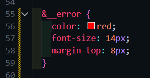
Hasil register:

Hasil saat melakukan registrasi dengan email yang sama :
