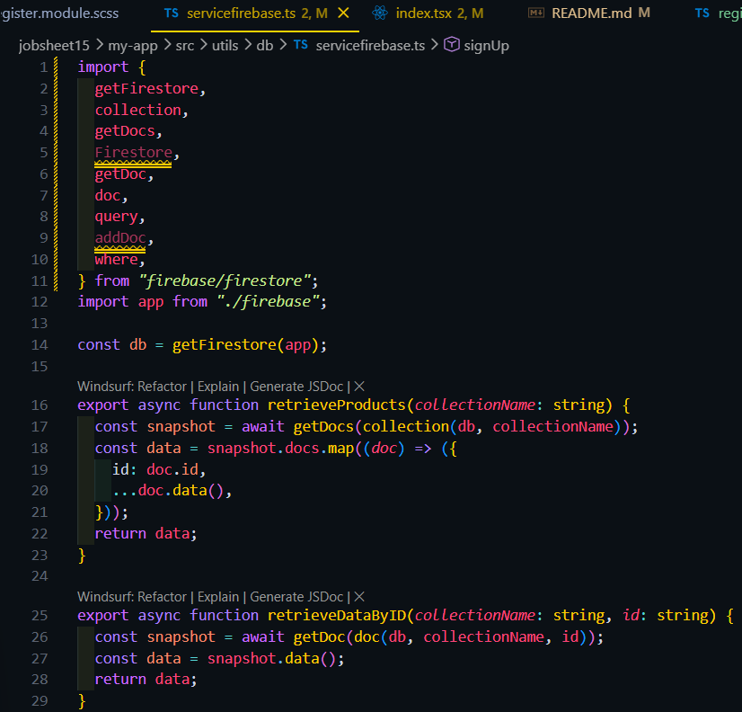
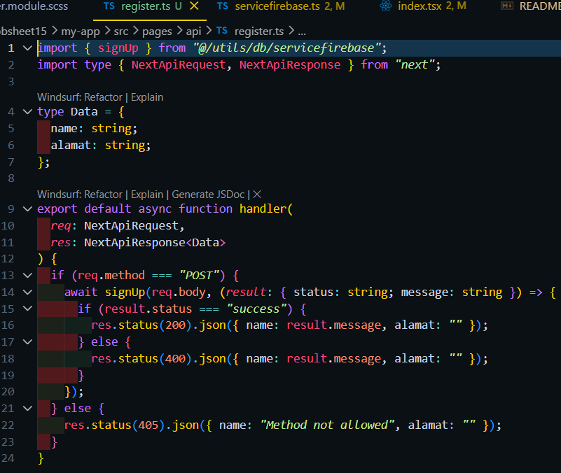

Langkah 1 – Membuat Register View
edit kode pages/auth/register/index.tsx

Membuat file baru dan isi kode pada file views/auth/register/index.tsx

Menambahkan styling pada view register

Hasil :

Langkah 2 – Membuat API Register
edit file servicefirebase.ts

membuat file register.ts

edit view register

Hasil :
