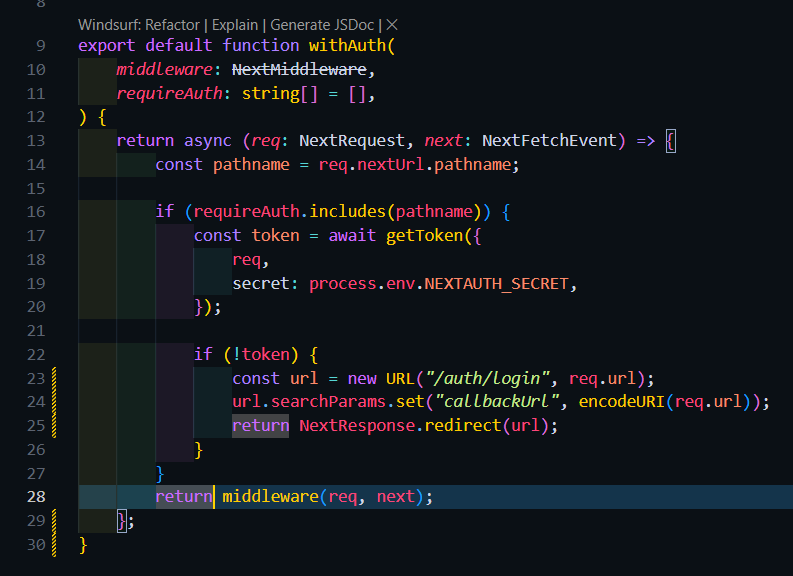

BAGIAN 1 – Custom Login Page
Edit kode [...nextauth].ts

Hasil :

BAGIAN 2 – Handle Login di Frontend
copy paste views login dari register

edit view login

edit style untuk views login

edit pages/auth/login/index.tsx

menambahkan kode di servicefirebase.ts untuk login

Hasil :

BAGIAN 3 – Authorize di NextAuth (Database Login)
mengedit bagian providers pada [...nextauth].ts

BAGIAN 4 – Tambahkan Role ke Token
modifikasi jwt callback pada [...nextauth].ts

Hasil :

BAGIAN 5 – Callback URL Logic
Edit middleware agar saat user login dapat kembali ke halaman sebelumnya
