### Konfigurasi Google OAuth
Langkah 1 – Masuk ke Google Cloud Console Buka: 
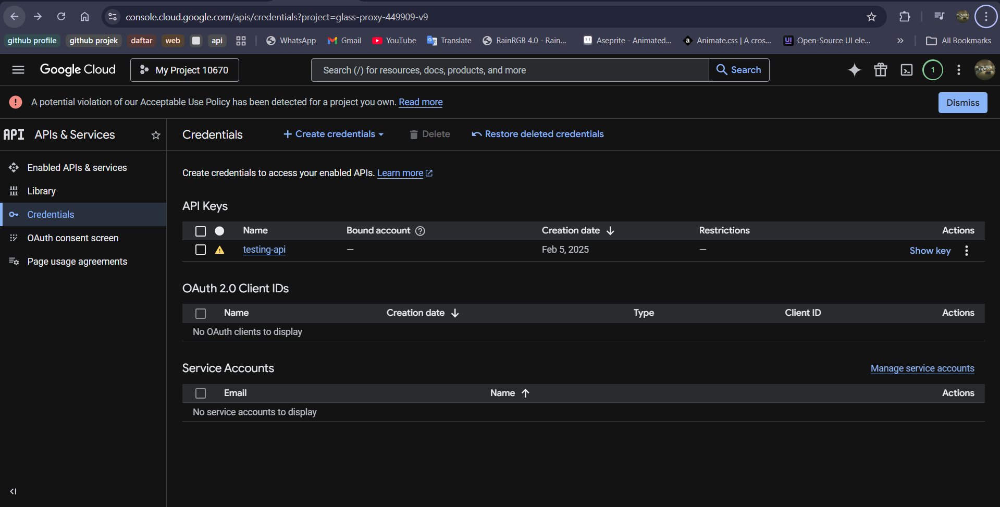  

Langkah 2 – Buat Project Baru 
Klik New Project 
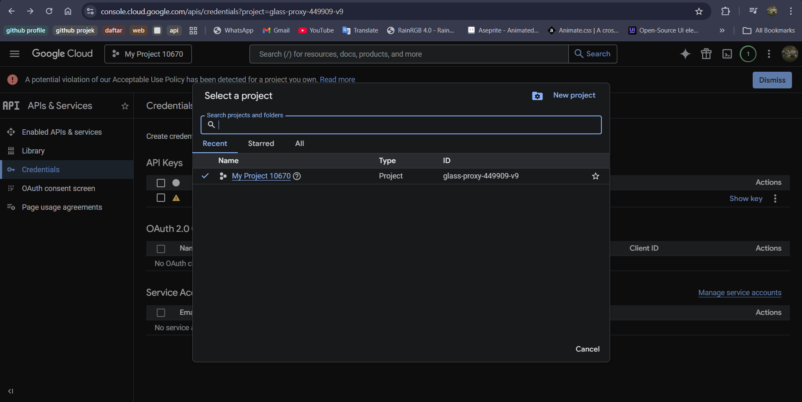 
Nama project: MyAppNext 
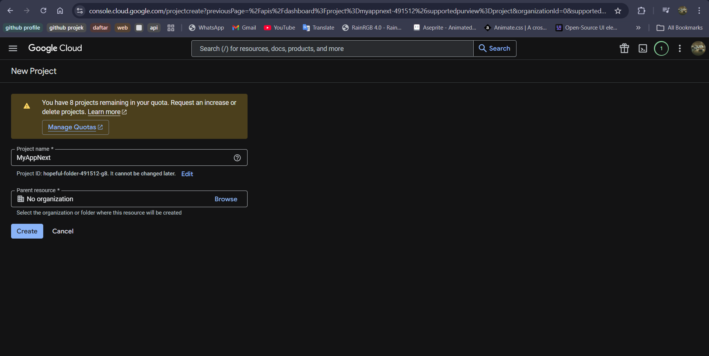 
Hasil : 
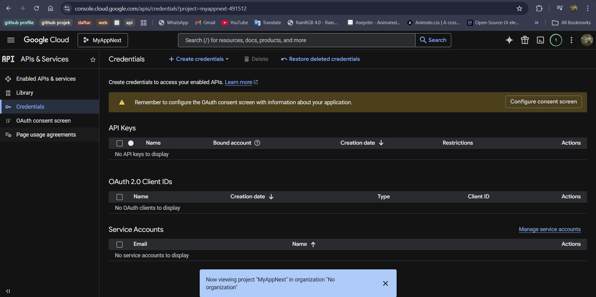  

Langkah 3 – Konfigurasi OAuth Consent Screen 
Pilih OAuth consent screen kemudian Pilih Get Started 
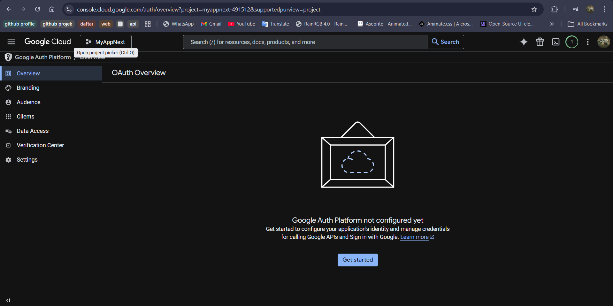 
Mengisi form sesuai pada jobsheet 
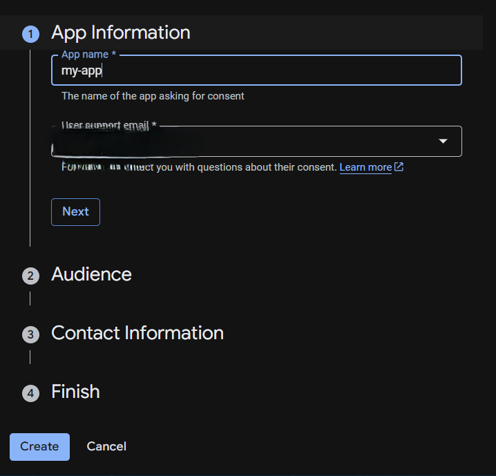 
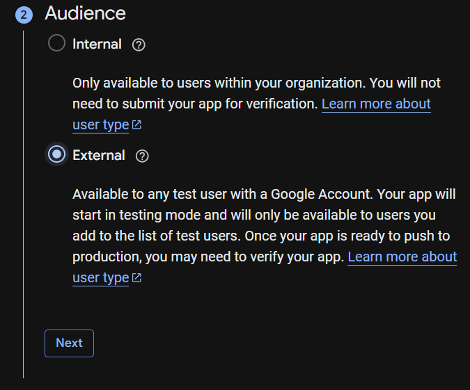 
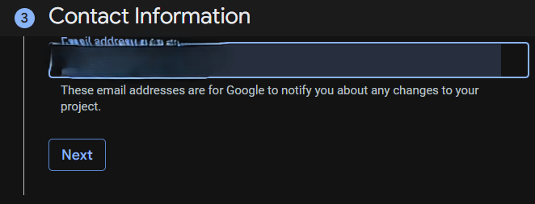 
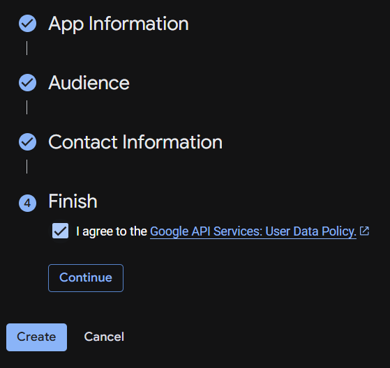  

Langkah 4 – Buat OAuth Credentials 
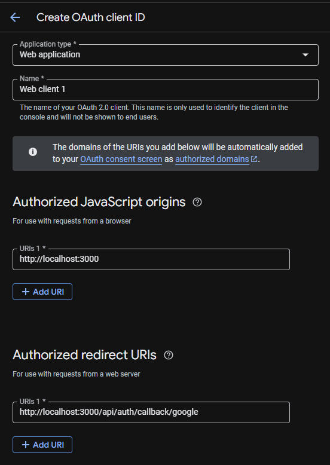  

Langkah 5 – Tambahkan Environment Variables 
mengcopy client ID dan client secret dari google ke .env 
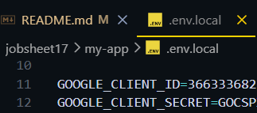  

Langkah 6 – Konfigurasi Google Provider di NextAuth dan Handle Callback JWT & Session 
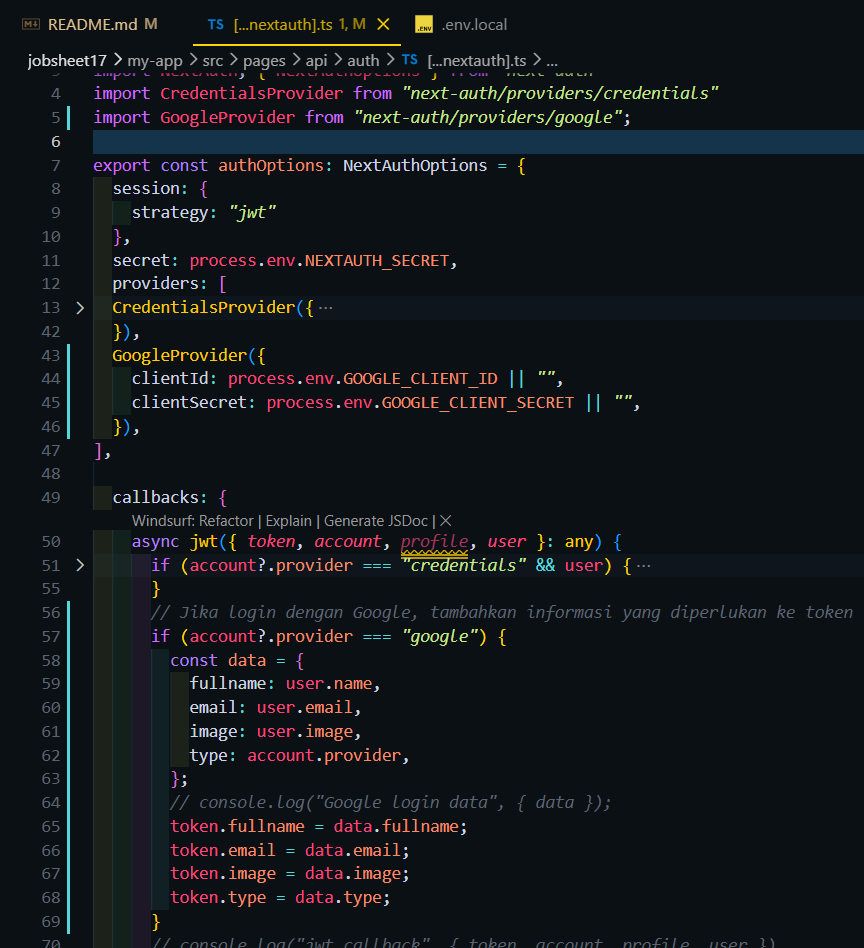 
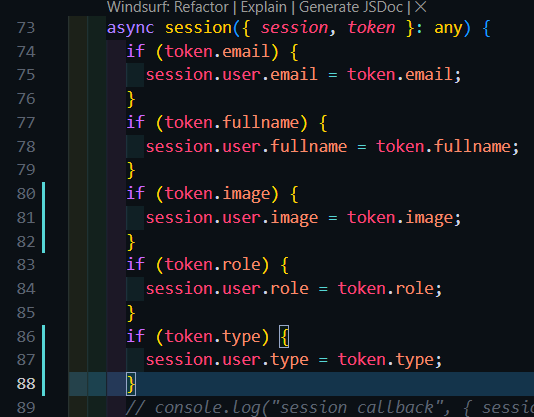  

Langkah 7 – Tambahkan Button Login Google 
Menambahkan tombol sigIn with google pada halaman login 
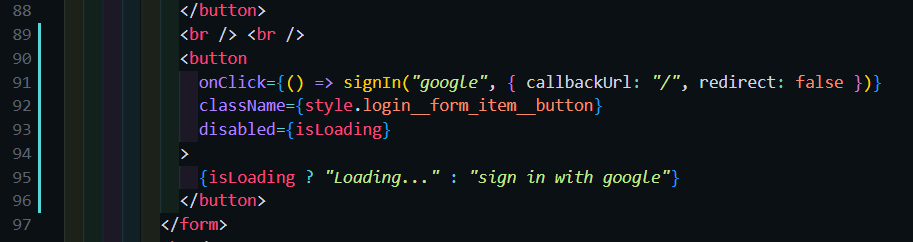 
Hasil : 
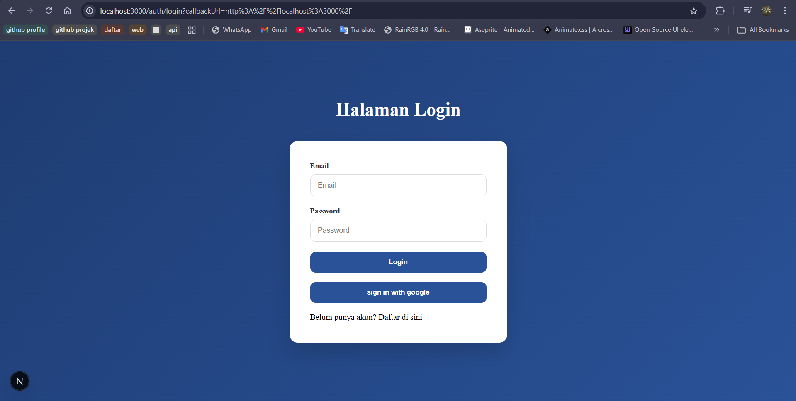 
Menambahkan foto profil dari akun google untuk ditampilkan di navbar 
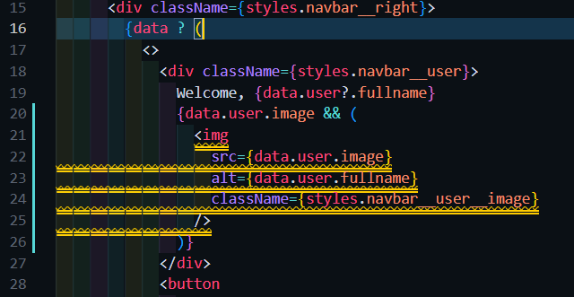 
melakukan styling untuk imag di navbar 
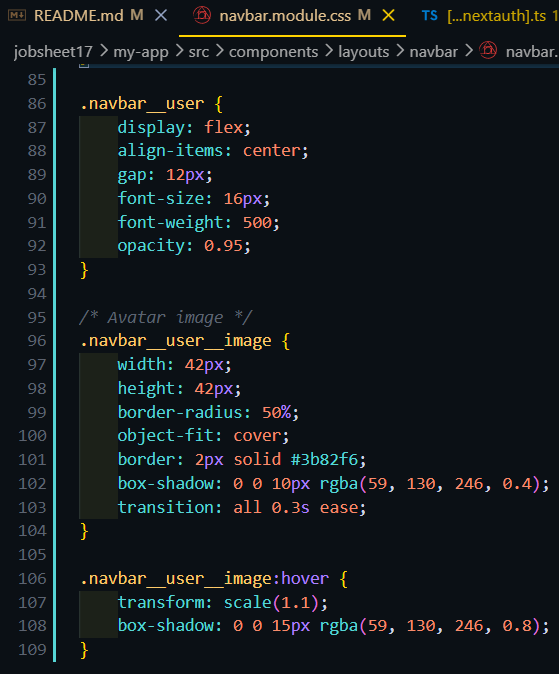 
Hasil : 
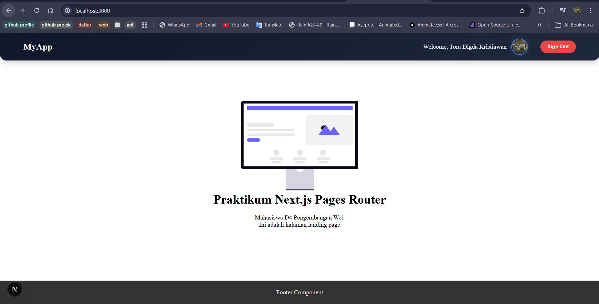 