### Konfigurasi Google OAuth
Langkah 1 – Masuk ke Google Cloud Console Buka: 
  

Langkah 2 – Buat Project Baru 
Klik New Project 
 
Nama project: MyAppNext 
 
Hasil : 
  

Langkah 3 – Konfigurasi OAuth Consent Screen 
Pilih OAuth consent screen kemudian Pilih Get Started 
 
Mengisi form sesuai pada jobsheet 
 
 
 
  

Langkah 4 – Buat OAuth Credentials 
  

Langkah 5 – Tambahkan Environment Variables 
mengcopy client ID dan client secret dari google ke .env 
  

Langkah 6 – Konfigurasi Google Provider di NextAuth dan Handle Callback JWT & Session 
 
  

Langkah 7 – Tambahkan Button Login Google 
Menambahkan tombol sigIn with google pada halaman login 
 
Hasil : 
 
Menambahkan foto profil dari akun google untuk ditampilkan di navbar 
 
melakukan styling untuk imag di navbar 
 
Hasil : 
  

Langkah 8 – Simpan Data Google ke Database 
menambhakan function sigInWithGoogle pada file firebase.ts 
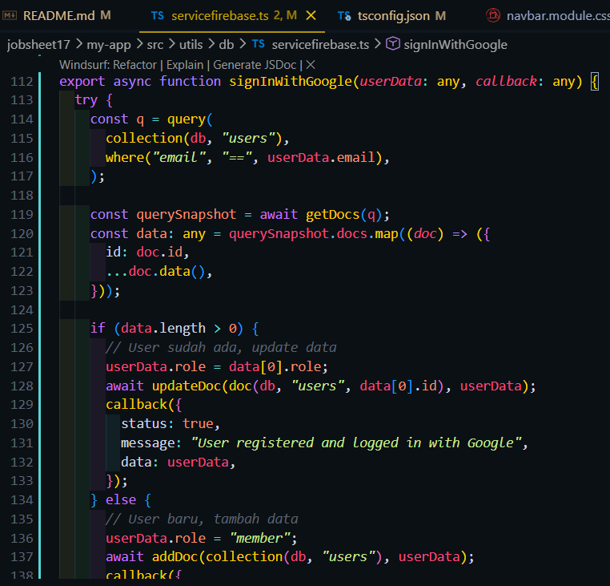 
menambahkan service jwt untuk login dengan google 
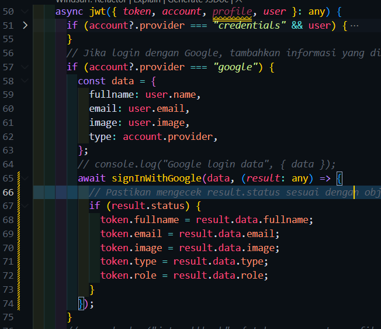 
Hasil : 
  

#### Tugas Mandiri
1. Tambahkan role editor 
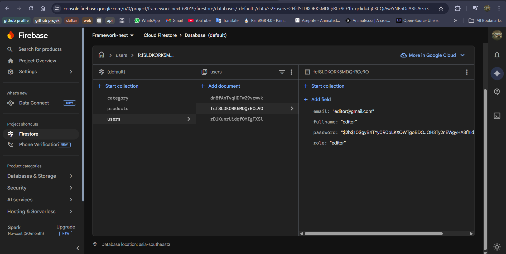 
2. Buat halaman khusus editor 
pages editor 
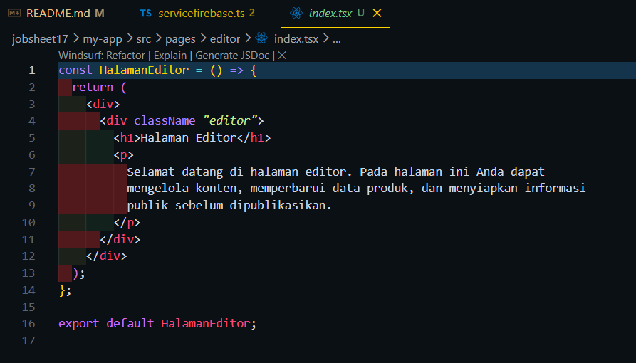 
menambahkan pengecekan autentukasi untuk halaman editor 
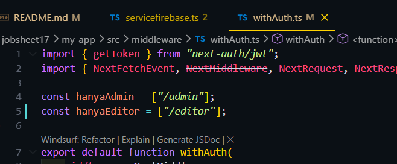 
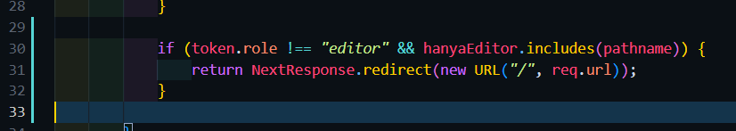 
Hasil : 
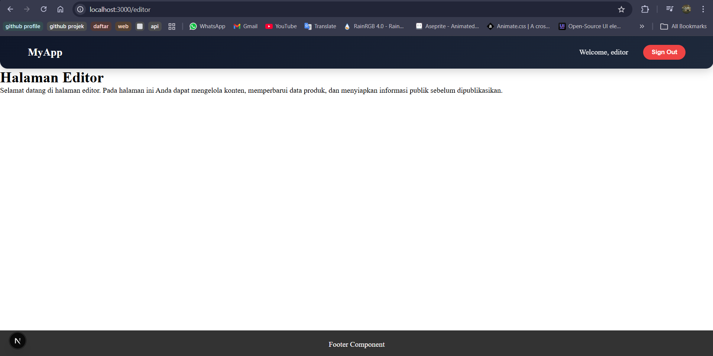 
3. Menambahkan provider github untuk login 
Membuat Oauth baru 
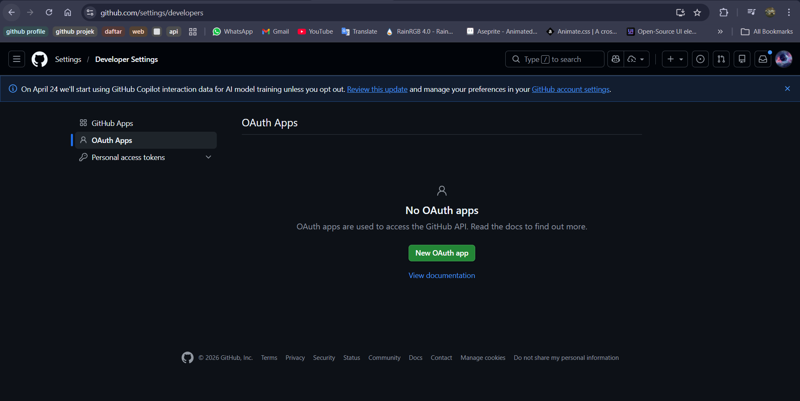 
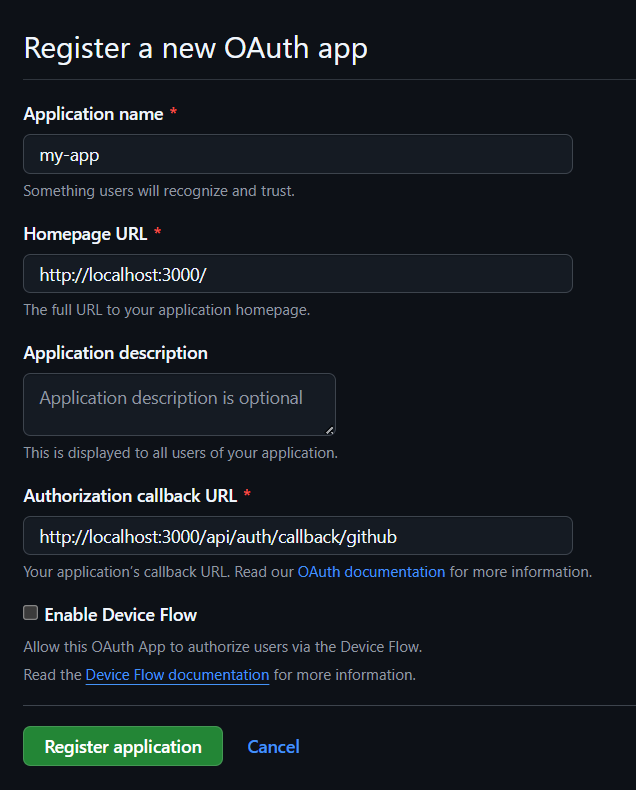 
setelah membuat Oauth  baru akan muncul id dan secret yang nanti akan dicoy ke file .env 
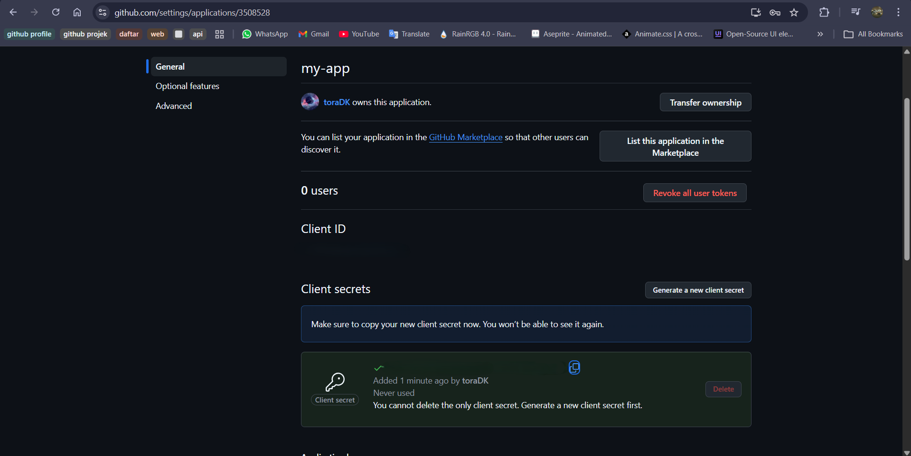 
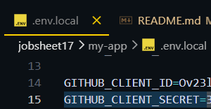 
mengedit kode pada file ...nextauth.ts untuk provider github 
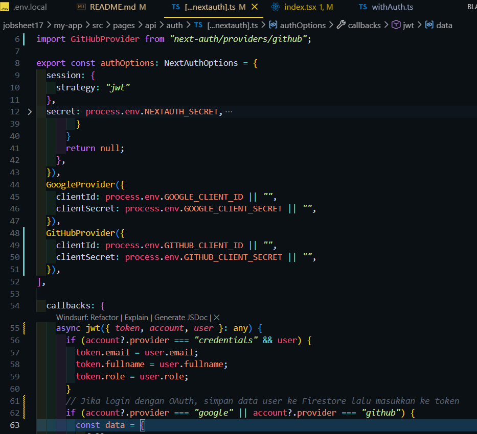 
Menambahkan button login dengan github di halaman login 
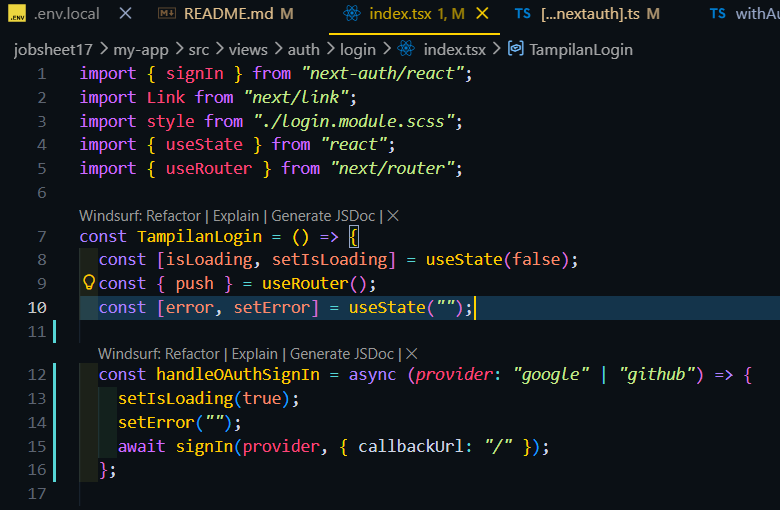 
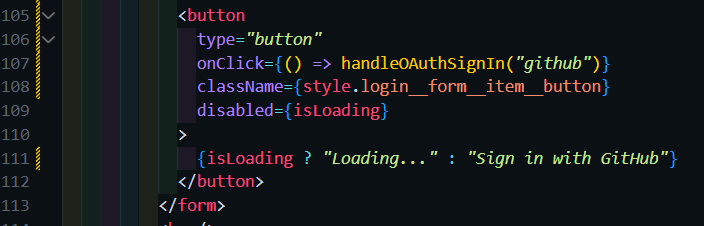 
Hasil : 
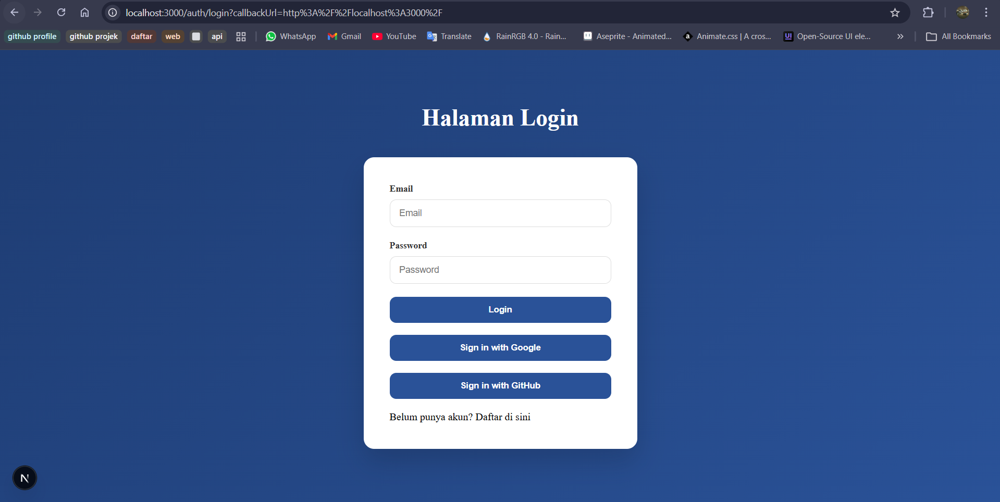 
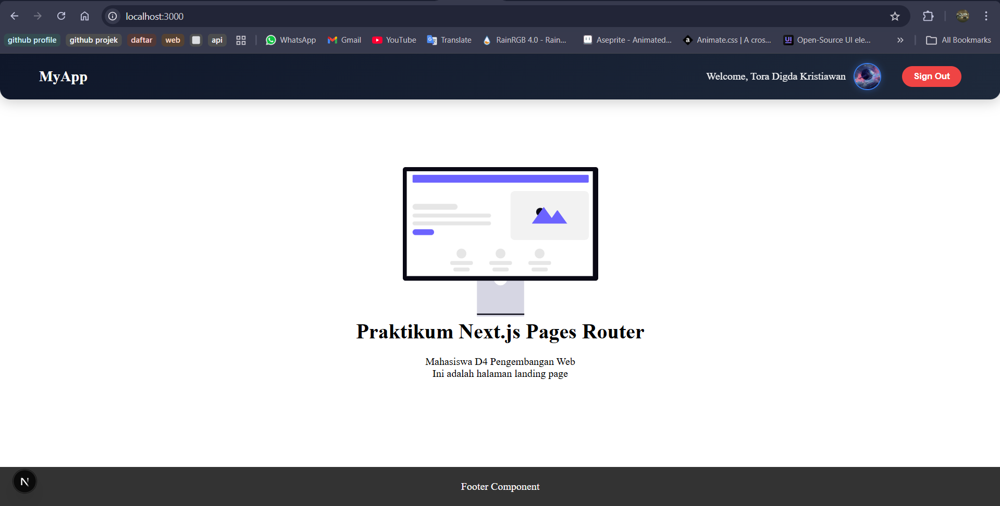 
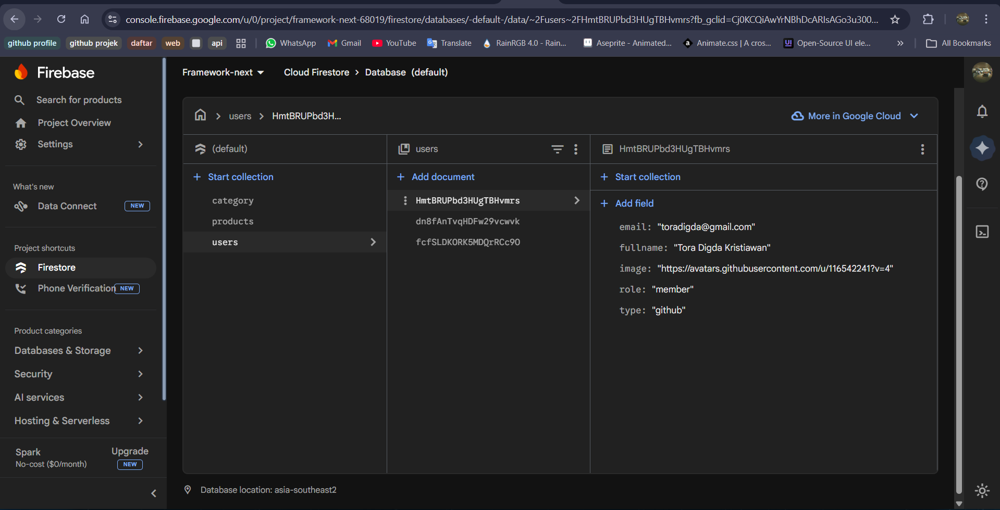 
4.Refactor service agar reusable 
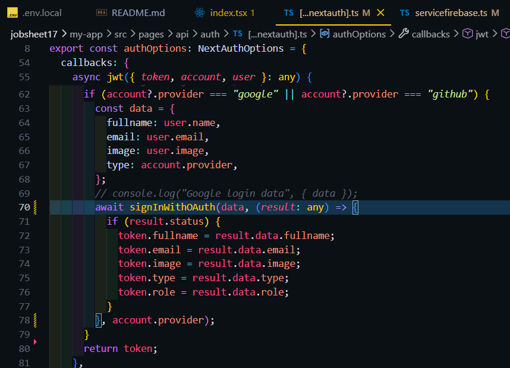 
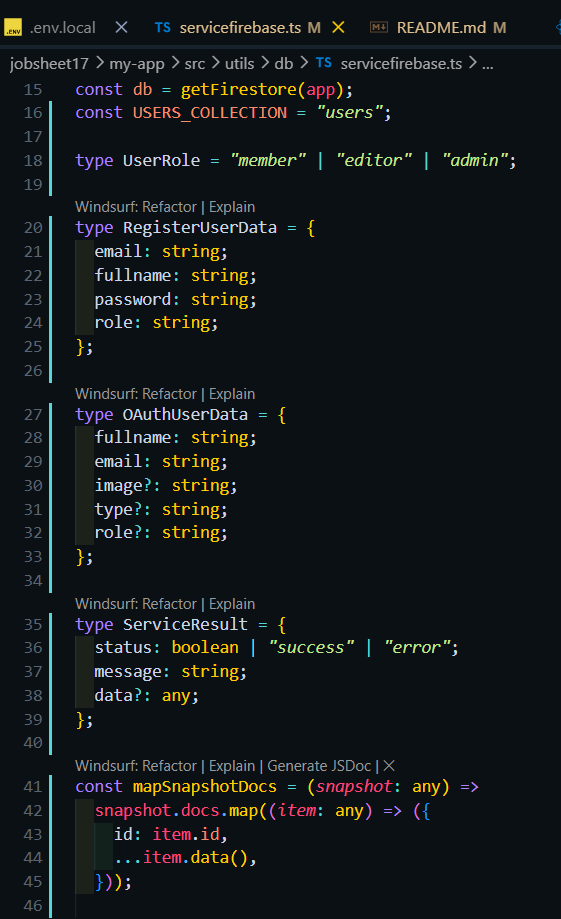 
Hasil : 
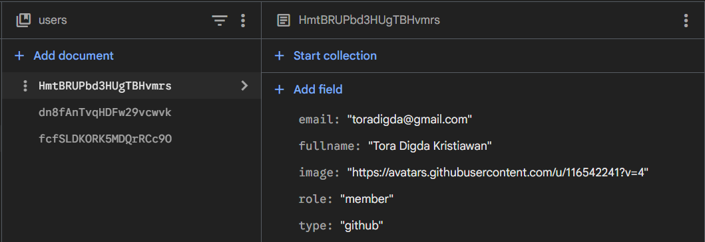 
5. Gunakan next/image untuk optimasi avatar 
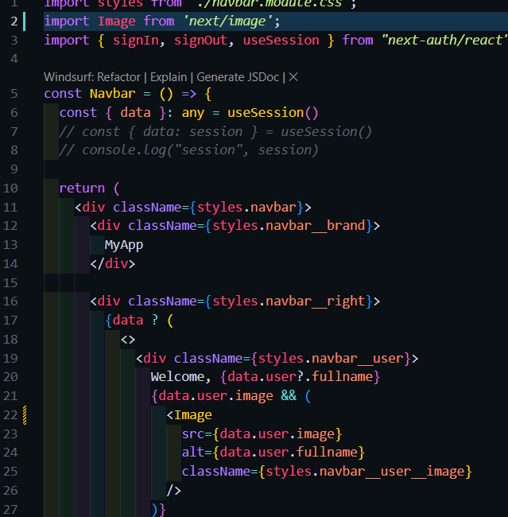 

Analisis & Diskusi
1. Apa perbedaan login credential dan login Google?
 -> Login Credential: User mendaftar secara manual menggunakan email dan password sendiri.nantinya yang mengelola password dan email adalah aplikasi itu sendiri
 -> Login Google : User tidak perlu mendaftar secara manual menggunakan email dan password user tinggal masuk menggunakan akun Google yang dipunya. Nantinya email dan password yang sudah di hash dari google tinggal di simpan di database 
2. Mengapa data Google tetap perlu disimpan ke database?
 -> bisa digunakan untuk mencatat siapa saja yang sudah login di aplikasi, Bisa juga digunakan untuk mengatur role user karena google tidak tahu role apa saja yang ada di aplikasi
3. Apa fungsi JWT callback?
 -> Memperbarui waktu kedaluwarsa token setiap kali sesi aktif
 -> Memperbarui waktu kedaluwarsa token setiap kali sesi aktif
4. Mengapa perlu multi-role?
 -> agar hanya admin yang bisa menghapus, mengedit, atau menambah data yang sifatnya sensitif.
 -> Melindungi data sensitif agar tidak bisa diakses oleh role user yang tidak berwenang.
5. Apa risiko jika tidak menyimpan user ke database?
 -> tidak ada data user
 -> jika tidak ada data user maka nanti tidak ada multi role. semua role user akan sama default