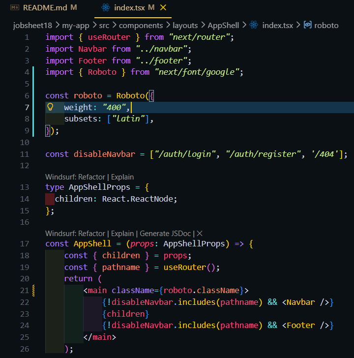
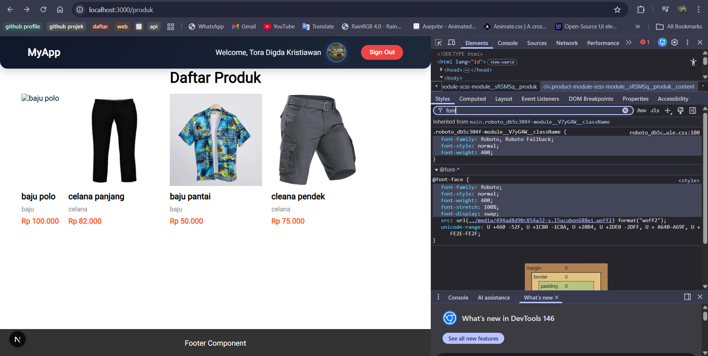
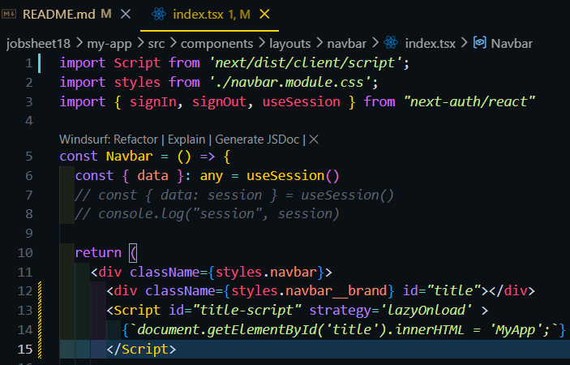
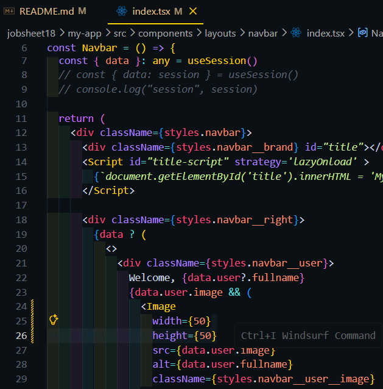
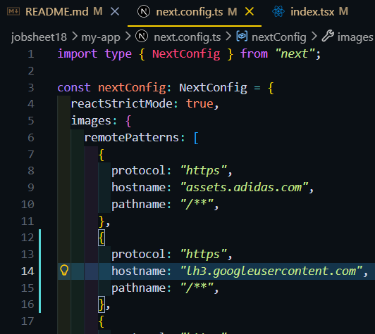
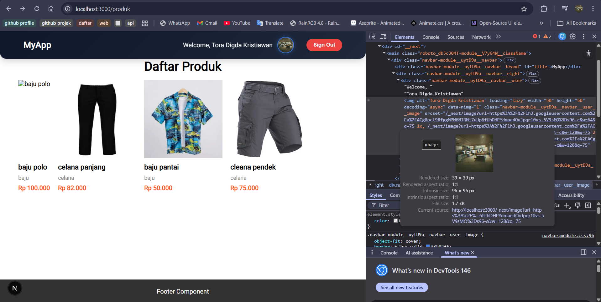

### PRAKTIKUM 1 – Image Optimization
#### Optimasi Gambar Lokal (Public Folder)
perfoma page 404 di lighthouse sebelum memakai tag Image 
 
Mengganti tag  pada halaman 404 
 
Hasil perfoma page 404 di lighthouse setelah memakai tag Image 
  

#### Optimasi Gambar Remote (External URL)
edit tag imag di file views/product/index.tsx
 
Buka file next.config.js 
  

Hasil : 
tanpa tag Image 
 
Saat memakai tag Image 
  

### PRAKTIKUM 2 – Font Optimization
#### Menggunakan next/font
modifikasi file index.tsx pada folder Appshell/index.tsx 
 
Hasil : 
  

### PRAKTIKUM 3 – Script Optimization
#### Menggunakan next/script
modifikasi file index.tsx pada folder layouts/Navbar 
  

### PRAKTIKUM 4 – Optimasi Avatar dengan next/image
modifikasi file index.tsx pada folder layouts/navbar 
 
menambaahkan konfigurasi untuk url google di next.config.ts agar data gambar bisa dipakai di aplikasi 
 
Hasil : 
