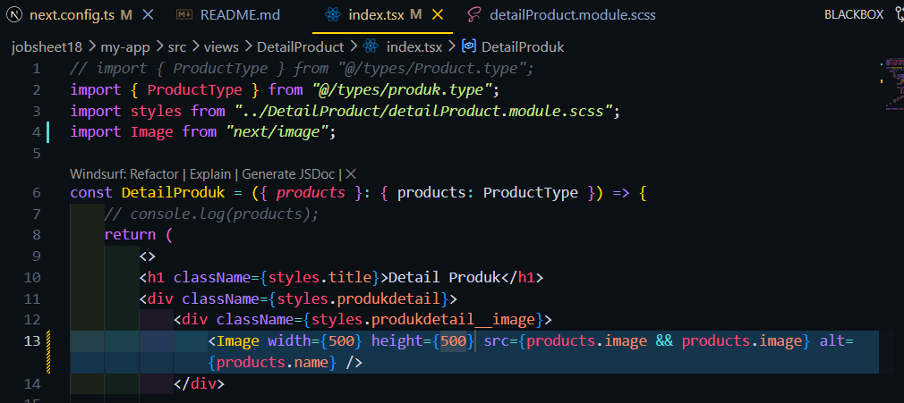
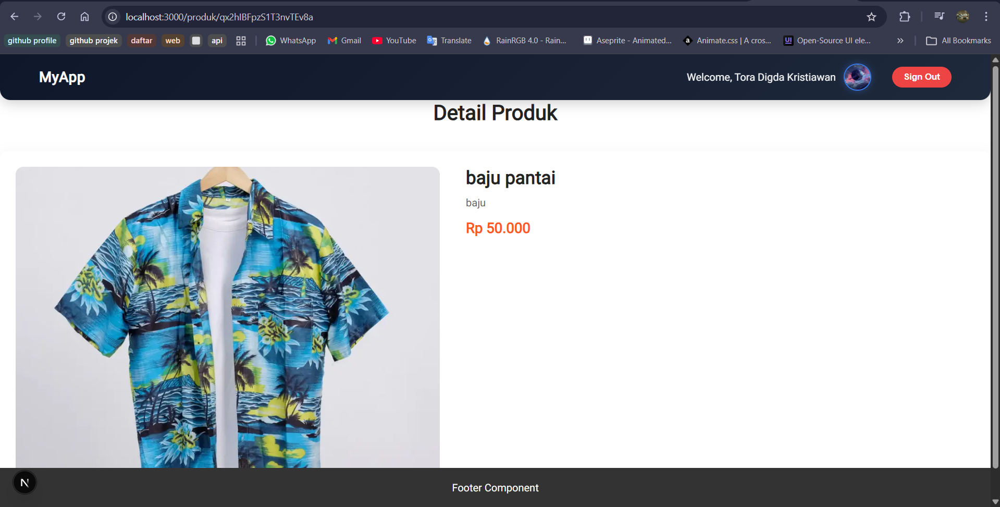
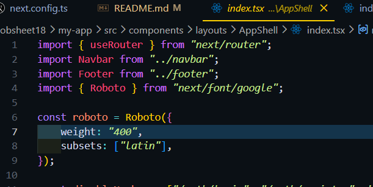
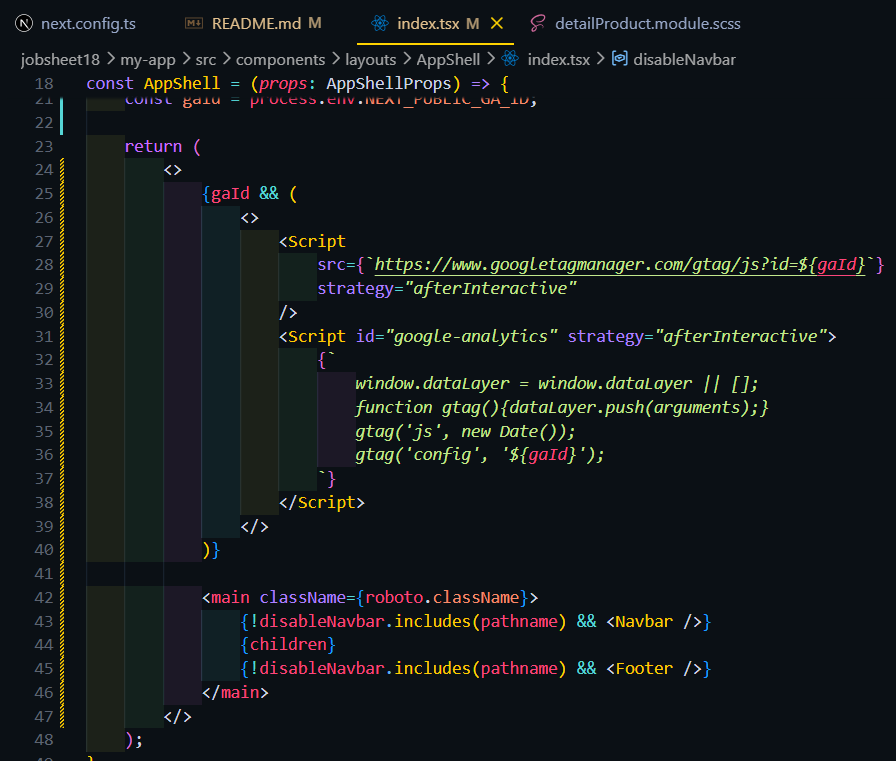
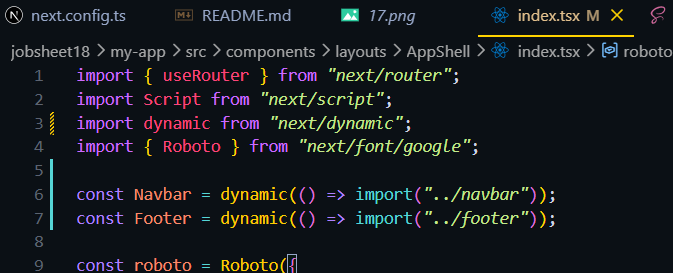
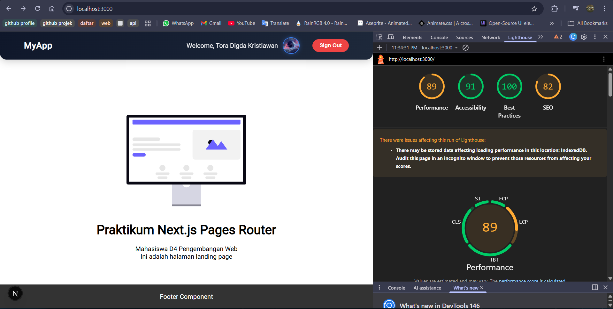

### PRAKTIKUM 1 – Image Optimization
#### Optimasi Gambar Lokal (Public Folder)
perfoma page 404 di lighthouse sebelum memakai tag Image 
 
Mengganti tag  pada halaman 404 
 
Hasil perfoma page 404 di lighthouse setelah memakai tag Image 
  

#### Optimasi Gambar Remote (External URL)
edit tag imag di file views/product/index.tsx
 
Buka file next.config.js 
  

Hasil : 
tanpa tag Image 
 
Saat memakai tag Image 
  

### PRAKTIKUM 2 – Font Optimization
#### Menggunakan next/font
modifikasi file index.tsx pada folder Appshell/index.tsx 
 
Hasil : 
  

### PRAKTIKUM 3 – Script Optimization
#### Menggunakan next/script
modifikasi file index.tsx pada folder layouts/Navbar 
  

### PRAKTIKUM 4 – Optimasi Avatar dengan next/image
modifikasi file index.tsx pada folder layouts/navbar 
 
menambaahkan konfigurasi untuk url google di next.config.ts agar data gambar bisa dipakai di aplikasi 
 
Hasil : 
 

Tugas 
1. Optimasi semua image di project menggunakan next/image 
 
Hasil : 
 
2. Gunakan minimal 1 font dari next/font 
 
menggunakan font roboto 
3. Tambahkan script Google Analytics menggunakan next/script 
 
4. Terapkan dynamic import pada minimal 1 komponen 
 
5. Dokumentasikan perubahan performa (screenshot Lighthouse) 
 

Refleksi & Diskusi 
1. Mengapa img biasa tidak optimal? 
-> tag img tidak bisa otomatis mengubah gambar menjadi format modern seperti WebP atau AVIF yang jauh lebih ringan dibanding PNG/JPG. 
-> Jika mengunggah gambar 5MB, browser akan mengunduh seluruh 5MB tersebut meskipun ditampilkan dalam ukuran kecil 
2. Apa perbedaan font CDN dan next/font? 
-> Font CDN: Browser harus melakukan permintaan HTTP tambahan ke server luar saat halaman dimuat. 
-> next/font: Next.js mengunduh file font tersebut saat proses build dan menyimpannya secara lokal di server 
3. Mengapa script bisa membuat website lambat? 
-> Render-Blocking: Secara default, browser akan berhenti merender HTML saat menemukan tag script untuk mengunduh dan mengeksekusi kode JavaScript tersebut. 
4. Kapan harus menggunakan dynamic import? 
-> Komponen memiliki library besar 
-> Komponen yang tidak langsung muncul saat halaman dimuat, seperti Modal, Sidebar, atau Dropdown. 
-> Mengurangi ukuran file JavaScript utama agar halaman awal muncul secepat kilat. 
5. Apa dampak bundle size terhadap UX? 
-> Waktu Tunggu (Loading Time): Semakin besar bundle, semakin lama user menatap layar putih atau loading spinner. 
-> Bundle besar membuat browser sibuk memproses kode, sehingga user merasa website lemot atau tidak bisa diklik meskipun gambarnya sudah muncul. 