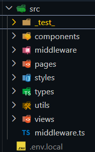
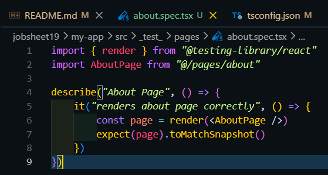
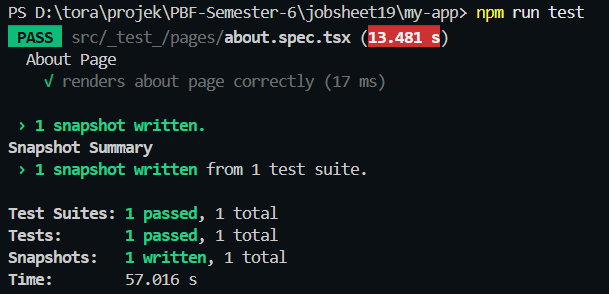

### Praktikum 1 – Setup Jest di Next.js
menginstall dependencies 
 
Membuat File Konfigurasi 
 
Menambahkan Script di package.json 
 

### PRAKTIKUM 2 – Struktur Folder Testing
membuat foler testing 
 

### PRAKTIKUM 3 – Testing Halaman About
menambahkan kode di about.spec.tsx

Hasil menjalankan testing
