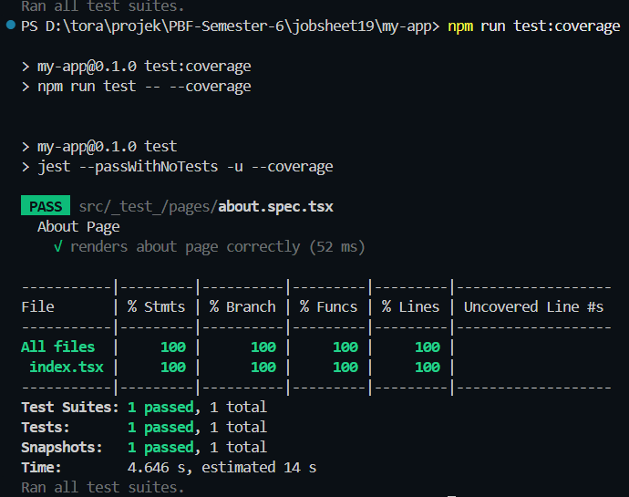
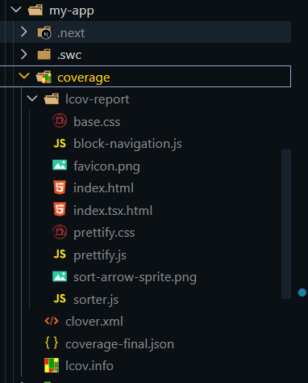
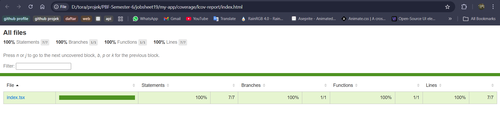
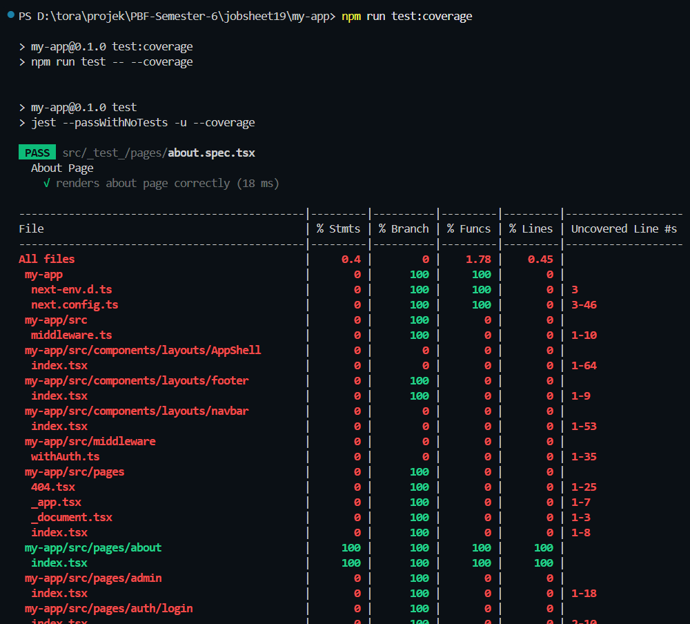
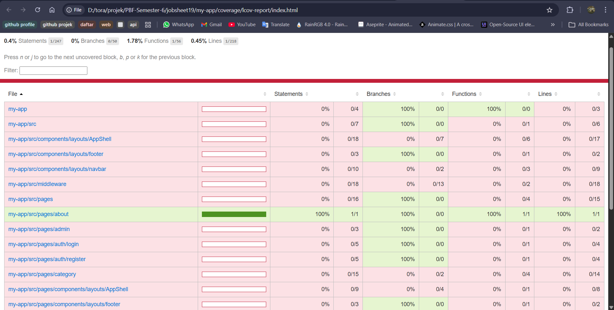

### Praktikum 1 – Setup Jest di Next.js
menginstall dependencies 
 
Membuat File Konfigurasi 
 
Menambahkan Script di package.json 
 

### PRAKTIKUM 2 – Struktur Folder Testing
membuat foler testing 
 

### PRAKTIKUM 3 – Testing Halaman About
menambahkan kode di about.spec.tsx 
 
Hasil menjalankan testing 
 

### PRAKTIKUM 4 – Coverage Report
Mnejalankan npm run test:coverage 
 
Muncul folder baru 
 
Hasil tampilan coverage 
 

### PRAKTIKUM 5 – Konfigurasi Coverage Lengkap
edit kode konfigurasi untuk jest 
 
Hasil saat menjalankan npm run test:coverage 
 
Hasil pada tampilan coverage 
 