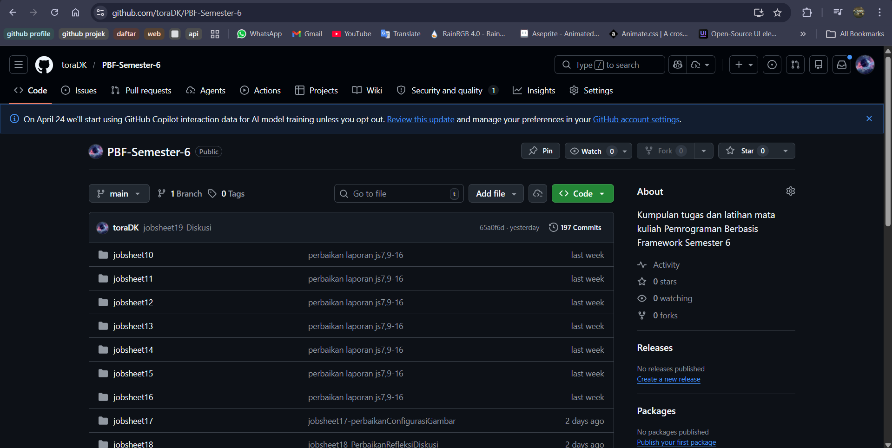
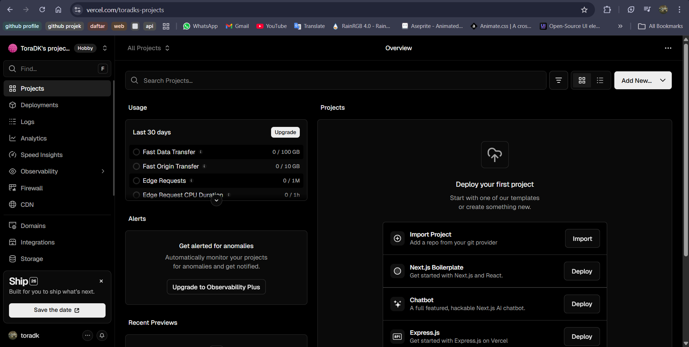
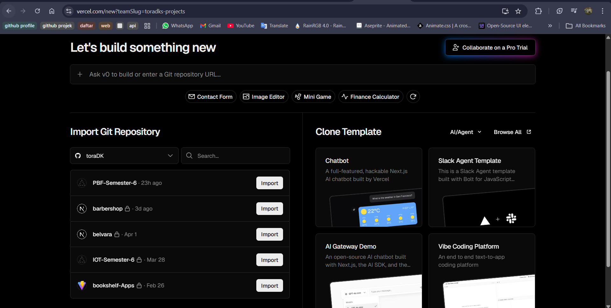
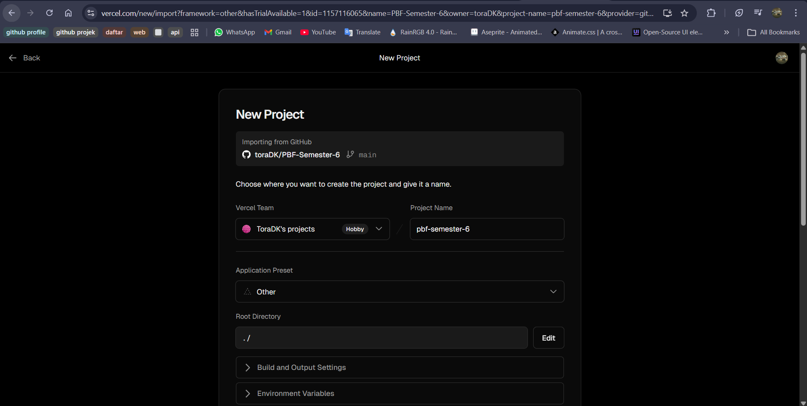
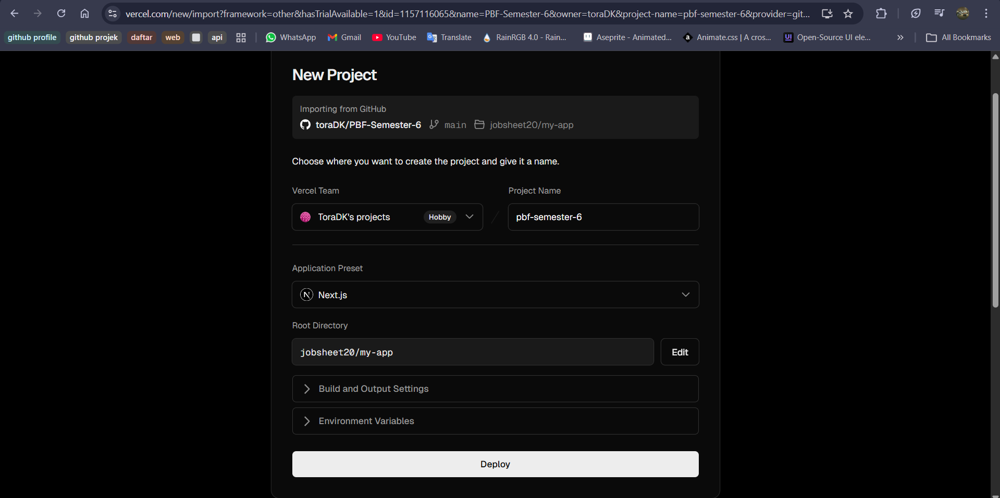
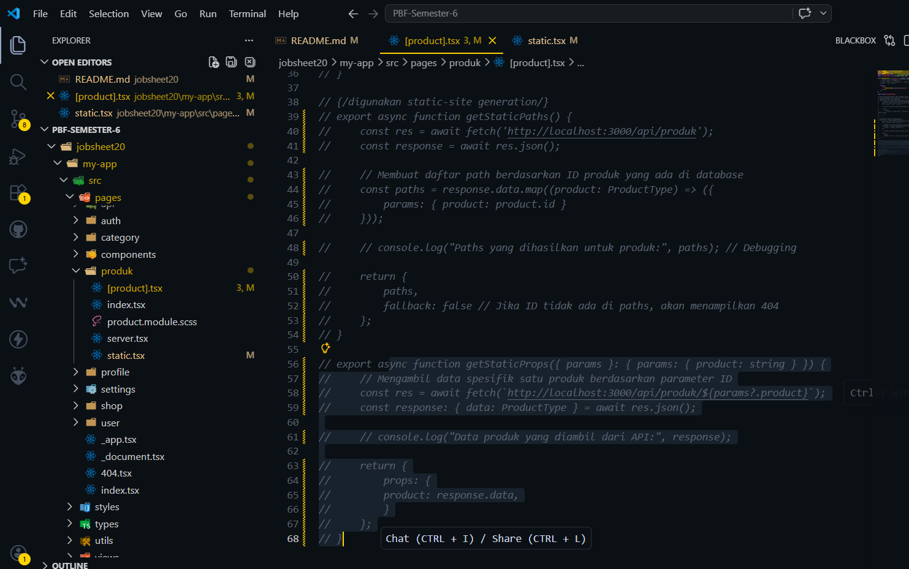

### PRAKTIKUM 1 – Membuat Repository GitHub
 
Saya sudah mengupload setiap jobsheet ke repository mulai jobsheet pertama 

### PRAKTIKUM 2 – Deployment ke Vercel
Login ke Vercel 
 
import Project 
 
 
Memilih root direktori 
  
#### Melakukan konfigurasi untuk mencegah error
Menghapus file static.tsx 
 
Comment pada line yang berhubungan dengan static-site pada file [produk].tsx  
 
Menggunakan SSR untuk produk 
 
Menambahkan variabel baru di .env.local 
 
Mengganti semua hardcode url 
pada file [produk].tsx 
 
pada file server.tsx 
 
commit dan push kode paling baru 
 
melakukkan pengaturan di vercel 
 