### Page dan Layout
1. Routing Dasar 
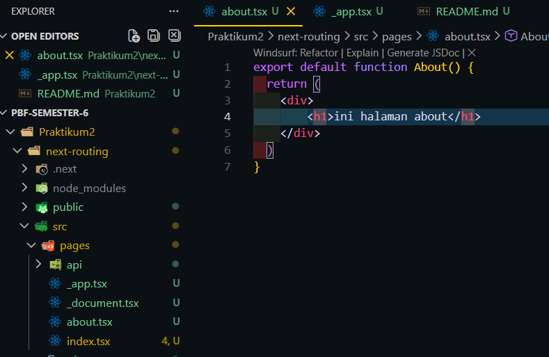 
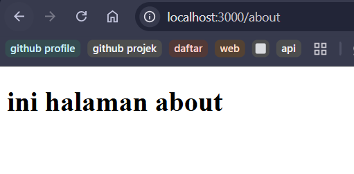  

2. Routing Menggunakan Folder 
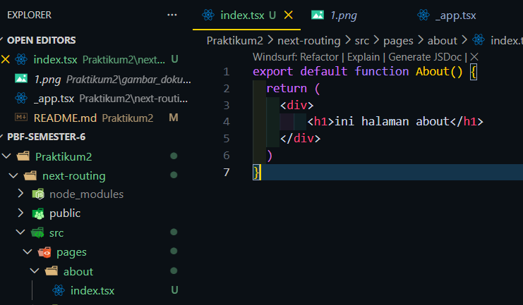 
  

3. Nested Routing 
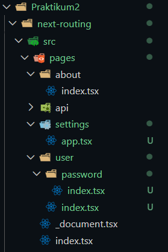 
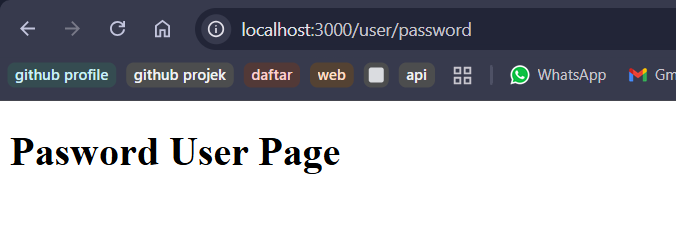  

4. Dynamic Routing 
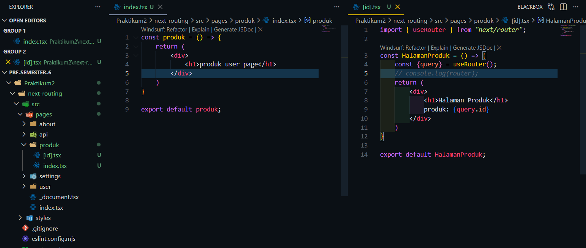 
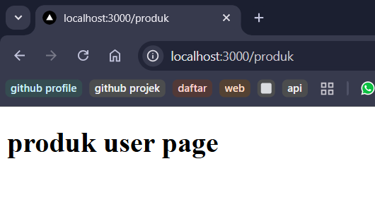 
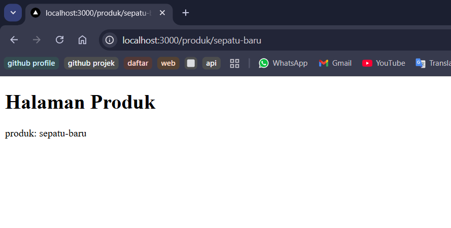  

5. Membuat Komponen Navbar 
-> Membuat Komponen Navbar 
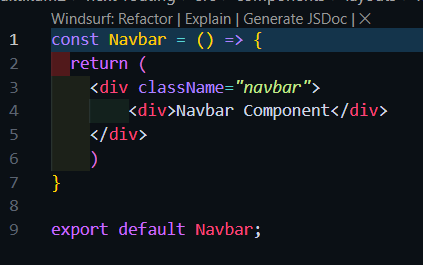 
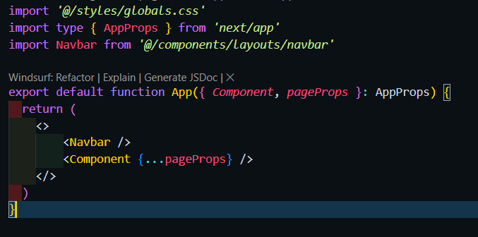 
->Hasil 
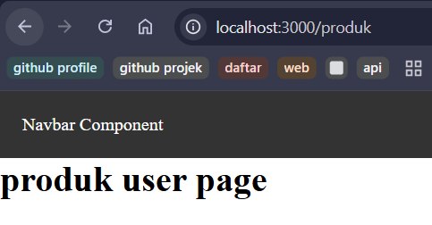 
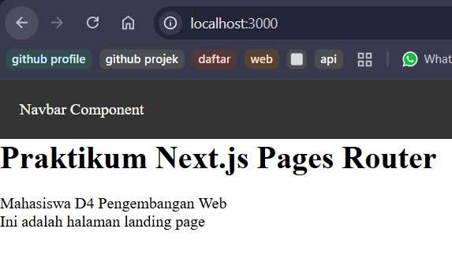 
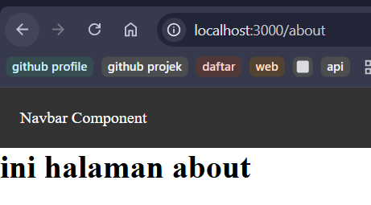 
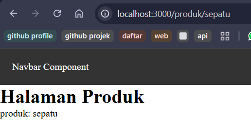  

6. Membuat Layout Global 
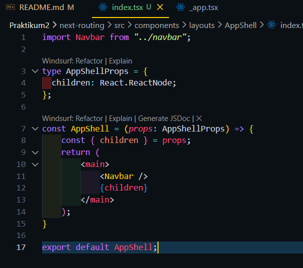 

7. Implementasi Layout di _app.tsx 
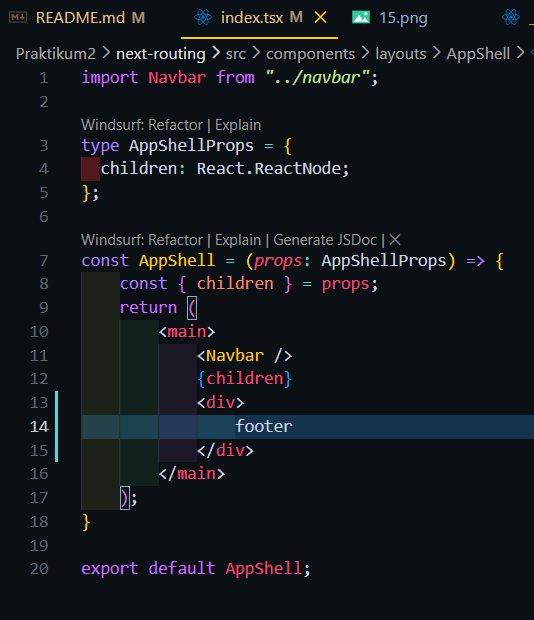 
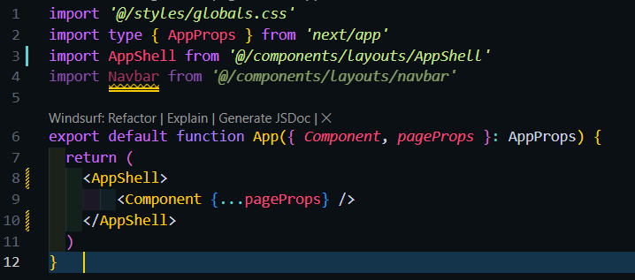 
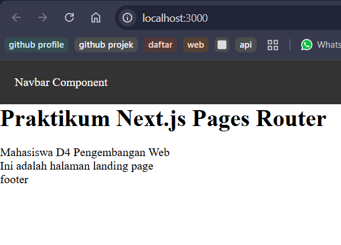  

Tugas1-Halaman profile dan edit profile 
->kode 
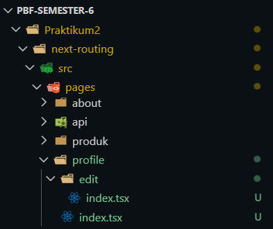 
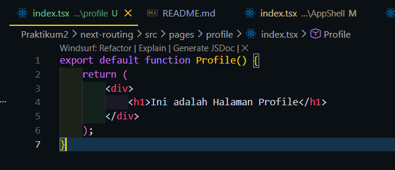 
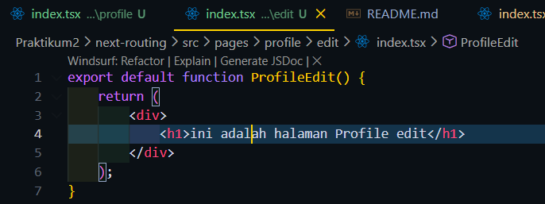 
->Hasil 
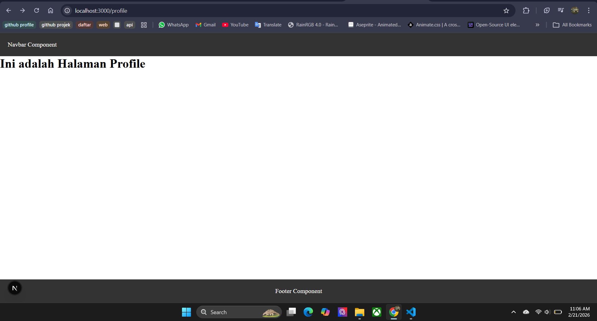 
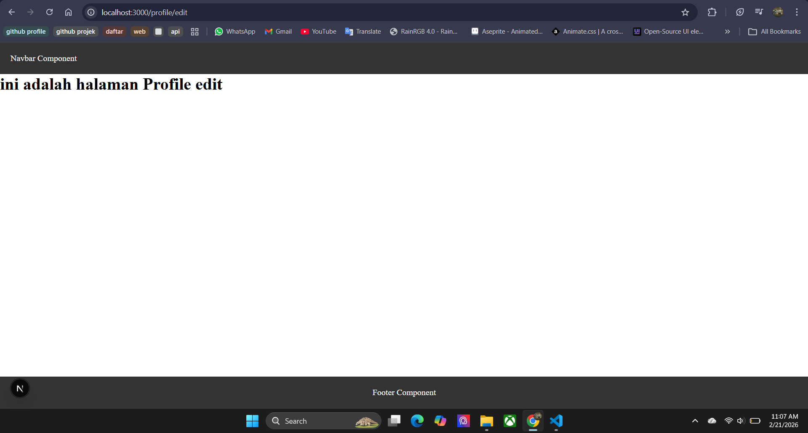  

Tugas2-Dynamic Routing 
->Kode 
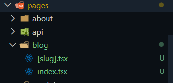 
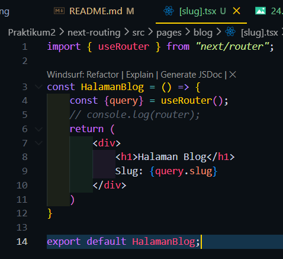 
->Hasil 
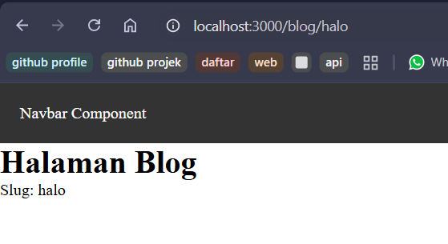  

Tugas3-Menambahkan footer pada AppShell 
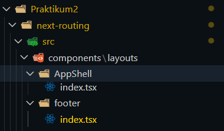 
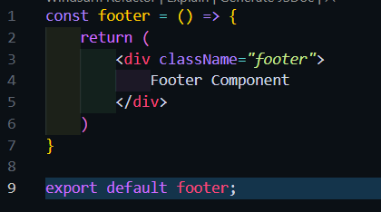 
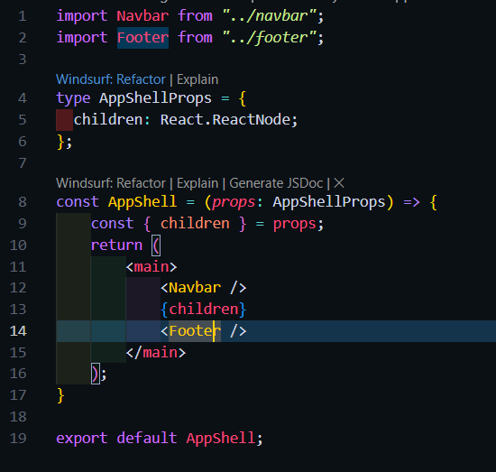 
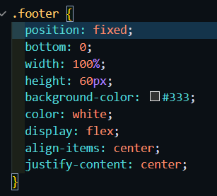 
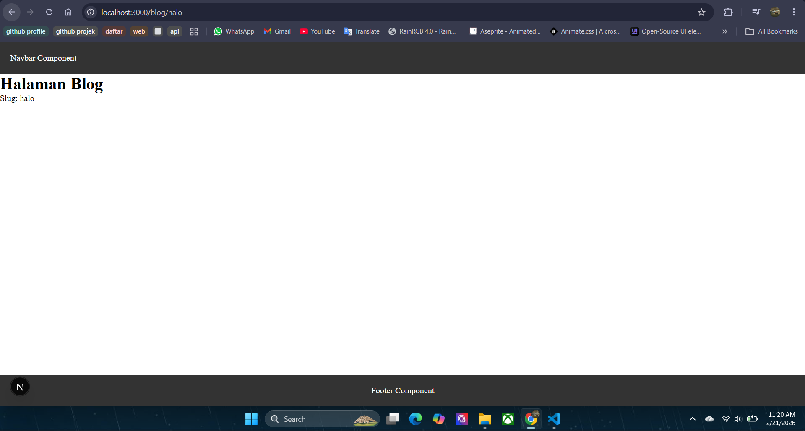 

Pertanyaan Refleksi
1. Apa perbedaan routing berbasis file dan routing manual?
 -> jika routing berbasis file url otomatis dibuat berdasarkan nama file, jika routing manual maka perlu melakukan konfigurasi terlebihdahulu untuk urlnya 
2. Mengapa dynamic routing penting dalam aplikasi web?
 -> agar web dapat menangkap data dari yang diberikan oleh url
3. Apa keuntungan menggunakan layout global dibanding memanggil komponen satu per satu?
 -> keuntungan menggunakan layout global adalah tidak perlu mengimport komponen setiap ada file baru cukup melakukan import sekali saja