1. Langkah 1 – Menjalankan Project 
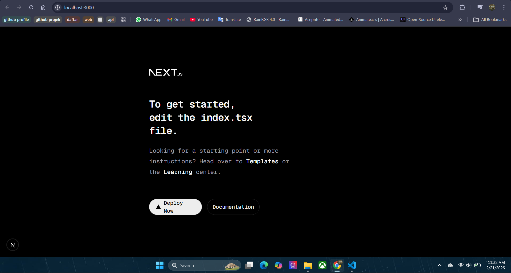  

2. Langkah 2 – Membuat Catch-All Route 
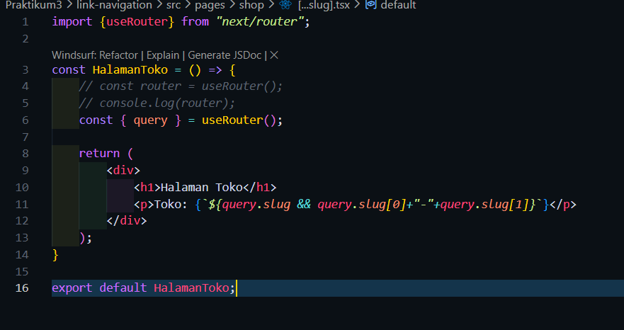  

3. Langkah 3 – Pengujian Catch-All Route 
->kode 
 
->Hasil 
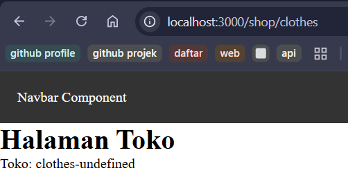 
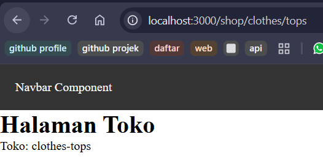 
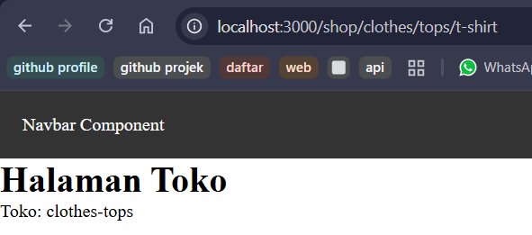 
->kode 
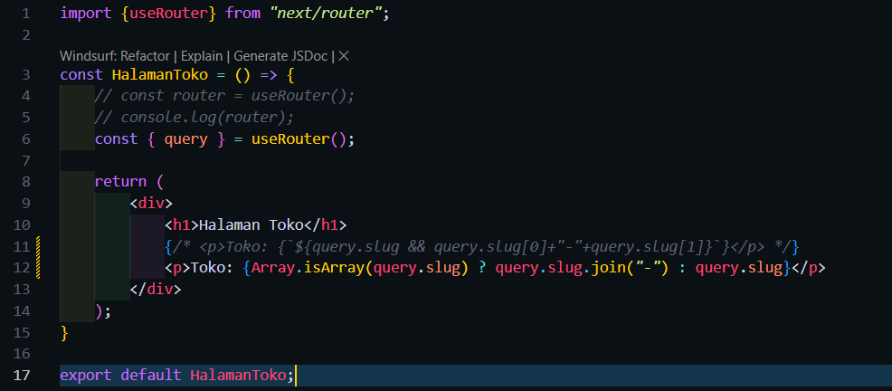 
->Hasil 
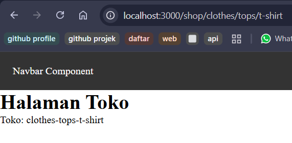 
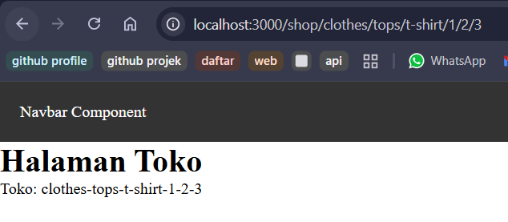  

4. Langkah 4 – Optional Catch-All Route 
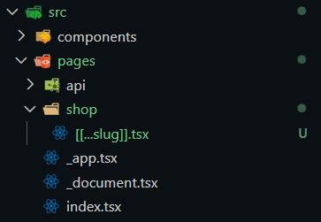 
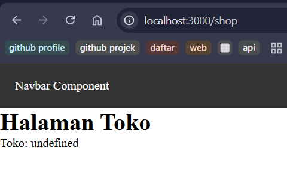  

5. Langkah 5 – Validasi Parameter 
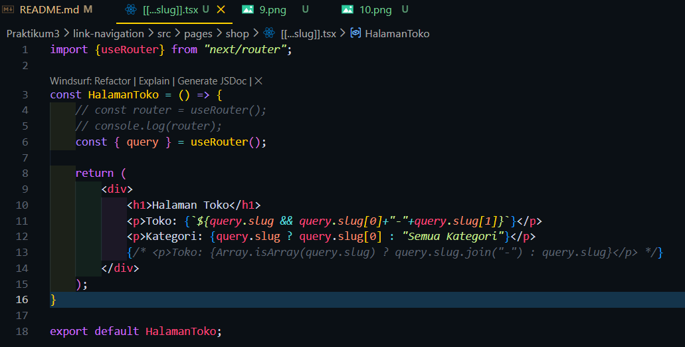 
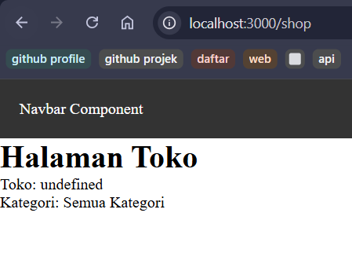  

6. Langkah 6 – Membuat Halaman Login & Register 
->Login 
-> Kode 
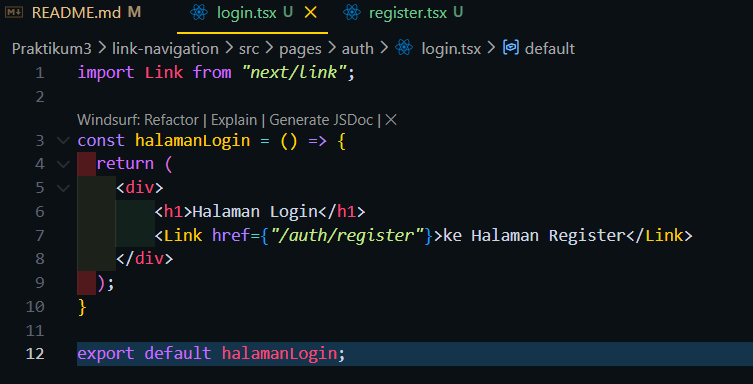 
-> Hasil 
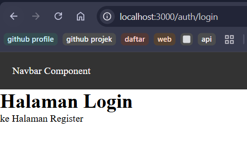 
->Register 
-> Kode 
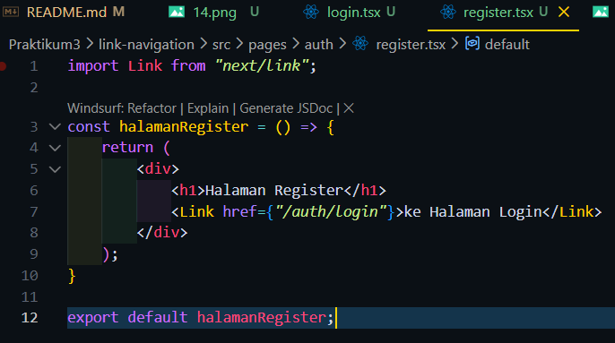 
-> Hasil 
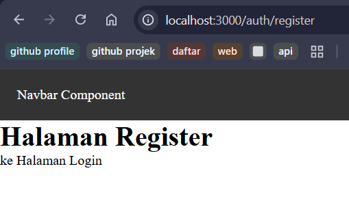  

7. Langkah 7 – Navigasi Imperatif (router.push) 
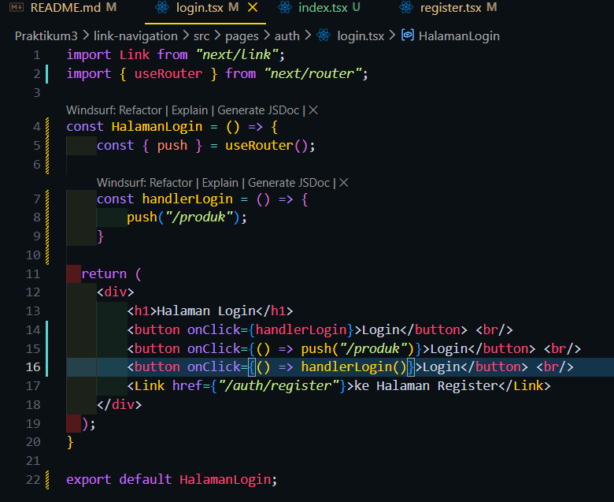 
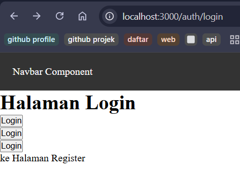 
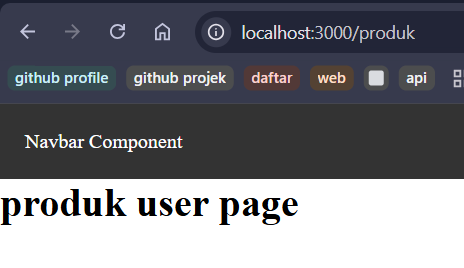  

8. Langkah 8 – Simulasi Redirect (Belum Login) 
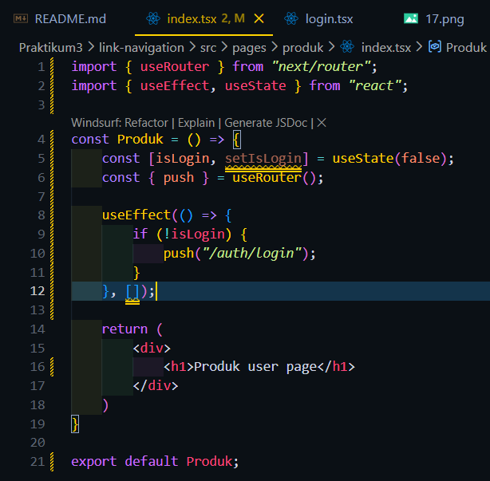  

Tugas1 
->kode 
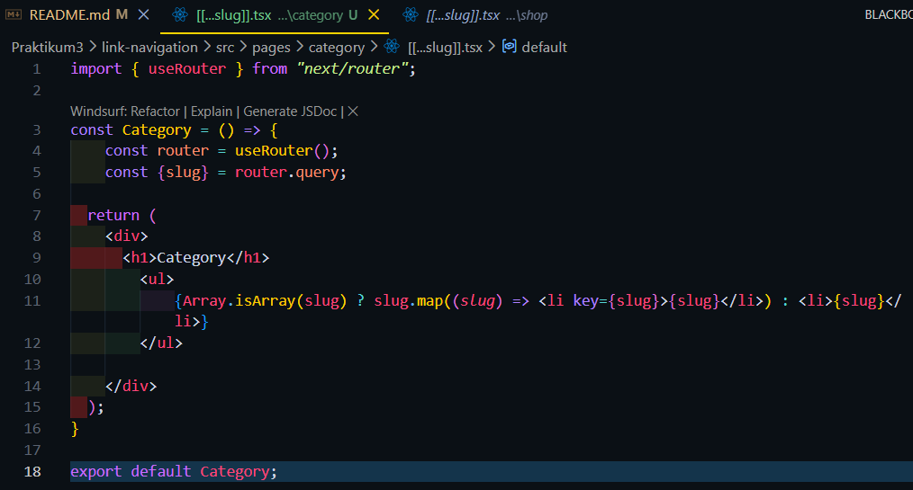 
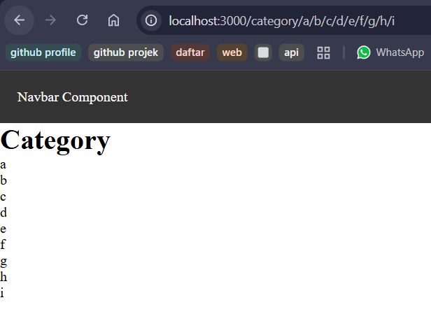  

Tugas2 
->kode 
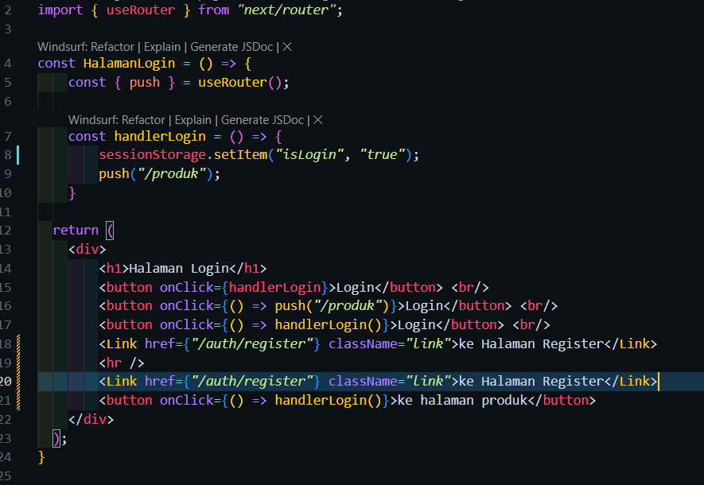 
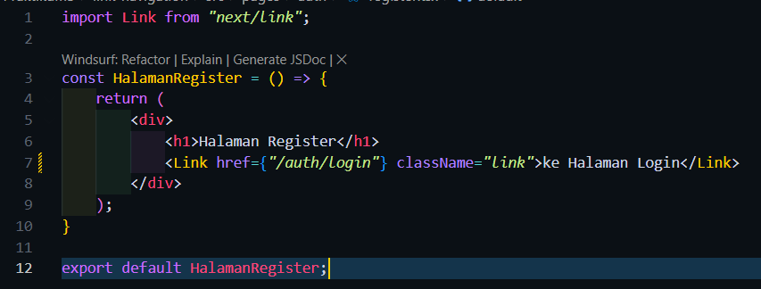 
->hasil 
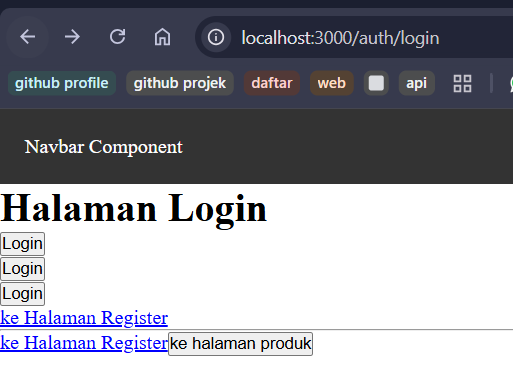 
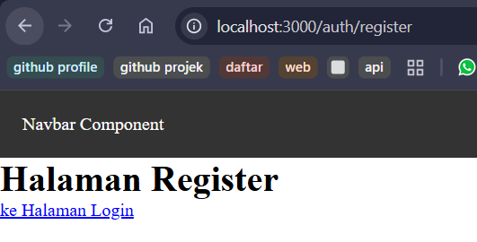 
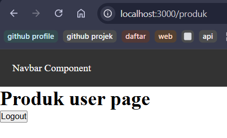  

Tugas3 
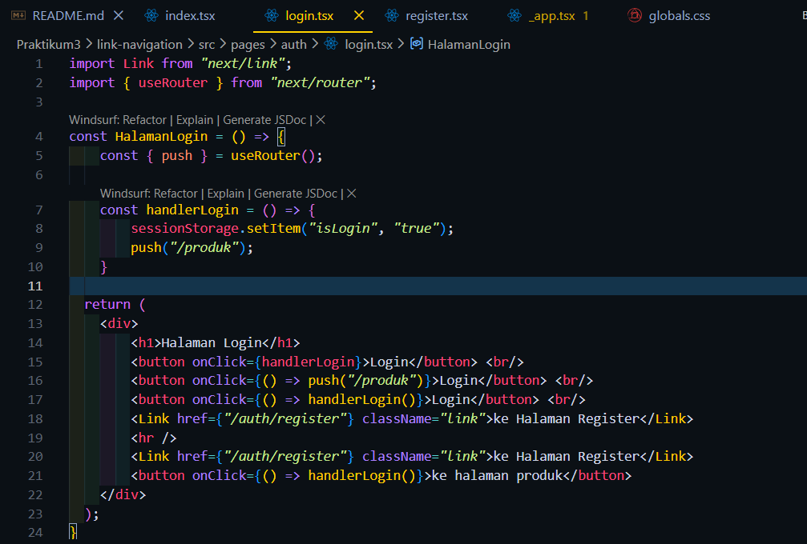 
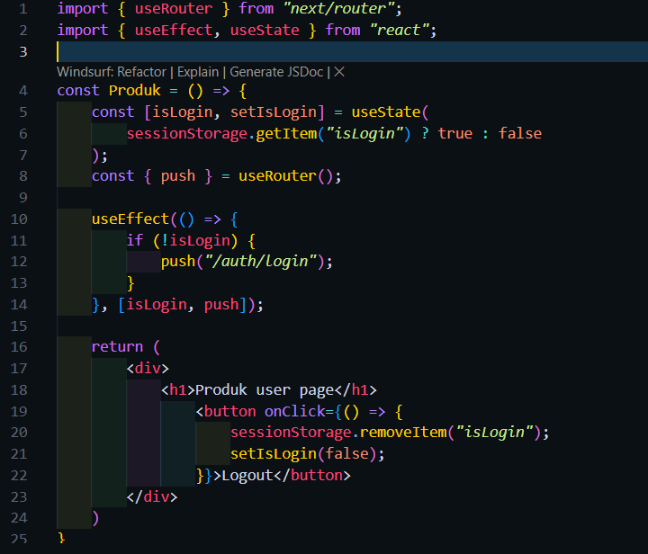  

F. Pertanyaan Evaluasi 
1. Apa perbedaan [id].js dan [...slug].js?
 -> jika [id] itu hanya bisa menangkap 1 parameter saja, sedangkan [...slug] bisa menangkap parameter tidak terbatas
2. Mengapa slug berbentuk array?
 -> karena slug menangkap lebih dari 1 parameter
3. Kapan sebaiknya menggunakan Link dan router.push()?
 -> Link digunakan saat melakukan perpindahan halaman tanpa ada logika tambahan sedangkan router.push() digunakan jika ada logika sebeum ke halaman yang dituju contohnya seperti form, login, register
4. Mengapa navigasi Next.js tidak me-refresh halaman?
 -> Karena Next.js menggunakan Client-Side Navigation