1. Global CSS

2. CSS Module (Local Scope)

3. Styling untuk Pages (CSS Module)

Hasil

4. Conditional Rendering Navbar(Tanpa Navbar di Login)

Hasil :

5. Refactoring Struktur Project (Best Practice)

Hasil tetap sama

6. Inline Styling (CSS-in-JS)

Hasil :

7. Kombinasi Global CSS + CSS Module

Hasil:

8. SCSS (SASS)

Hasil:

9. Tailwind CSS

Hasil:

Tugas1
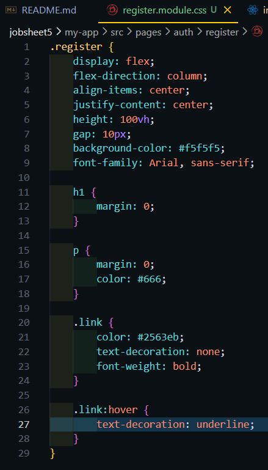
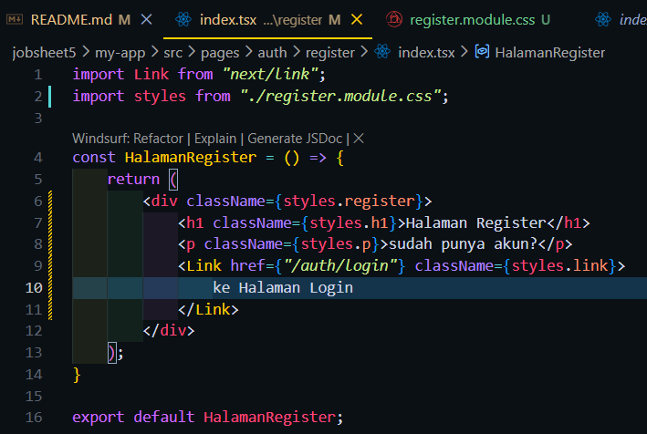
Hasil
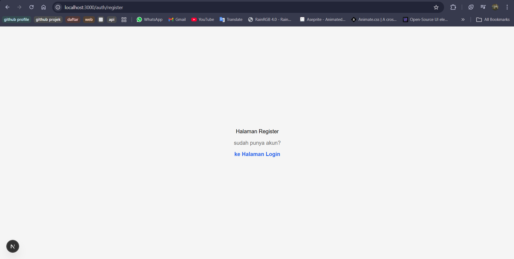

Tugas2
Struktur Folder
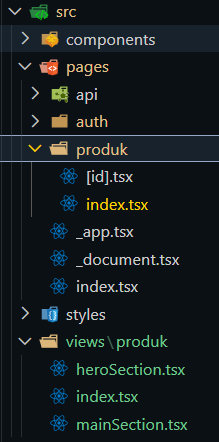
Kode
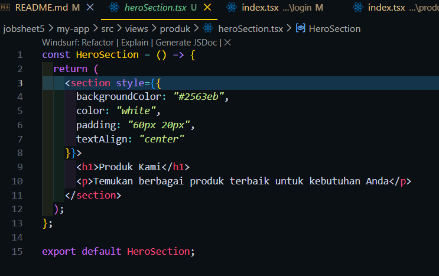
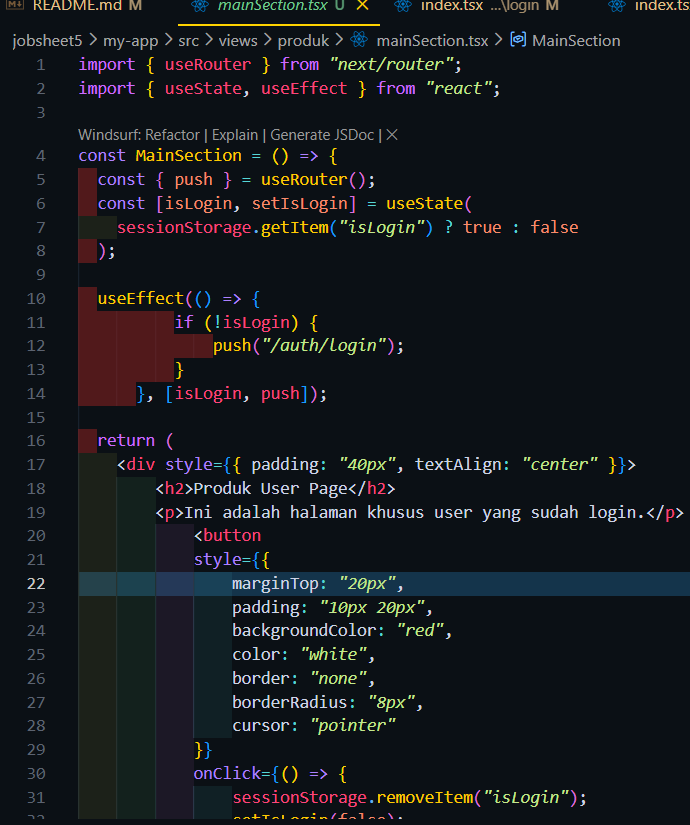
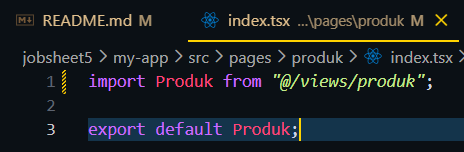
Hasil
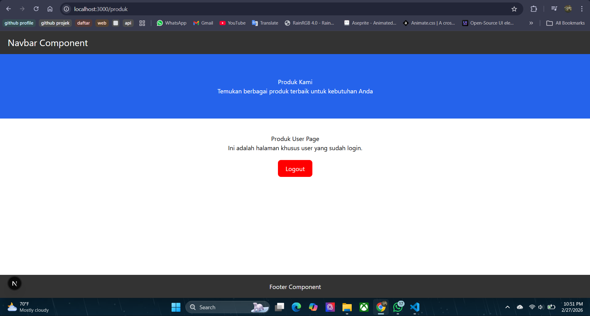

Tugas3
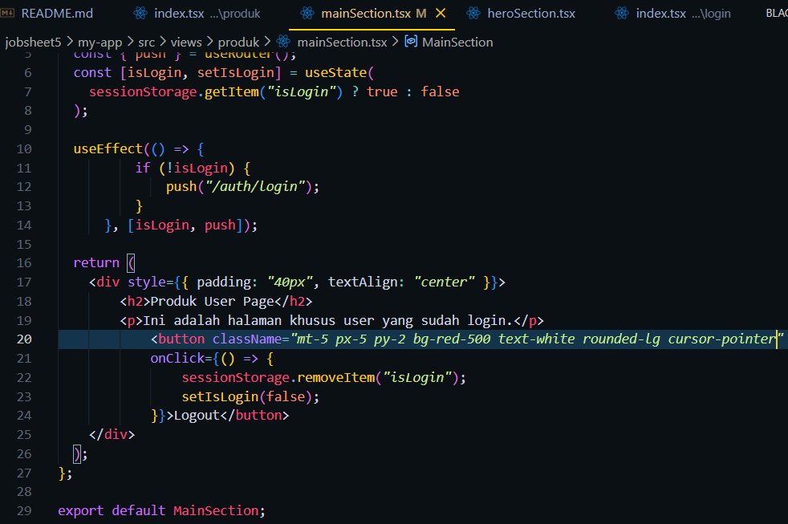
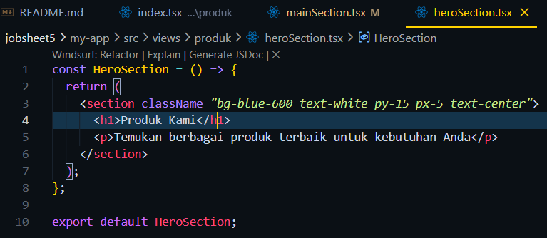
Hasil
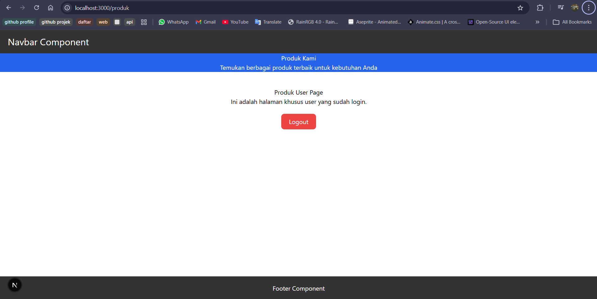

F. Pertanyaan Refleksi
1. Kapan sebaiknya menggunakan CSS Module dibanding Global CSS?
-> menggunakan css module ketika Styling hanya digunakan oleh 1 komponen tertentu, Ingin menghindari bentrok nama class
-> menggunakan css global ketika mereset CSS, Styling dasar seperti body dan html, Theme global (font, warna utama, dll)
2. Apa kelemahan inline styling?
-> Tidak bisa menggunakan pseudo-class, Tidak bisa menggunakan media query, Kode jadi tidak rapi jika styling banyak, tidak reusable
3. Mengapa SCSS cocok untuk project skala besar?
-> karena memiliki fitur variabel, function, partials & modularisasi oleh karena itu Kode jadi lebih terstruktur, Mudah dikelola, reusable, Lebih scalable
4. Apa keunggulan Tailwind dibanding CSS tradisional?
-> Lebih cepat development, langsung styling di file tsx tanpa perlu keluar dari file tsx, Tidak perlu bikin banyak file CSS, Minim konflik class