1. Global CSS
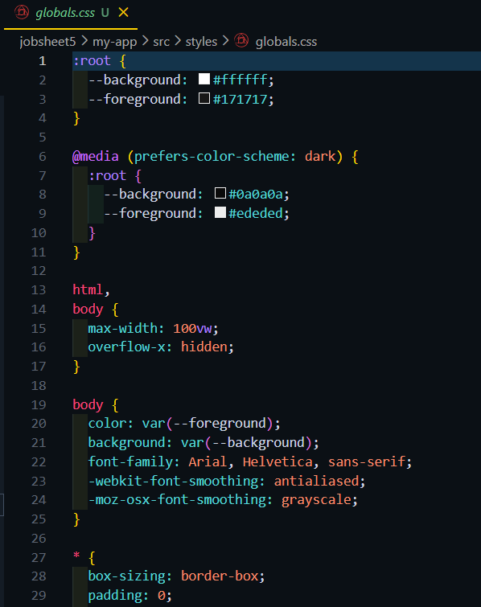
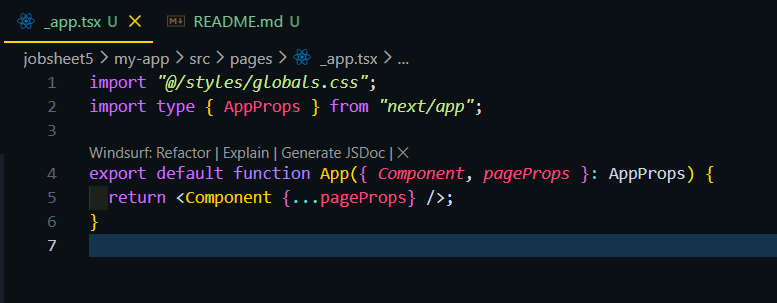

2. CSS Module (Local Scope)
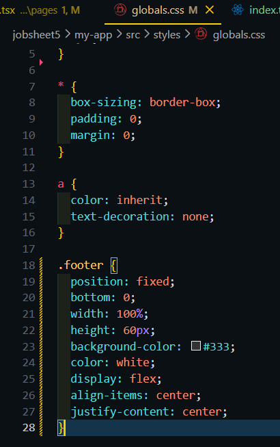
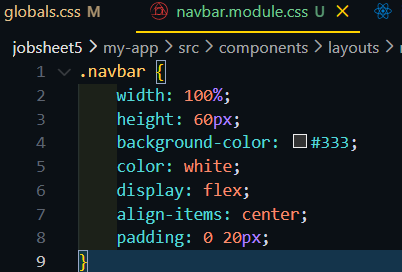
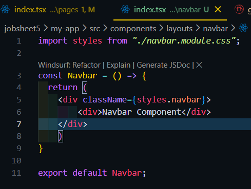
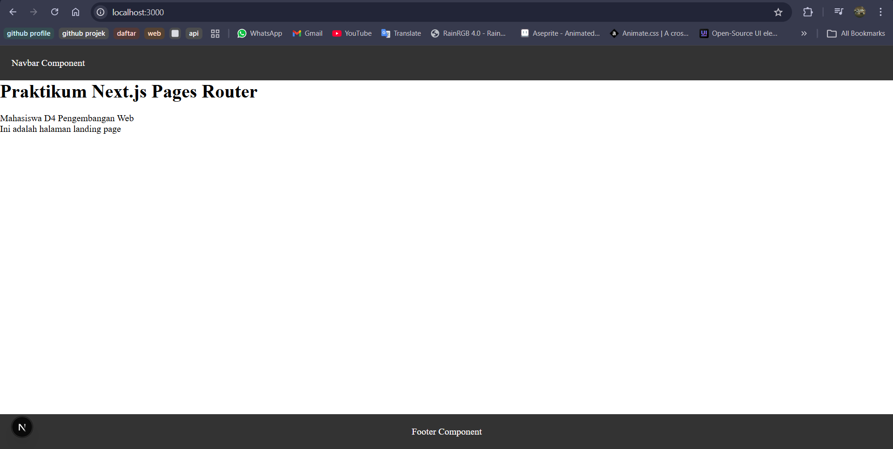

3. Styling untuk Pages (CSS Module)
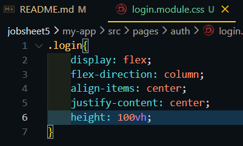
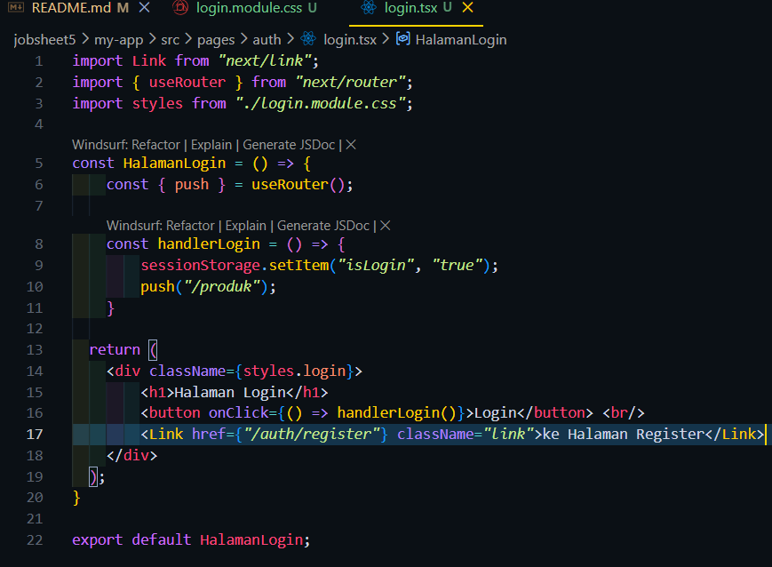
Hasil
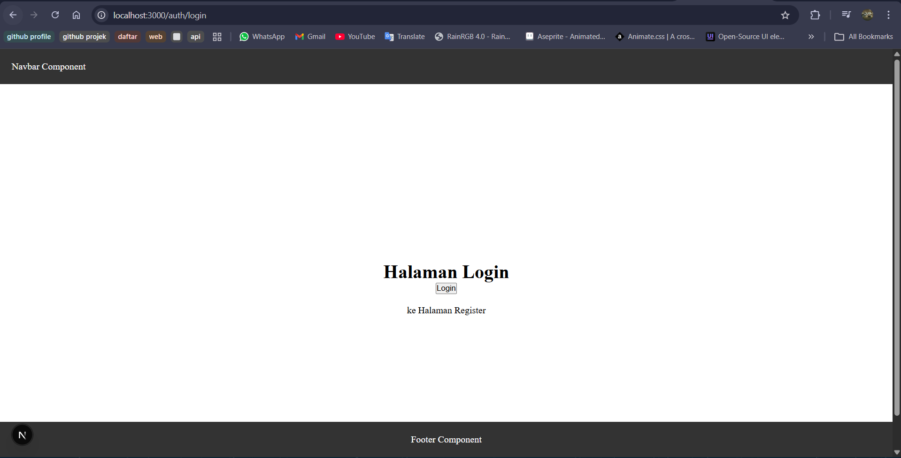

4. Conditional Rendering Navbar(Tanpa Navbar di Login)
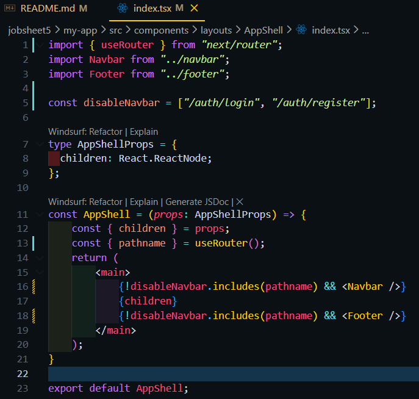
Hasil :

5. Refactoring Struktur Project (Best Practice)
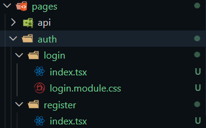
Hasil tetap sama
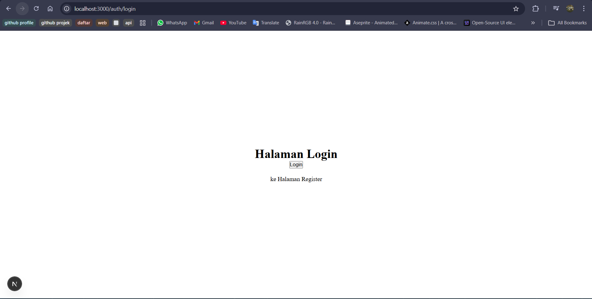

6. Inline Styling (CSS-in-JS)
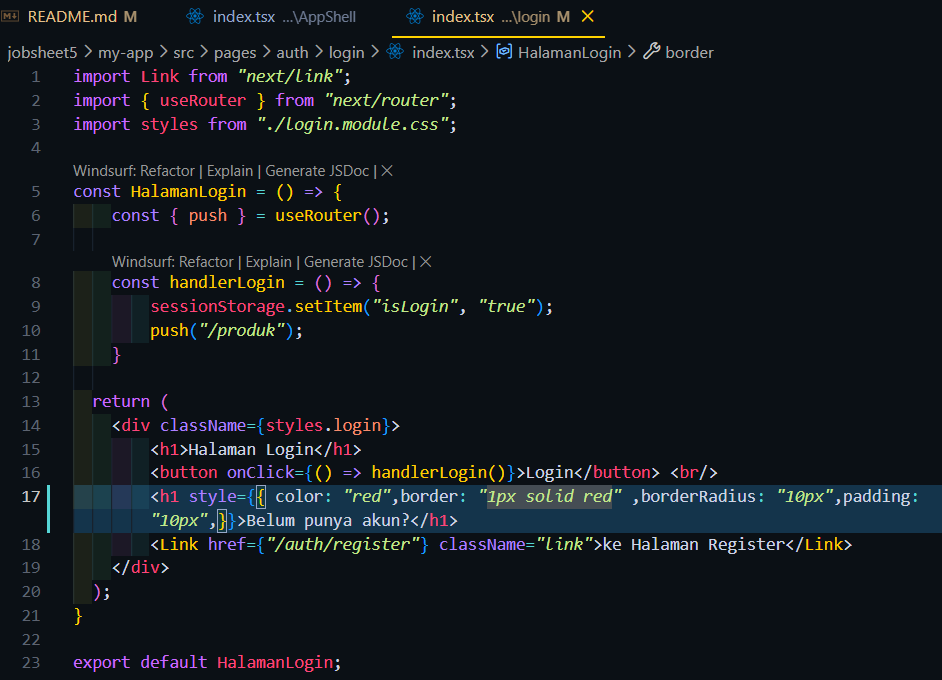
Hasil :
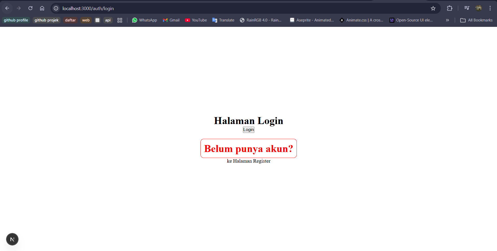

7. Kombinasi Global CSS + CSS Module
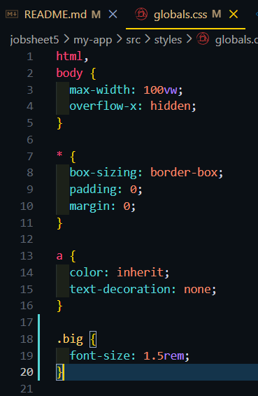
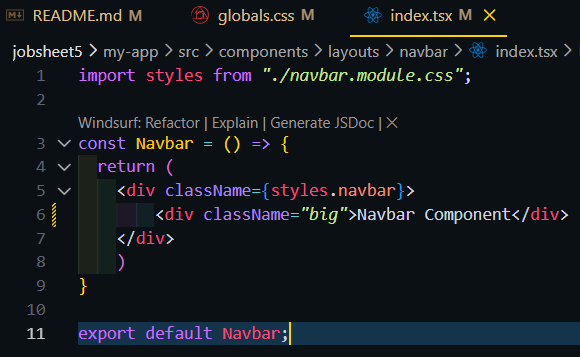
Hasil:
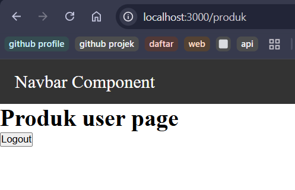

8. SCSS (SASS)
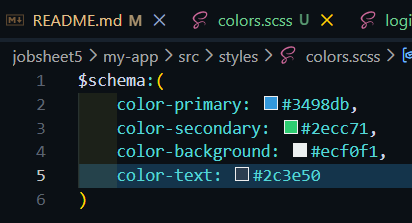
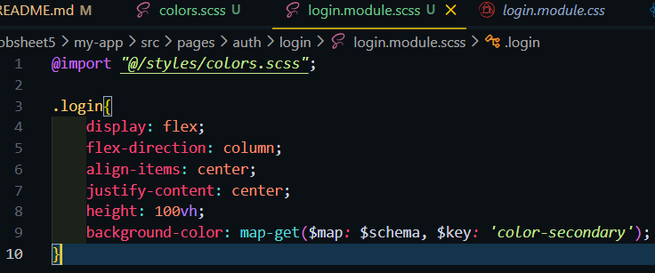
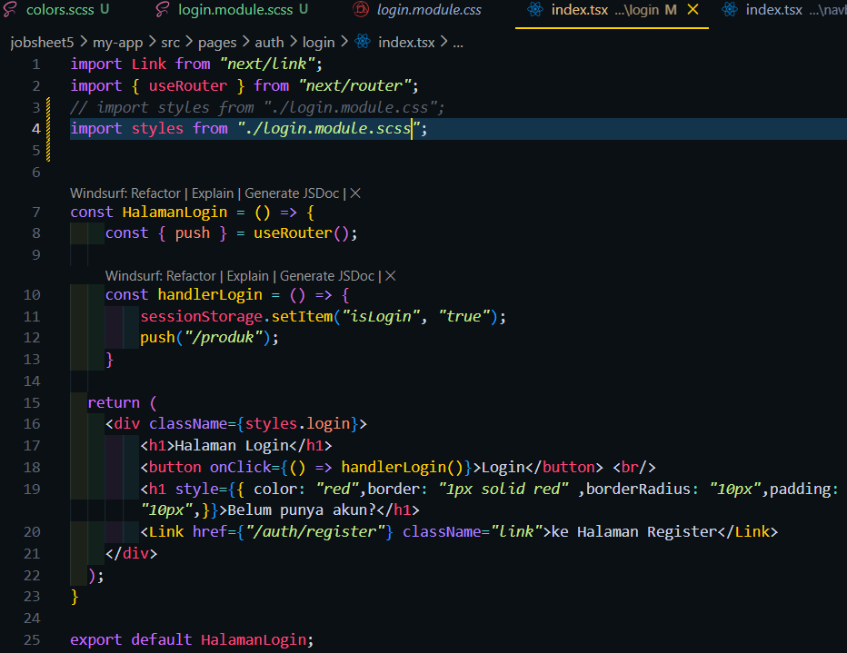
Hasil:
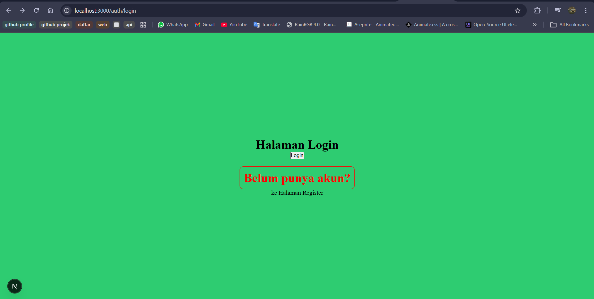

9. Tailwind CSS
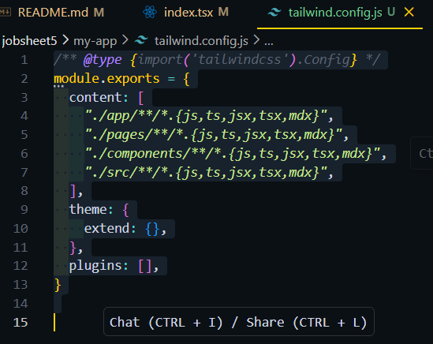
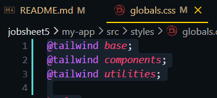
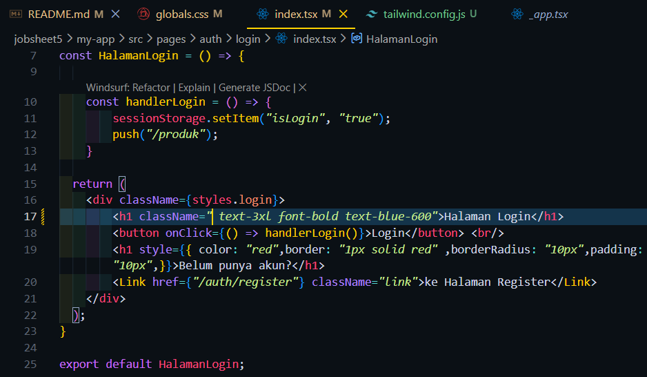
Hasil:
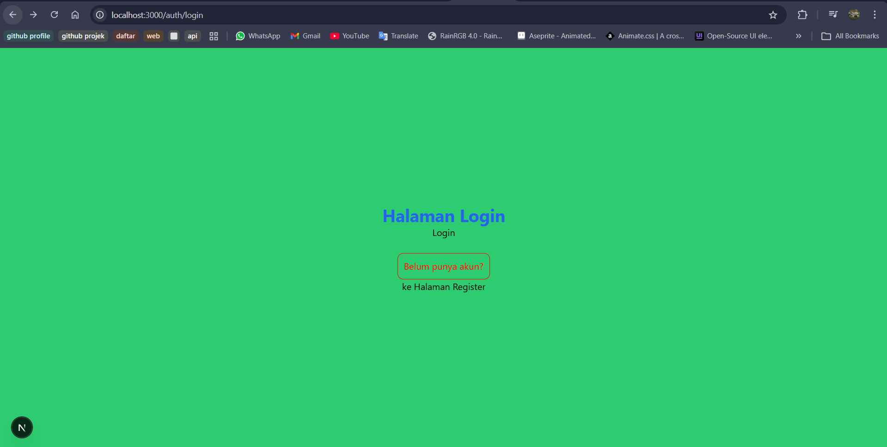