1. Langkah 1 – Menjalankan Project

2. Langkah 2 – Membuat Custom Document

3. Langkah 3 – Pengaturan Title per Halaman

Hasil:

4. Langkah 4 – Membuat Custom Error Page (404)

Hasil:

5. Langkah 5 – Styling Halaman 404

Hasil:

6. Langkah 6 – Menampilkan Gambar dari Folder Public
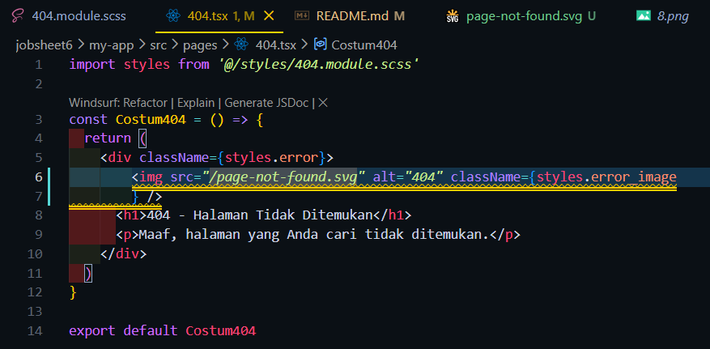
Hasil :
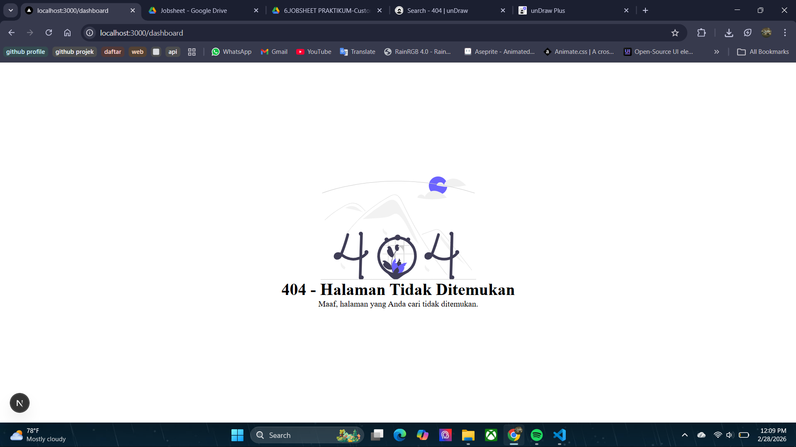

Tugas1
Halaman 404
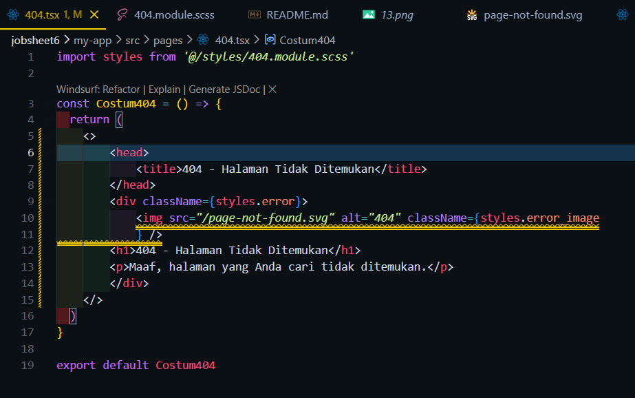
Hasil :
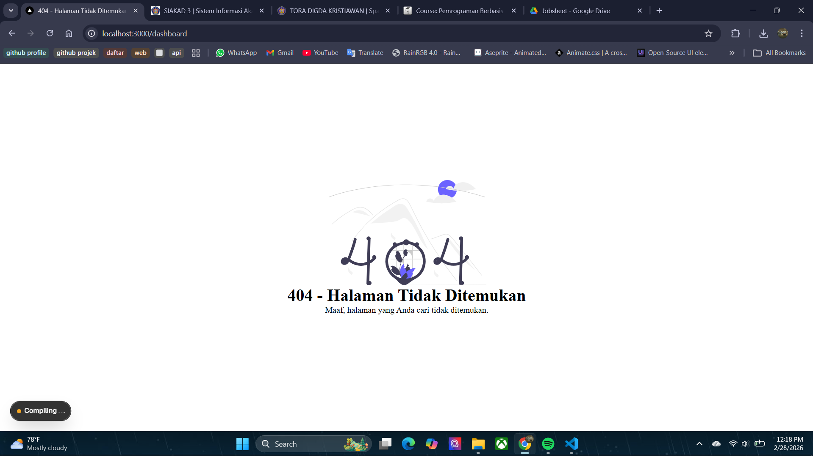

Halaman Landing Page
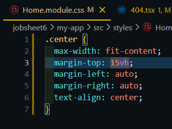
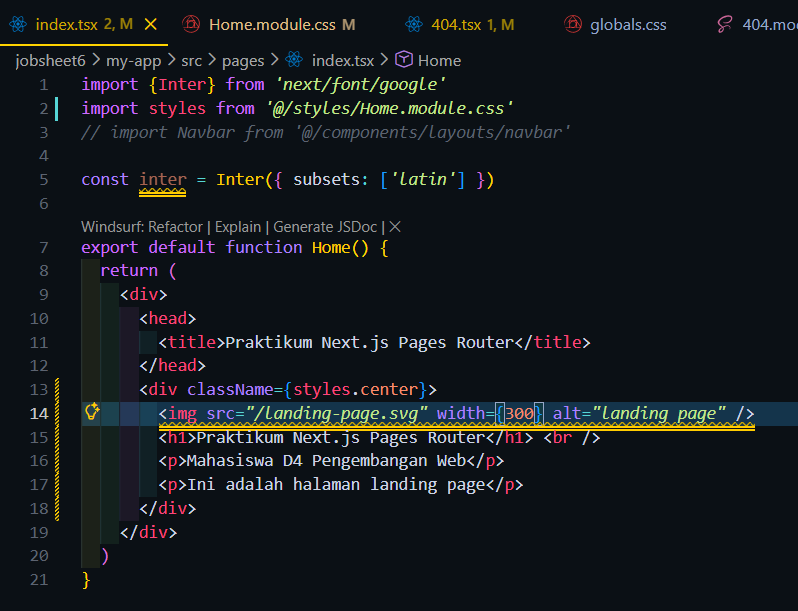
Hasil :
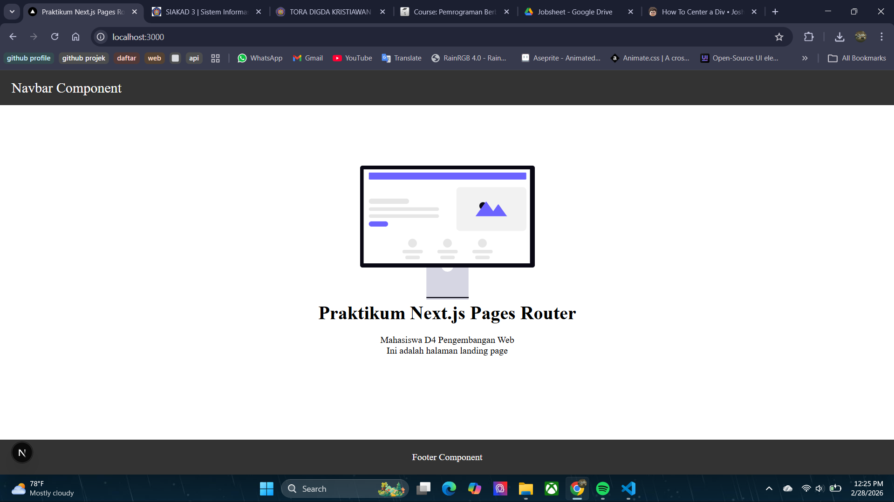

Tugas2
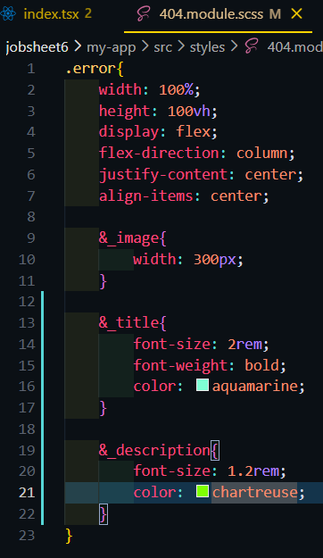
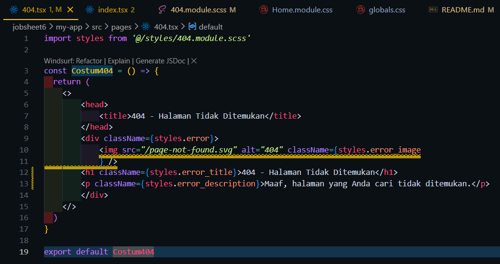

Hasil :
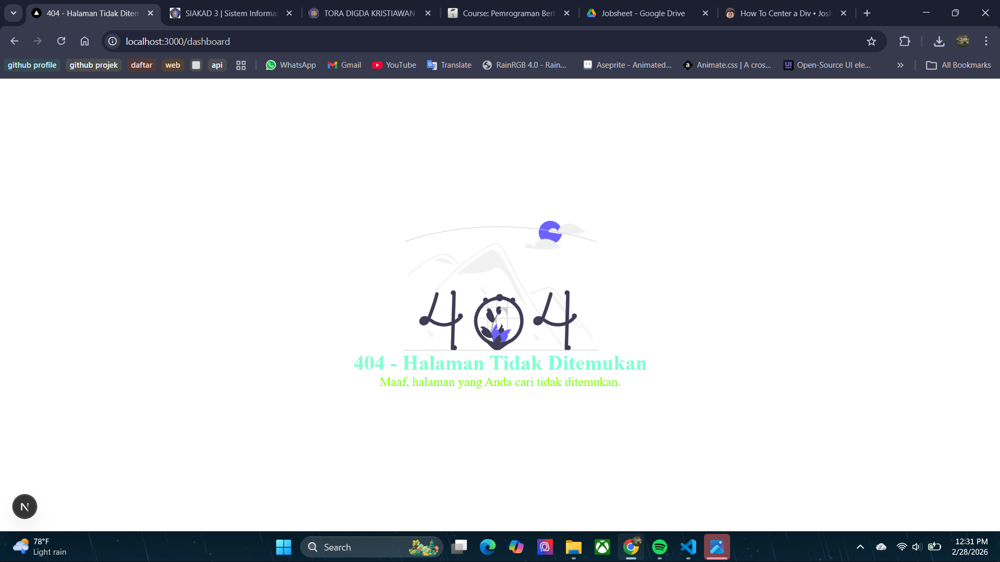

Tugas3
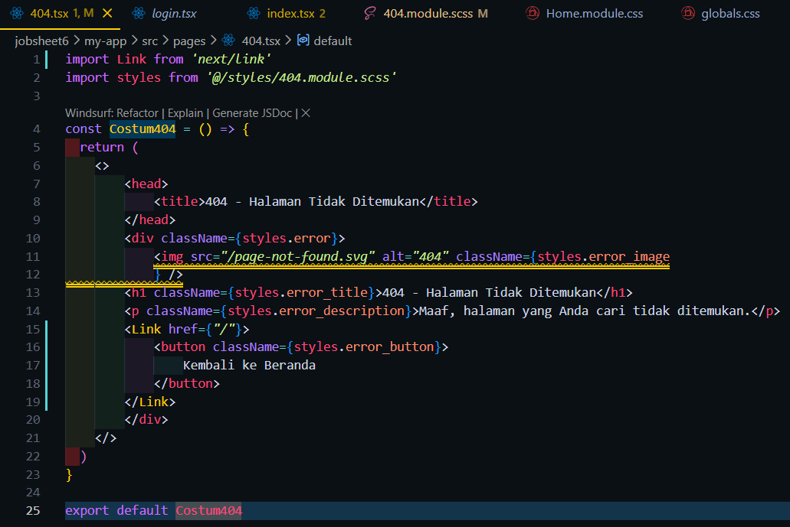
Hasil
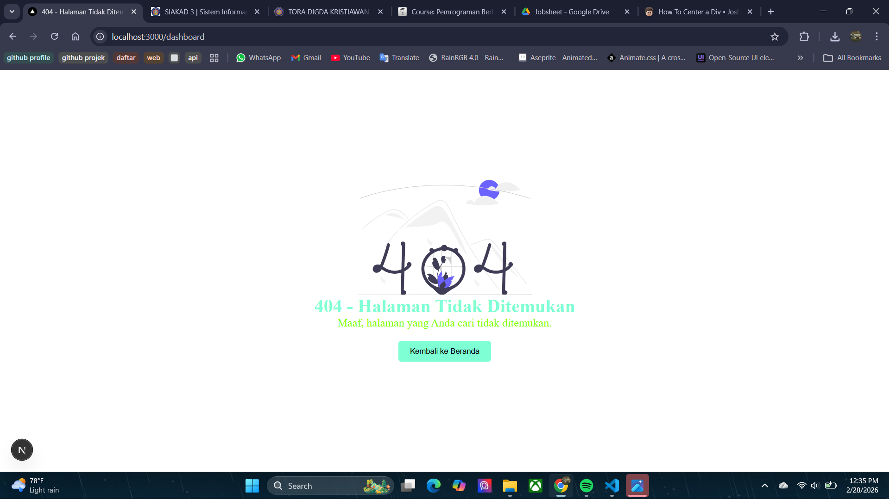

F. Pertanyaan Evaluasi
1. Apa fungsi utama _document.js?
-> untuk mengedit struktur HTML dasar dari seluruh aplikasi Next.js
2. Mengapa <title> tidak disarankan di _document.js?
-> Karena _document.js hanya di-render sekali di server saat halaman pertama dimuat.Jadi semua title halaman akan sama
3. Apa perbedaan halaman biasa dan halaman 404.js?
-> halaman biasa muncul saat user memasukkan url yang benar sedangkan untuk 404 akan muncul jika url tidak menemukan file atau url salah
4. Mengapa folder public tidak perlu di-import?
-> karena semua yang berada di folder public bisa langsung digunakan tanpa perlu di import