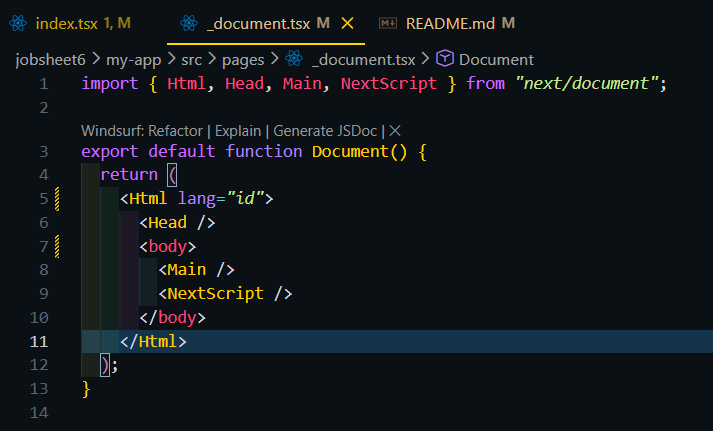
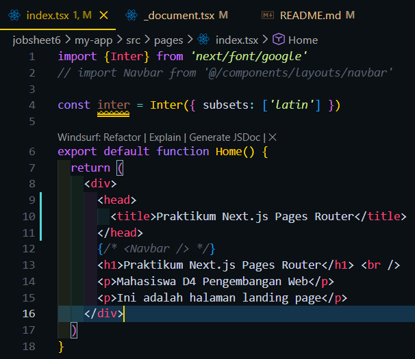
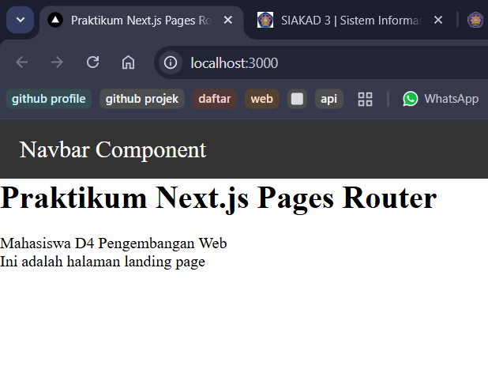
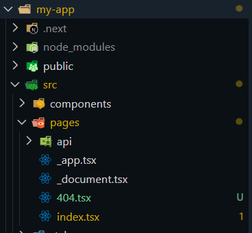
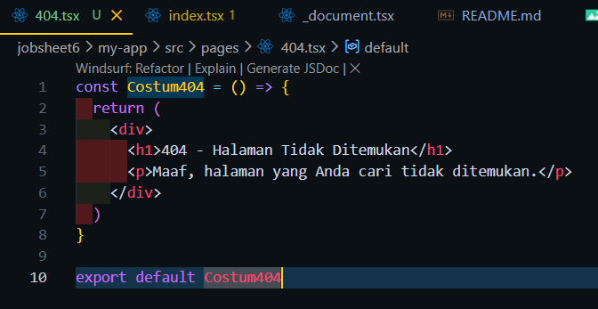
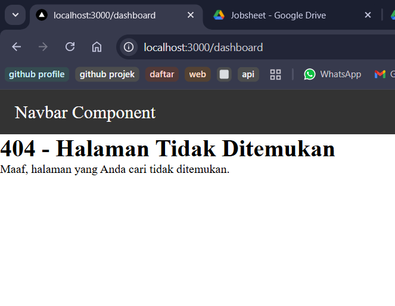
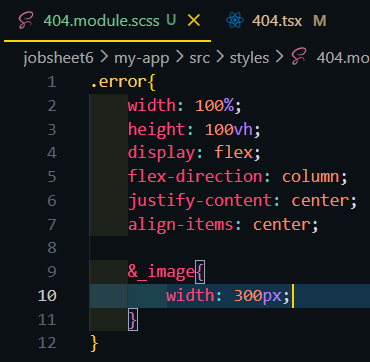
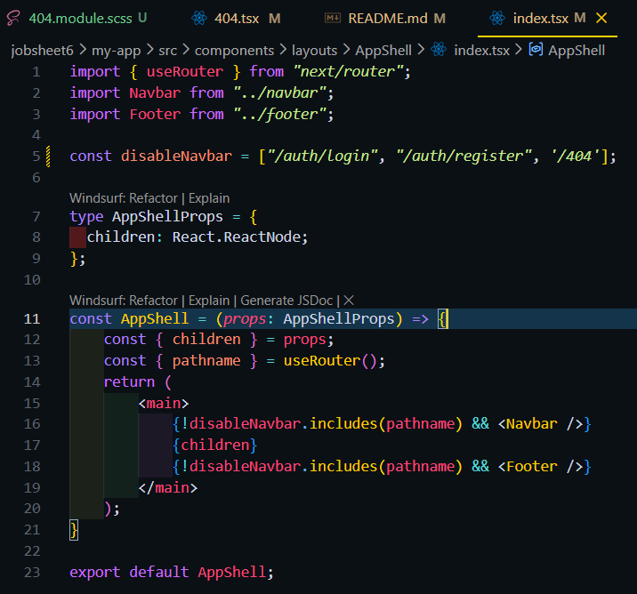
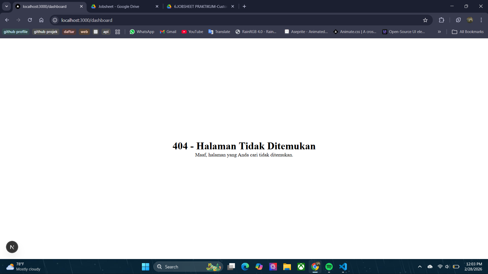

1. Langkah 1 – Menjalankan Project

2. Langkah 2 – Membuat Custom Document

3. Langkah 3 – Pengaturan Title per Halaman

Hasil:

4. Langkah 4 – Membuat Custom Error Page (404)

Hasil:

5. Langkah 5 – Styling Halaman 404

Hasil:
