1. Langkah 1 – Menjalankan Project
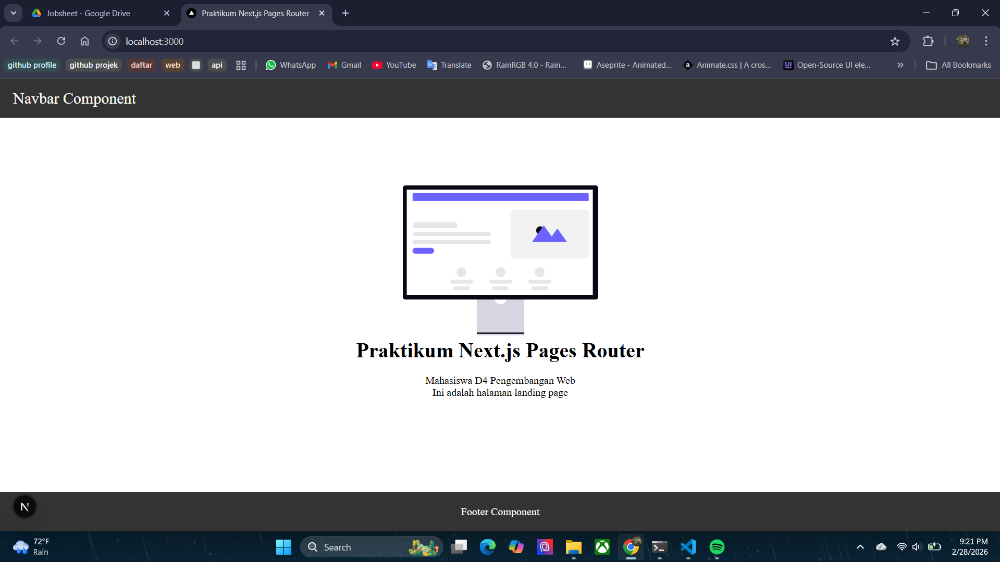

2. Langkah 2 – Membuat API Produk
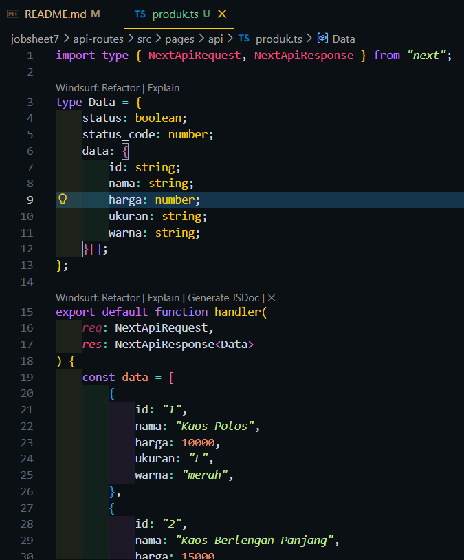
Hasil :
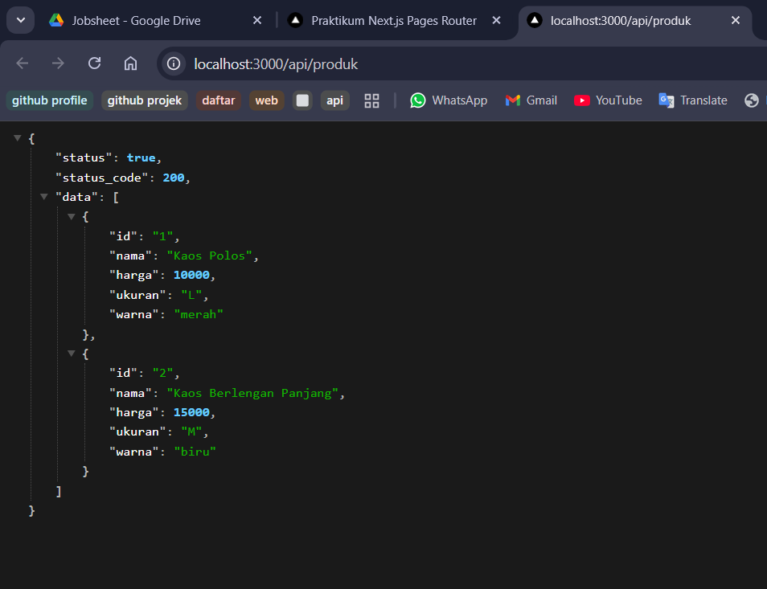

3. Langkah 3 – Fetch Data API di Frontend
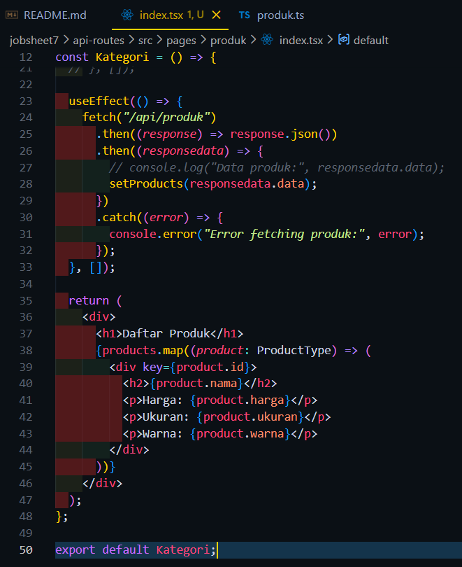
Hasil :
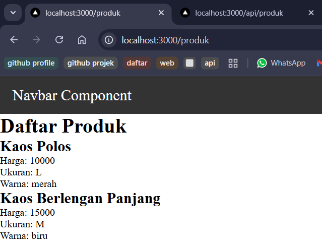

4. Langkah 5 – Setup Firebase

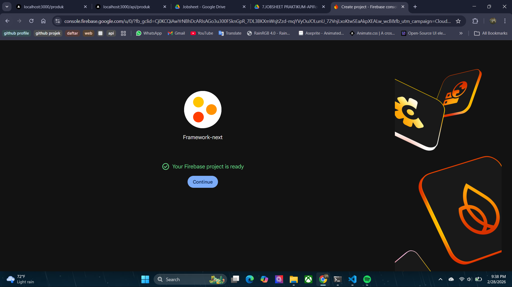
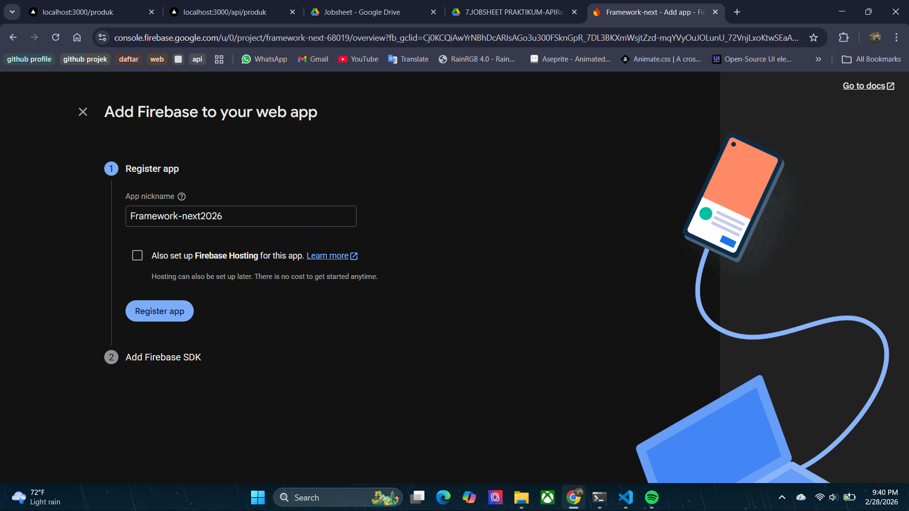
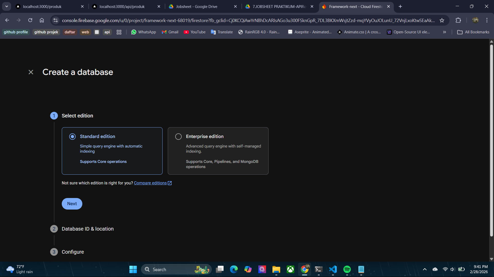
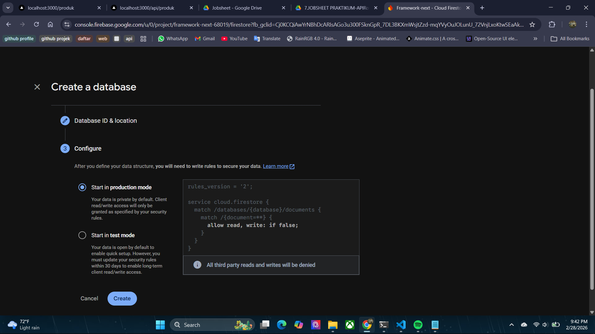
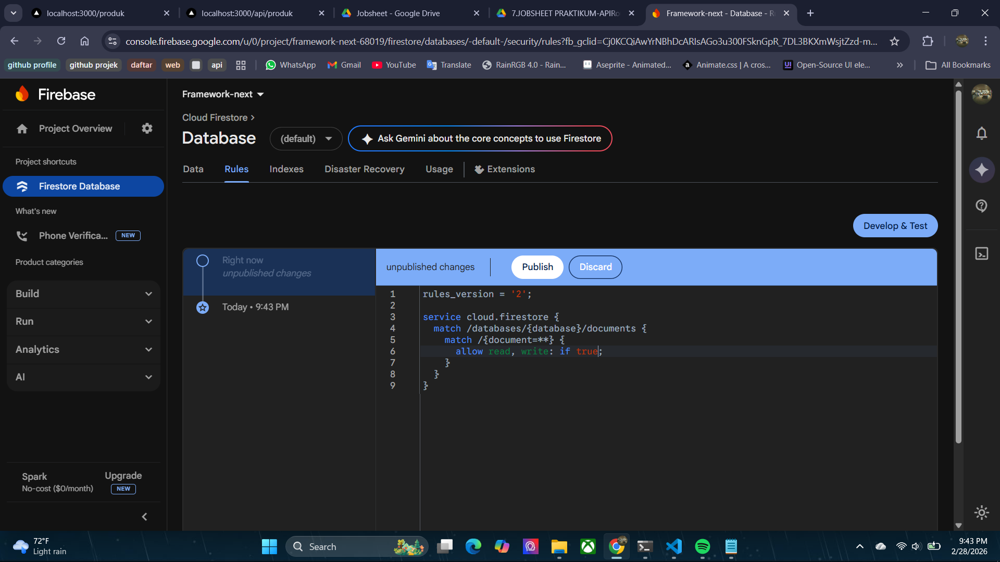
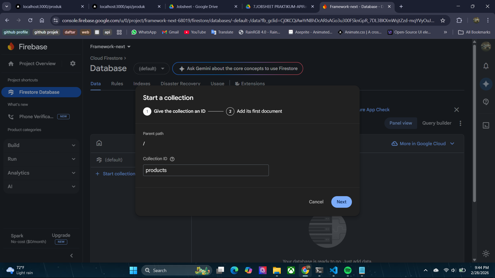
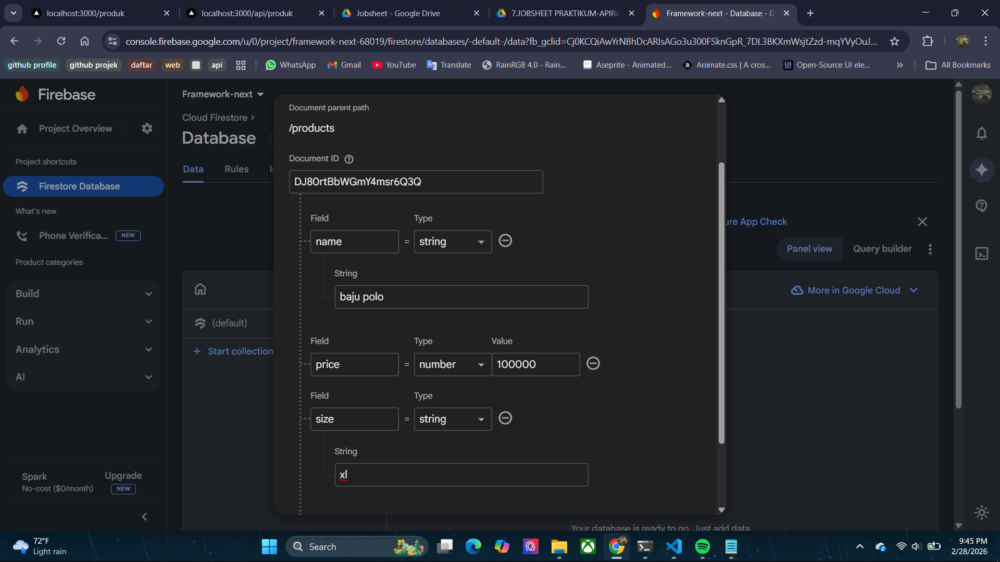
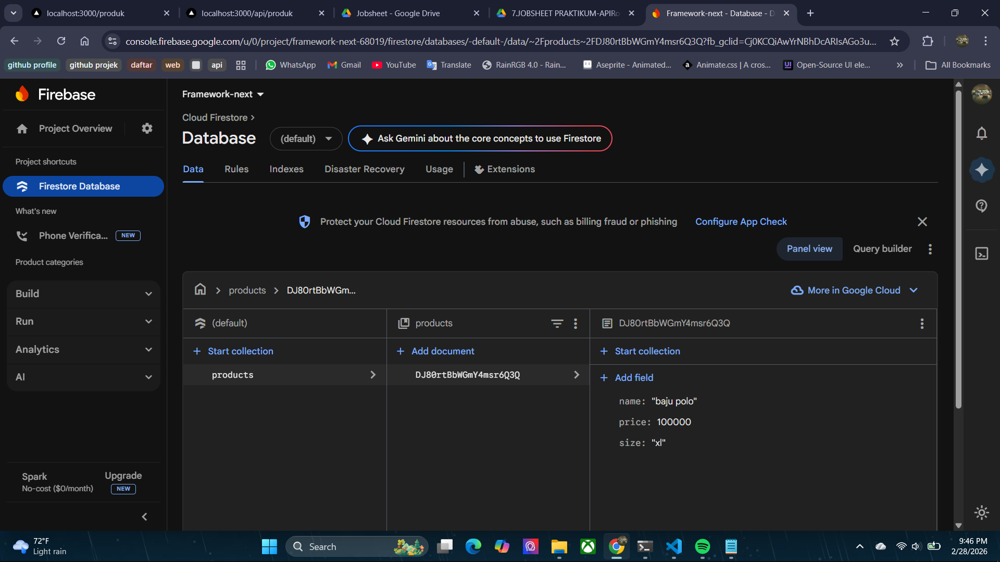

5. Langkah 6 – Install Firebase
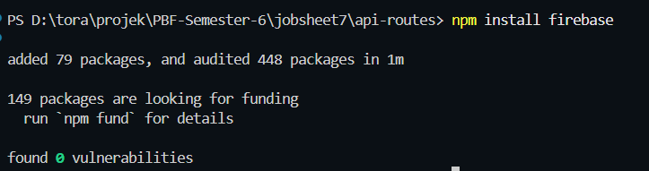
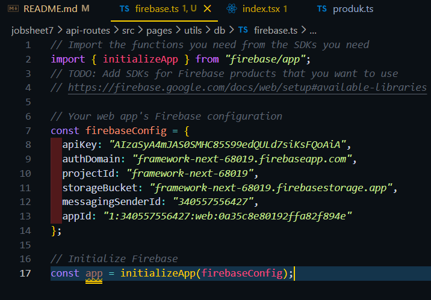

6. Langkah 7 – Konfigurasi Environment Variable agar credensial firebase tidak dapat dilihat saat dipush
di repository
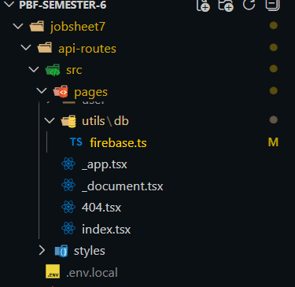
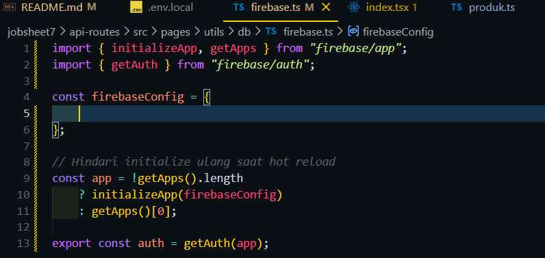

7.Langkah 8 – Konfigurasi Firebase
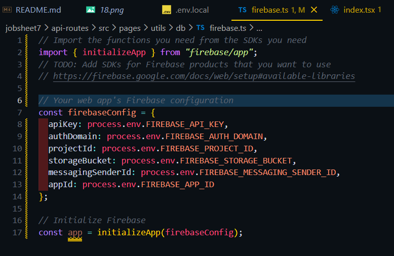
