1. Bagian 1 – Setup Data Produk

2. Bagian 2 – Implementasi CSR dengan useEffect
kode :

Hasil :

kode :

Hasil :

2. Bagian 3 – Implementasi Skeleton Loading
Kode :
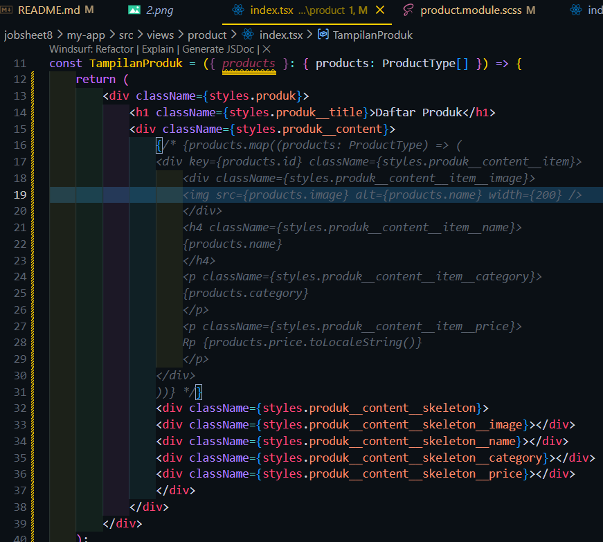
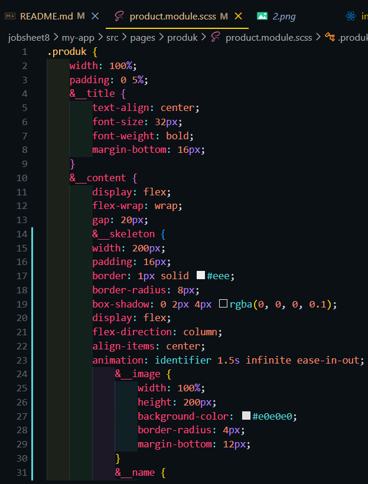
Hasil :
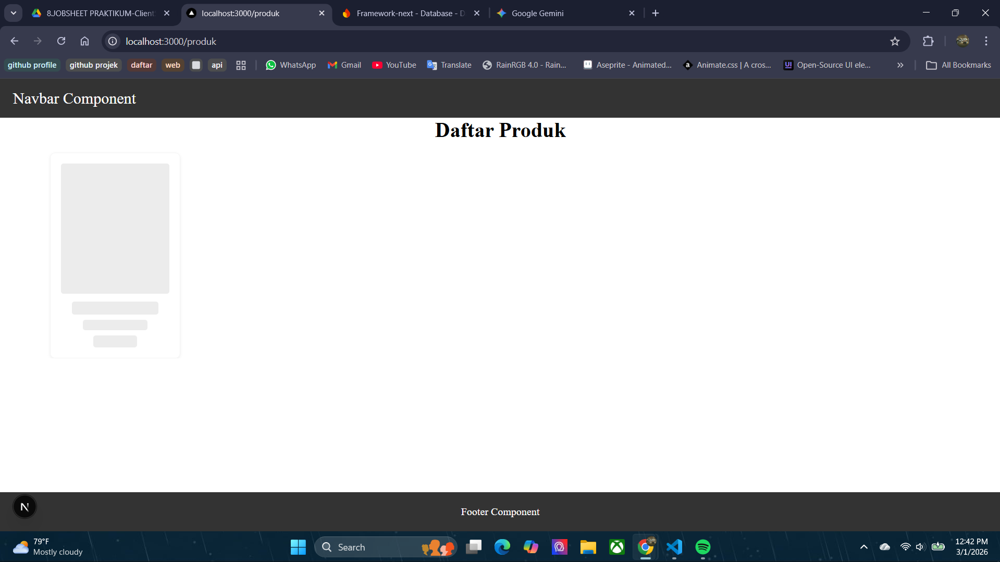
Kode :
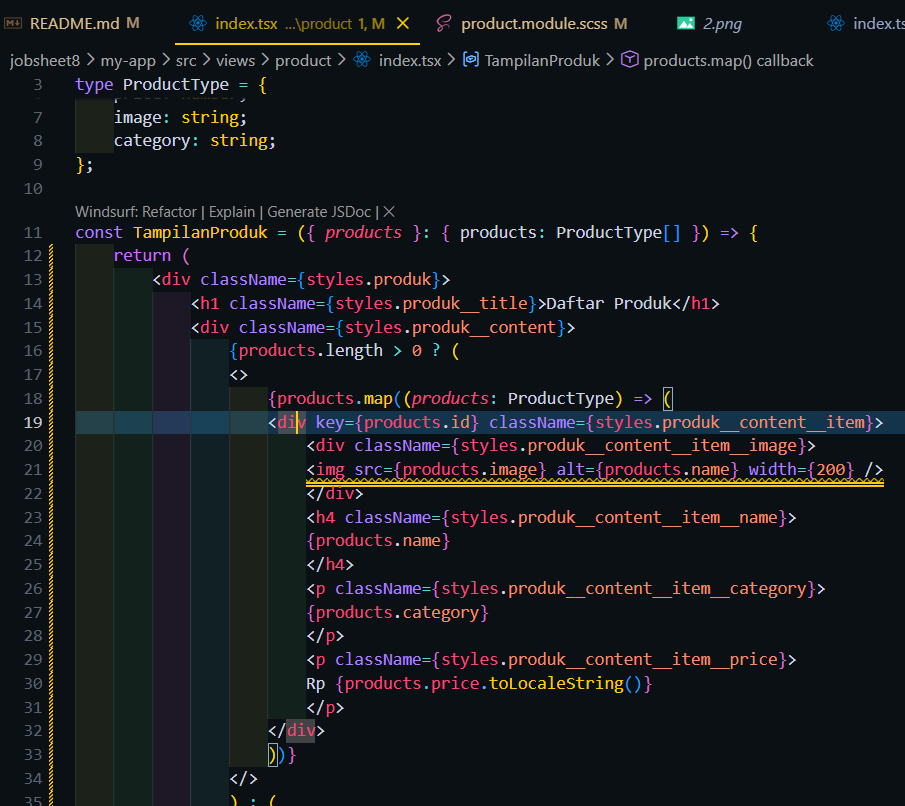
Hasil:

3. Bagian 5 – Implementasi SWR
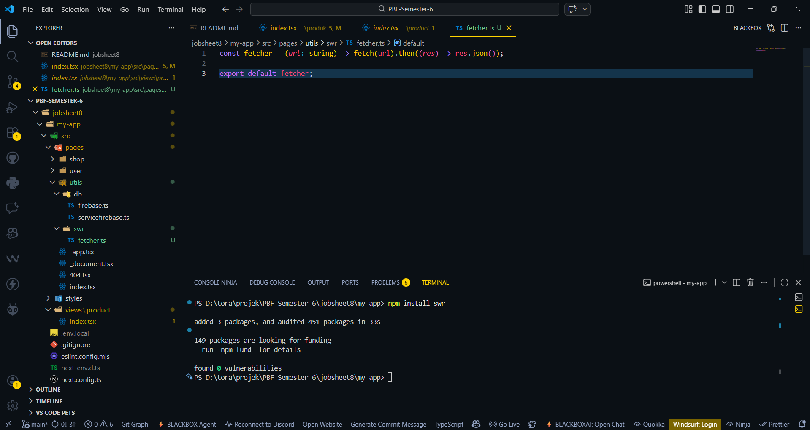
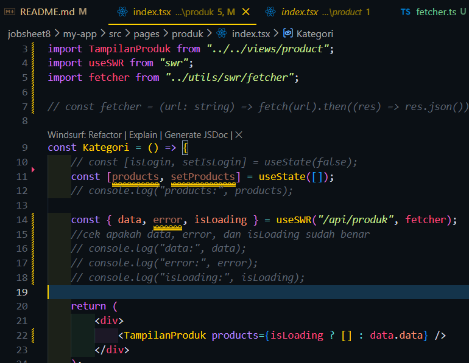
Hasil :
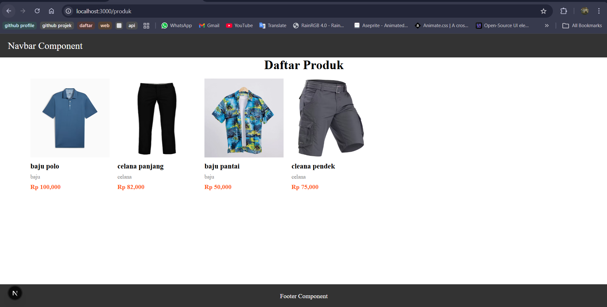

Tugas 1
Perbedaan Client Side Rendering, Server Side Rendering, Static Site Generation
-> CSR adalah metode rendering di mana proses pengambilan data dan penampilan konten dilakukan di sisi browser user setelah halaman dimuat
-> SSR adalah metode rendering di mana server memproses dan mengambil data terlebih dahulu, kemudian mengirimkan halaman HTML yang sudah lengkap ke browser user
-> SSG adalah metode rendering di mana halaman sudah dibuat dan di-generate saat proses build aplikasi

Tugas 2
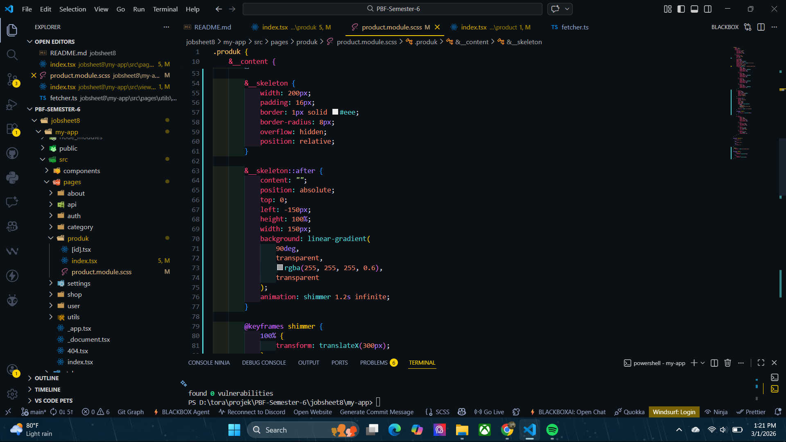
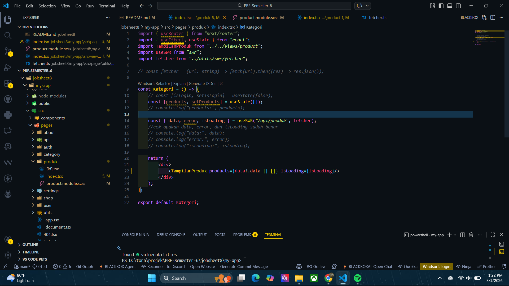
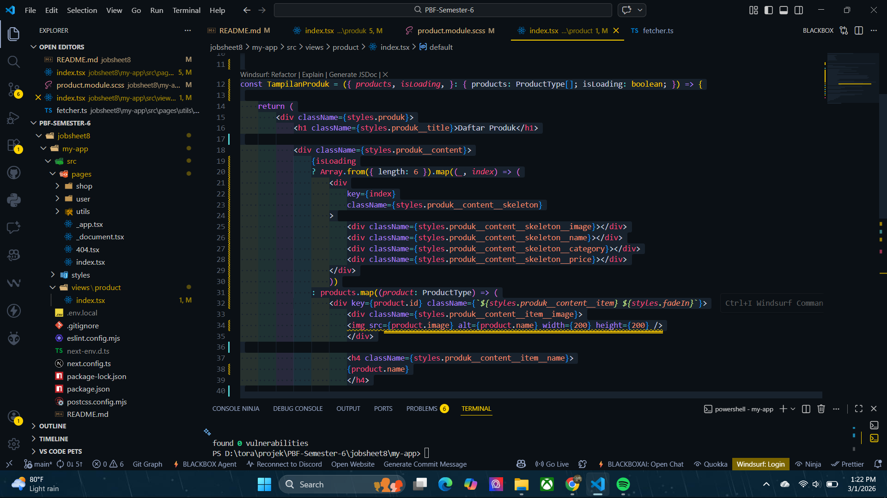
Hasil :
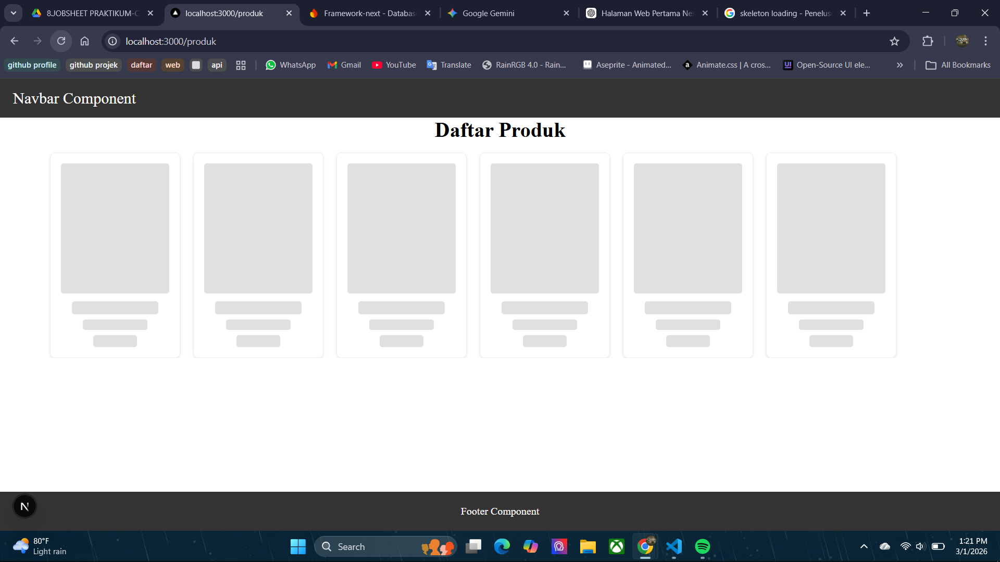