Bagian 1 – Setup Halaman SSR

Hasil :
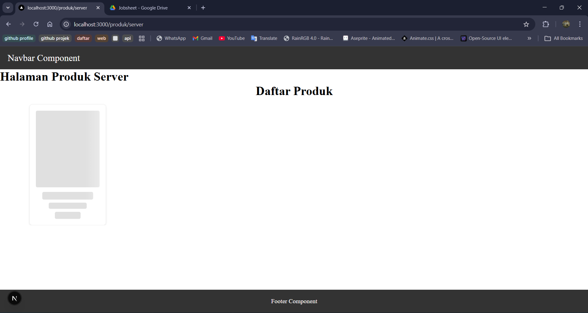

Bagian 2 – Implementasi getServerSideProps pada server.tsx
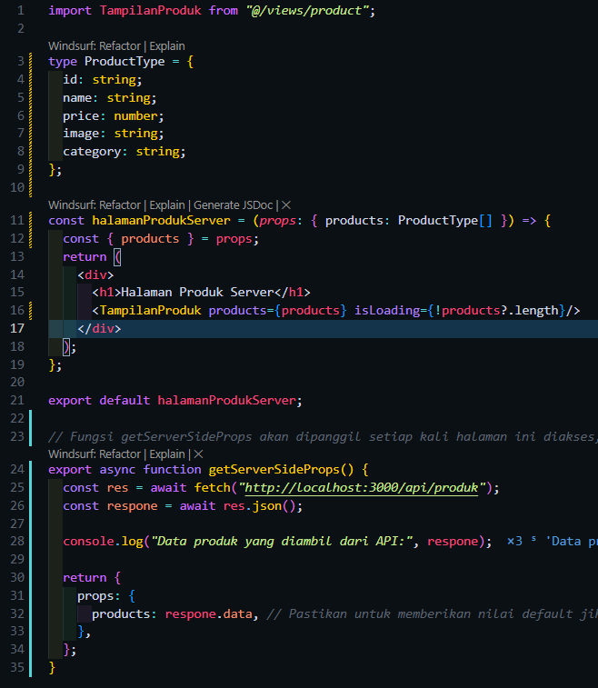
Hasil :
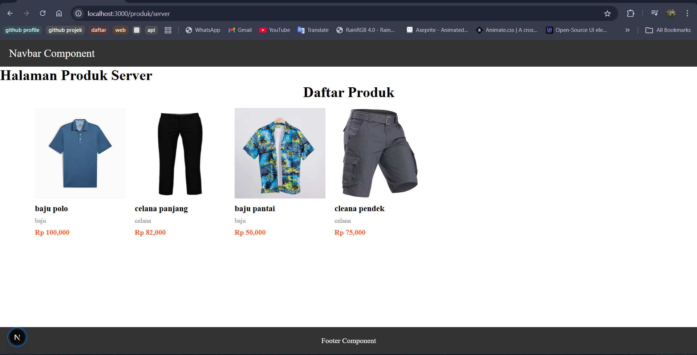

Bagian 3 – Refactor Type ( produk type )
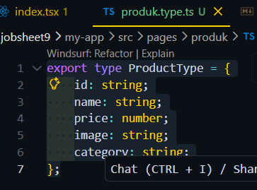
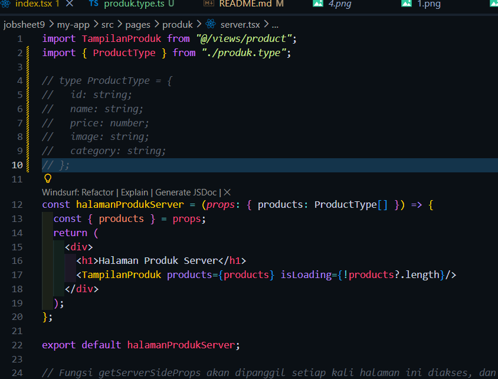
Hasil :
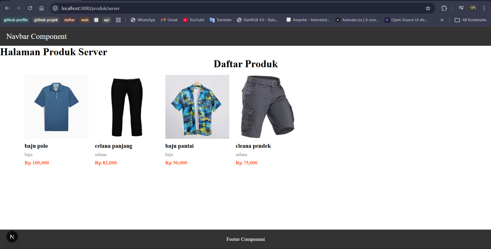

Bagian 4 – Uji Perbedaan SSR vs CSR
Uji 1 – Skeleton
-> Hasil CSR
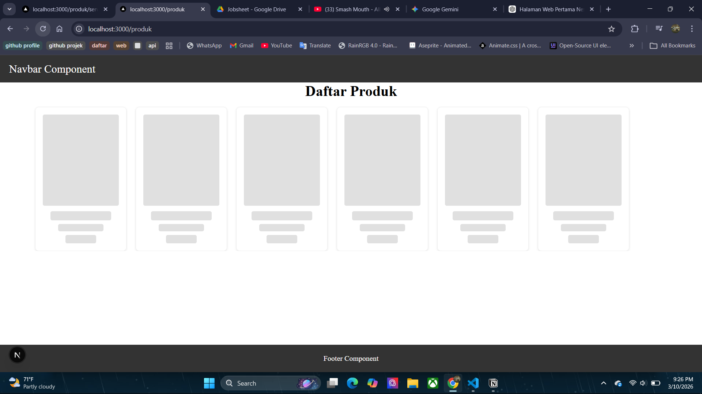
muncul sekeleton terlebih dahulu sebelum muncul data

-> Hasil SSR
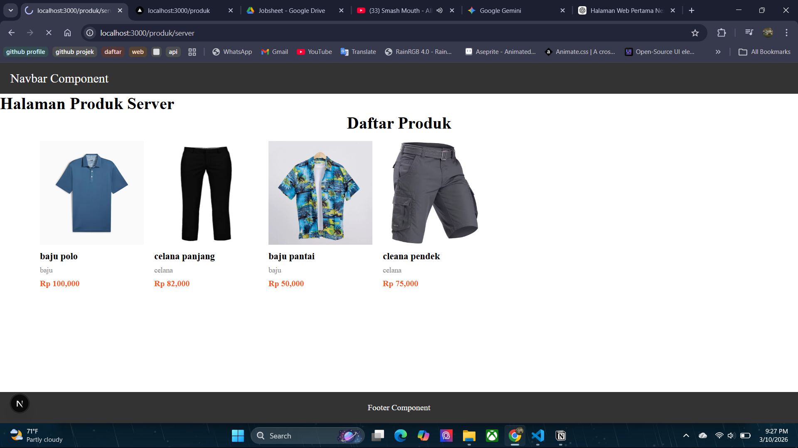
tidak muncul sekeleton sebelum muncul data

Uji 2 – Network Tab
-> Hasil CSR
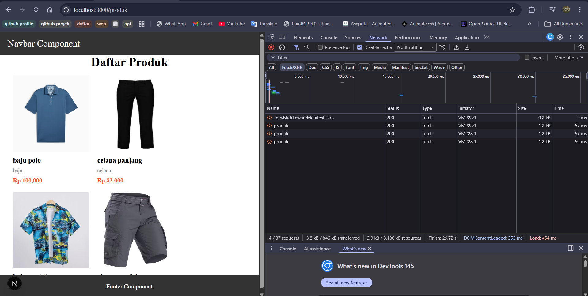

-> Hasil SSR
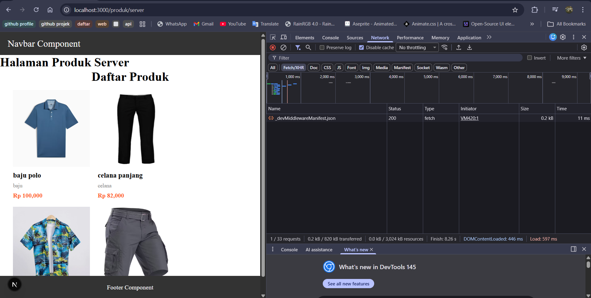

Uji 3 – Response HTML
-> Hasil CSR

muncul sekeleton terlebih dahulu sebelum muncul data

-> Hasil SSR

tidak muncul sekeleton sebelum muncul data

Tugas :
1. Buat 2 halaman:
    - /products (CSR)
    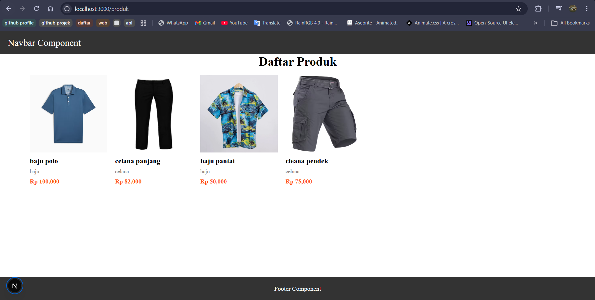
    - /products/server (SSR)
    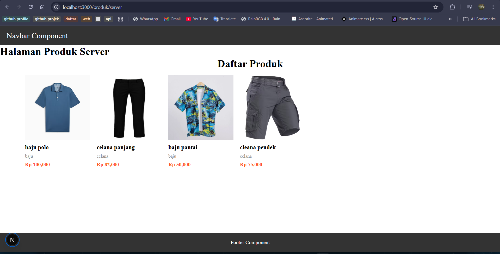

