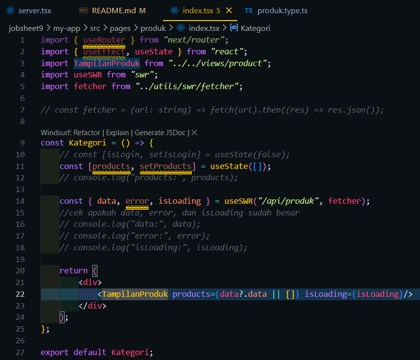
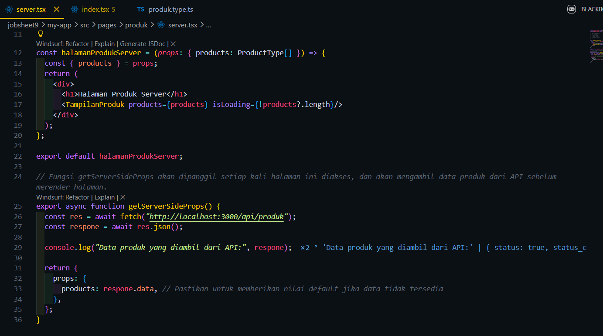
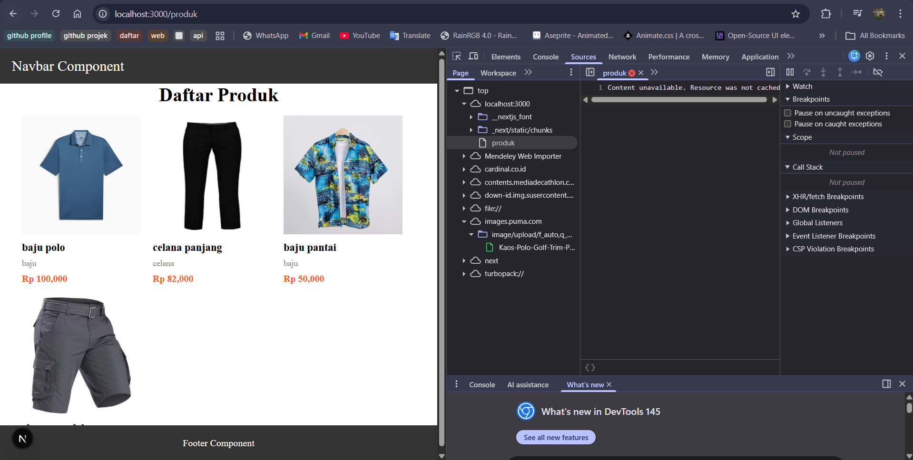
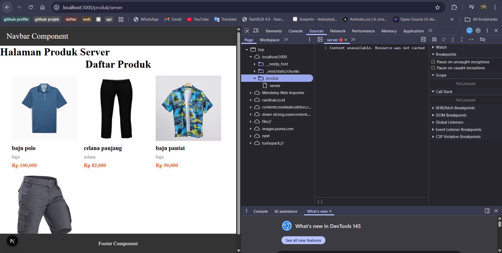

Bagian 1 – Setup Halaman SSR 
 
Hasil : 
  

Bagian 2 – Implementasi getServerSideProps pada server.tsx 
 
Hasil : 
  

Bagian 3 – Refactor Type ( produk type ) 
 
 
Hasil : 
  

Bagian 4 – Uji Perbedaan SSR vs CSR 
Uji 1 – Skeleton 
-> Hasil CSR 
 
muncul sekeleton terlebih dahulu sebelum muncul data 

-> Hasil SSR 
 
tidak muncul sekeleton sebelum muncul data 

Uji 2 – Network Tab 
-> Hasil CSR 
 

-> Hasil SSR 
 

Uji 3 – Response HTML 
-> Hasil CSR 
 
muncul sekeleton terlebih dahulu sebelum muncul data 

-> Hasil SSR 
 
tidak muncul sekeleton sebelum muncul data  

Tugas : 
1. Buat 2 halaman: 
    - /products (CSR) 
     
    - /products/server (SSR) 
     

2. Dokumentasikan: 
    - Screenshot CSR 
     
    Hasil : 
     
    - Screenshot SSR 
     
    Hasil : 
     
    - Perbedaan Network tab 
    -> Hasil CSR 
     
    -> Hasil SSR 
     
    - Perbedaan View Source 
    -> Hasil CSR 
     
    -> Hasil SSR 
     

E. Studi Analisis
1. Mengapa SSR lebih baik untuk SEO?
    -> SSR lebih baik untuk SEO karena halaman sudah dirender di server sebelum dikirim ke browser
2. Kapan sebaiknya menggunakan SSR?
    -> SSR sebaiknya digunakan ketika halaman membutuhkan data yang selalu berubah dan harus ditampilkan langsung saat halaman dibuka
3. Apa kekurangan SSR dibanding CSR?
    -> Kekurangan SSR dibandingkan CSR adalah proses rendering terjadi di server untuk setiap request pengguna. Hal ini dapat meningkatkan beban server dan membuat waktu respon menjadi lebih lambat jika trafik pengguna sangat tinggi.
4. Mengapa skeleton tidak muncul pada SSR?
    -> Skeleton loading tidak muncul pada SSR karena data sudah diambil di server sebelum halaman dirender.