Bagian 1 – Membuat Middleware 
Modifikasi file index.tsx pada folder src/pages/produk 
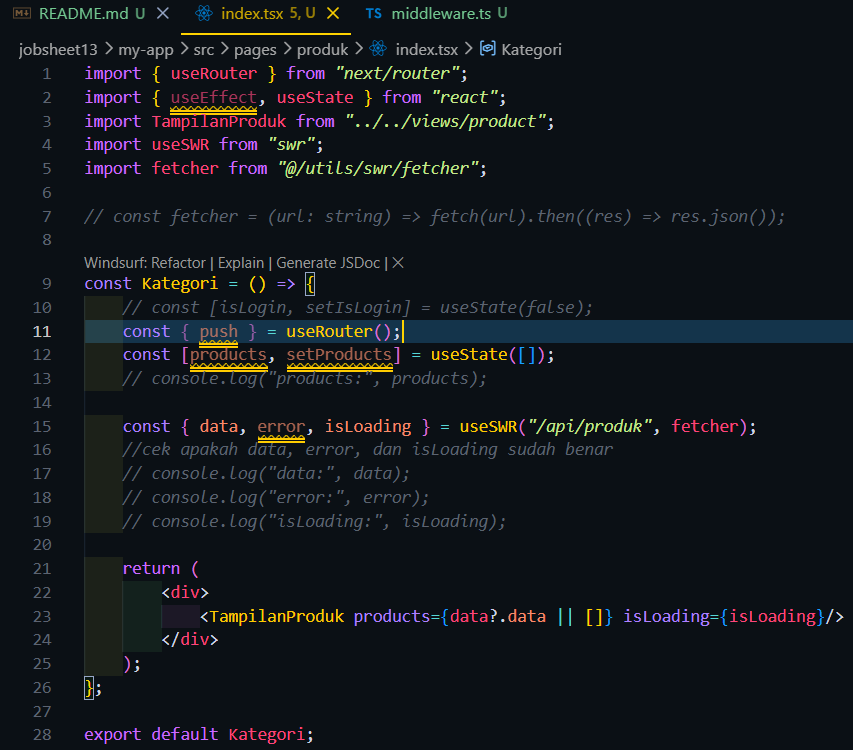 
Buat file: src/middleware.ts 
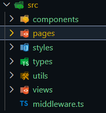  

Bagian 2 – Struktur Dasar Middleware 
Kode dasar middleware 
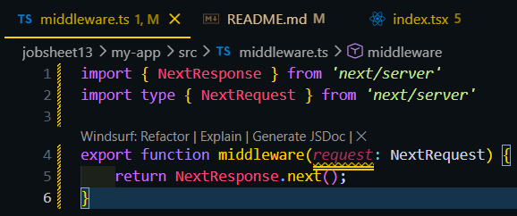 
Masih bisa mengakses halaman produk 
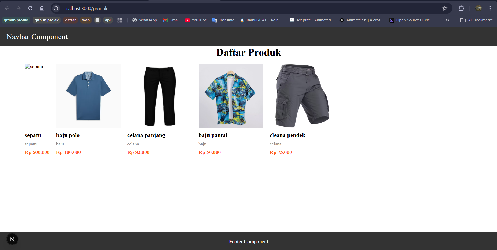  

Bagian 3 – Redirect Sederhana 
kode middleware 
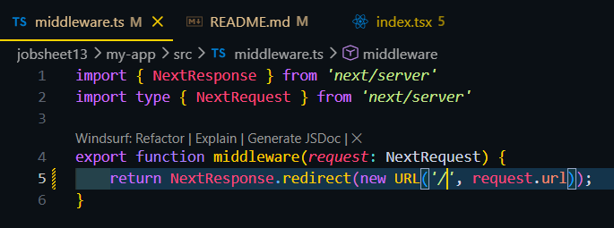 
Saat ke url produk hasilnya akan auto redirect ke home dan error karena terus menerus loading 
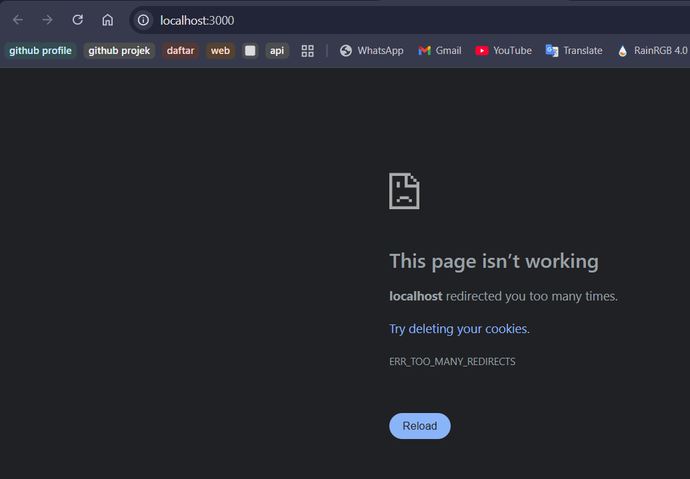  

Bagian 4 – Batasi Route Tertentu 
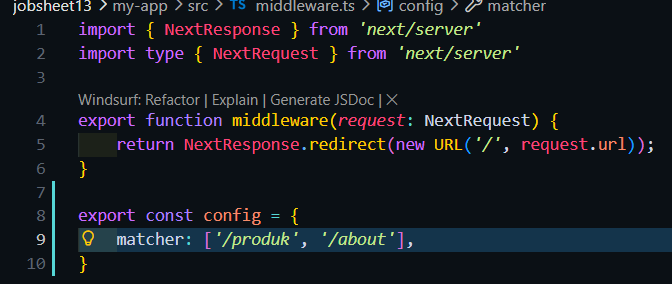 
Hasil : 
  

Bagian 5 – Simulasi Sistem Login 
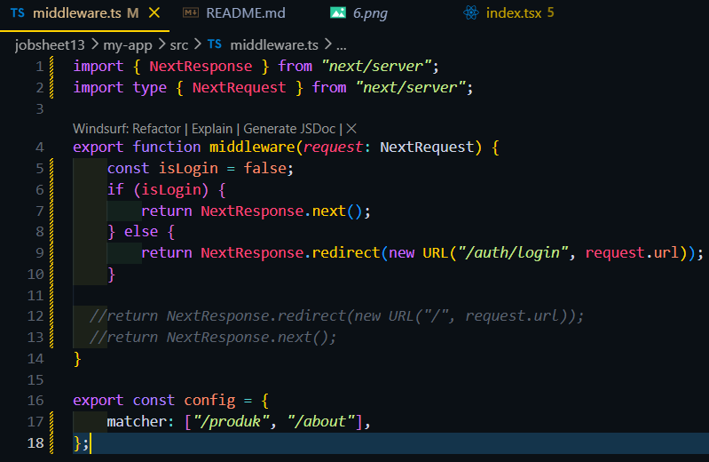 
Hasil : 
  

##### Pengujian
Uji 1 – isLogin = false 
Hasil : 
 

Uji 2 – isLogin = true 
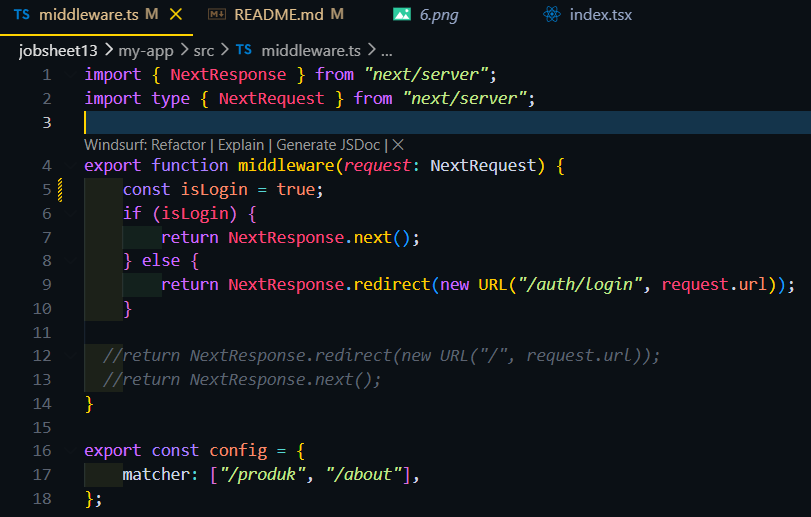 
 

Uji 3 – Tambahkan Multiple Route 
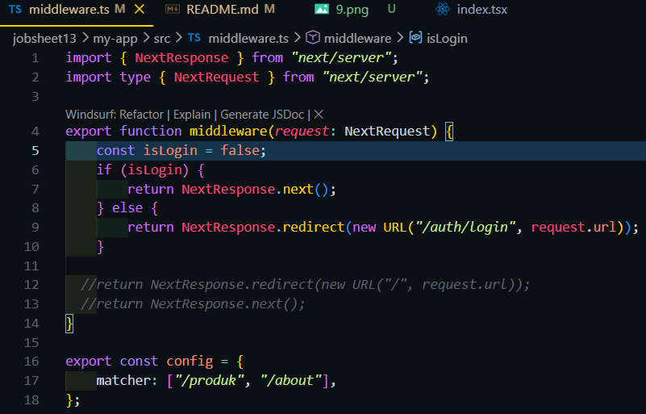 
  

##### Implementasi Middleware Redirect ke /login jika belum login dan Izinkan akses jika login true.
Kode Middleware : 
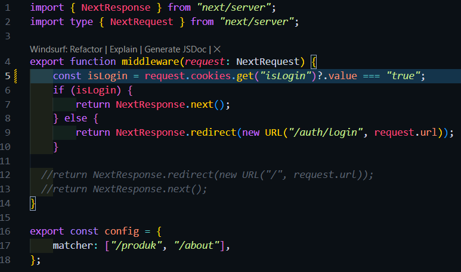 
mengedit file index pada login untuk handler button login dengan menyeting cookies agar bernilai true saat di klik dengan bantuan library js-cookies : 
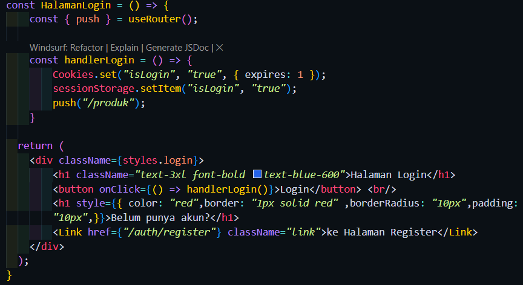 
mengedit index pada produk untuk handler button login agar saat button logout dikklik cookies login hilang dan berpindah ke halaman auth/login 
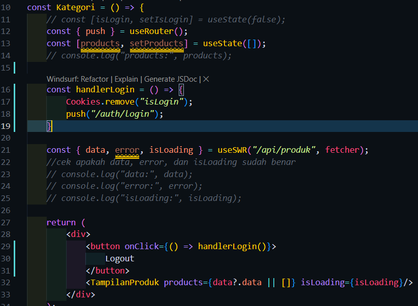 
Hasil Akhir : 
  

Pertanyaan Analisis
1. Mengapa middleware lebih aman dibanding useEffect?
 -> Middleware lebih aman karena bekerja di Sisi Server sebelum halaman dikirim ke browser.
2. Mengapa middleware tidak menimbulkan glitch?
 -> Glitch terjadi pada useEffect karena ada jeda waktu antara proses render pertama dan eksekusi kode cek login. Karena Middleware berjalan sebelum proses rendering dimulai, Next.js sudah menentukan apakah user boleh melihat halaman tersebut atau harus pindah ke halaman lain.
3. Apa risiko jika semua halaman diproteksi tanpa pengecualian?
 -> Jika semua halaman termasuk /auth/login di proteksi maka akan terjadi Infinite Redirect Loop. Middleware akan mengecek apakah user belum login, dan akan mengalihkan ke /auth/login karena belum login. Ini akan terus berulang sampai browser menampilkan error "Too many redirects".
4. Kapan middleware tidak diperlukan?
 -> Halaman yang memang boleh dilihat siapa saja seperti Landing Page, Blog publik, atau Dokumentasi.
5. Apa perbedaan middleware dan API route?
 -> Middleware : mengatur lalu lintas request.
 -> API routes : Menangani logika bisnis seperti CRUD, koneksi database, mengirim email.