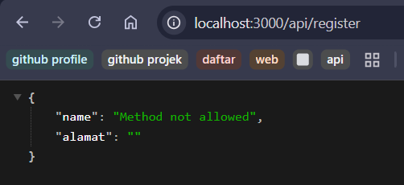
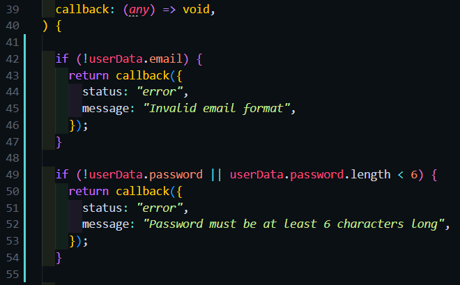
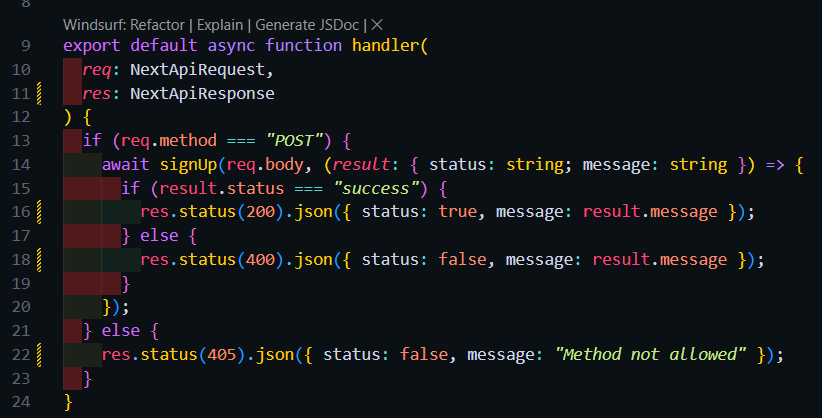
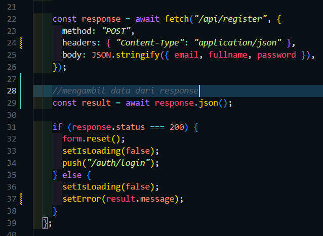
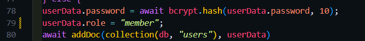

Langkah 1 – Membuat Register View 
edit kode pages/auth/register/index.tsx 
 
Membuat file baru dan isi kode pada file views/auth/register/index.tsx 
 
Menambahkan styling pada view register 
 
Hasil : 
  
Langkah 2 – Membuat API Register 
edit file servicefirebase.ts 
 
membuat file register.ts 
 
edit view register 
 
Hasil : 
  
Langkah 3 – Install bcrypt 
menginstall bcrypt 

modifikasi file servicefirebase.ts 
  

#### melakukan beberapa perubahan agar sistem tidak memproses inputan user saat data yang dimasukkan sama dengan yang ada di database
view register 

perubahan pada pesan error
 

Menampilkan pemberitahuan kepada user saat ada error 
 
 
styling error di file scss 
 
Hasil register: 

Hasil saat melakukan registrasi dengan email yang sama : 
  
Pengujian
Uji 1 – Register Baru 
 
Uji 2 – Email Sudah Ada 
 
Uji 3 – Method GET 
  

Tugas
 

1. menambahkan validasi untuk email dan password minimal 6 karakter 
Mengedit file servicefirebase.ts untuk menambahkan validasi email dan password 
 

2. menampilkan pessan error di ui 
edit file api/register.ts untuk bisa mengirimkan hasil erro dari servicefirebase ke view register 
 
mengambil data dari response dan menampilkan messagenya 
 

3. menambahkan role default "member" 
 

Hasil error : 
 

Hasil berhasil : 
 

H. Pertanyaan Analisis
1. Mengapa password harus di-hash?
 -> agar saat password disimpan di database aman.dengan hasing orang lain tidak bisa melihat apa passwordnya yang mengetahui password hanya orang yang membuat passwordnya
2. Apa perbedaan addDoc dan setDoc?
 -> addDoc pada firestore akan membuatkan ID dokumen secara otomatis yang bersifat acak dan unik.
 -> setDoc adalah kebalikan dari addDoc kegunaannya untuk menambahkan ID dokumen secara manual.
3. Mengapa perlu validasi method POST?
 -> Method POST dirancang untuk mengirim data sensitif dalam request body, bukan di URL, sehingga lebih aman dan terstruktur untuk operasi yang mengubah isi database.
4. Apa risiko jika email tidak dicek unik?
 -> Satu email bisa terdaftar berkali-kali dengan password yang berbeda-beda.
5. Apa fungsi role pada user?
 -> untuk membatasi akses apa yang bisa dan tidak bisa dilakukan oleh user