BAGIAN 1 – Custom Login Page 
Edit kode [...nextauth].ts 
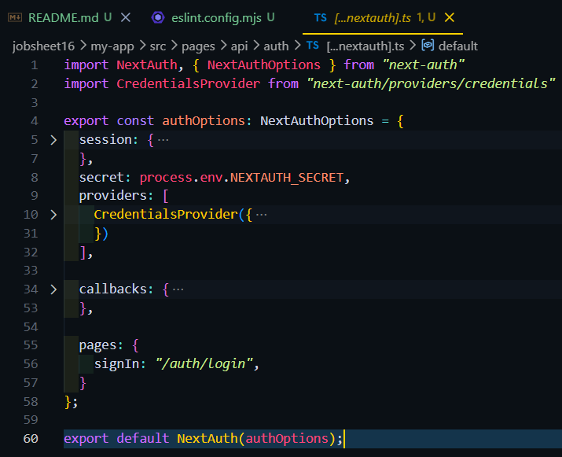 
Hasil : 
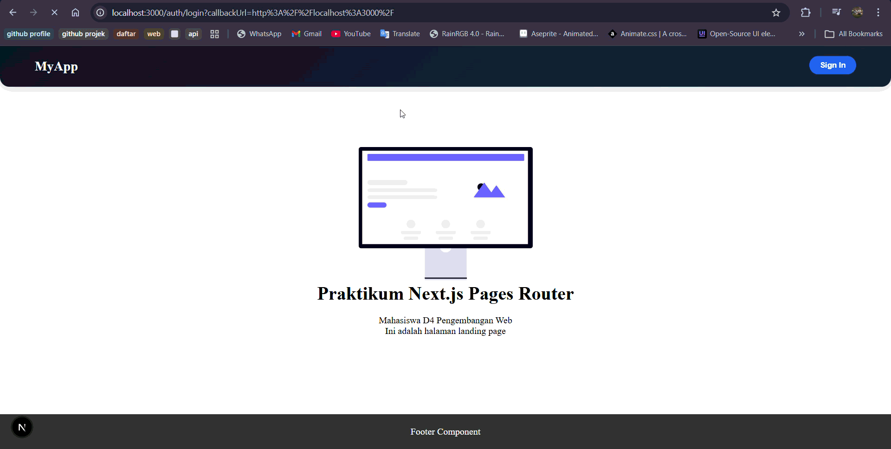  
BAGIAN 2 – Handle Login di Frontend 
copy paste views login dari register 
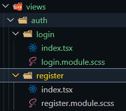 
edit view login 
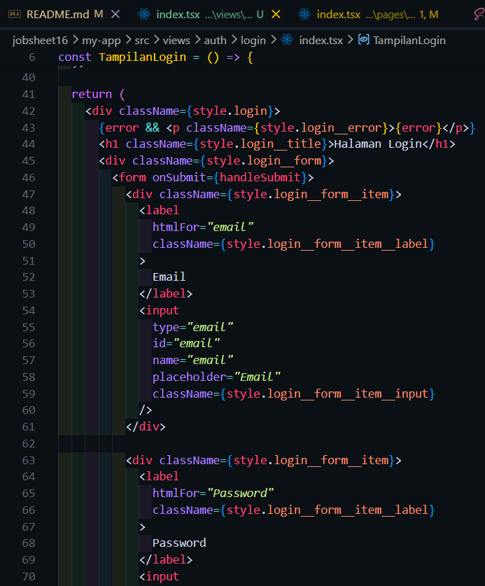 
edit style untuk views login 
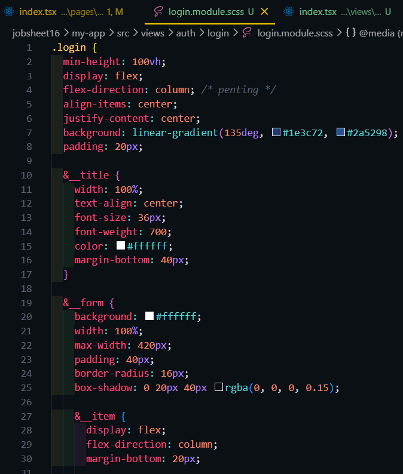 
edit pages/auth/login/index.tsx 
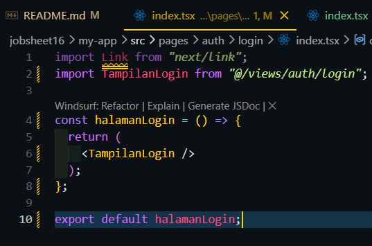 
menambahkan kode di servicefirebase.ts untuk login 
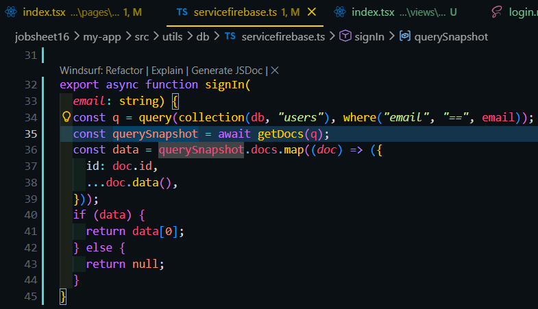 
Hasil : 
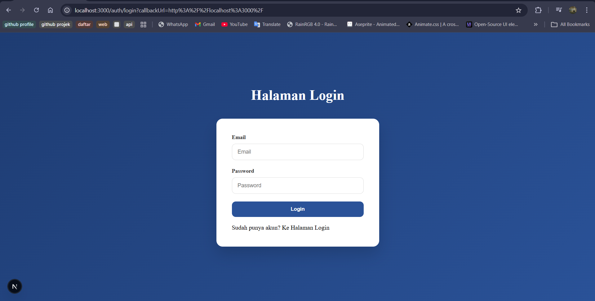  
BAGIAN 3 – Authorize di NextAuth (Database Login) 
mengedit bagian providers pada [...nextauth].ts 
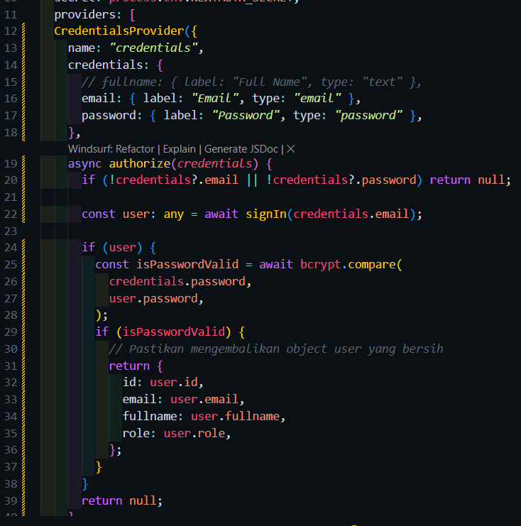  
BAGIAN 4 – Tambahkan Role ke Token 
modifikasi jwt callback pada [...nextauth].ts 
 
Hasil : 
  
BAGIAN 5 – Callback URL Logic 
Edit middleware agar saat user login dapat kembali ke halaman sebelumnya 
  
BAGIAN 6 – Membuat halaman Admin dan authoriz 
Membuat halaman admin 
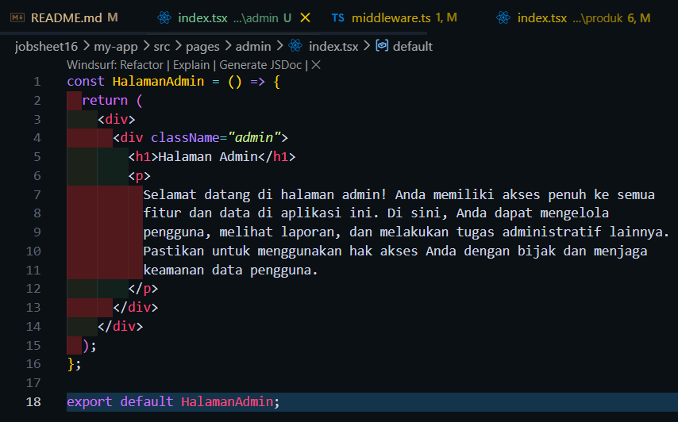 
Modifikasi withAuth.ts untuk pengecekan role admin 
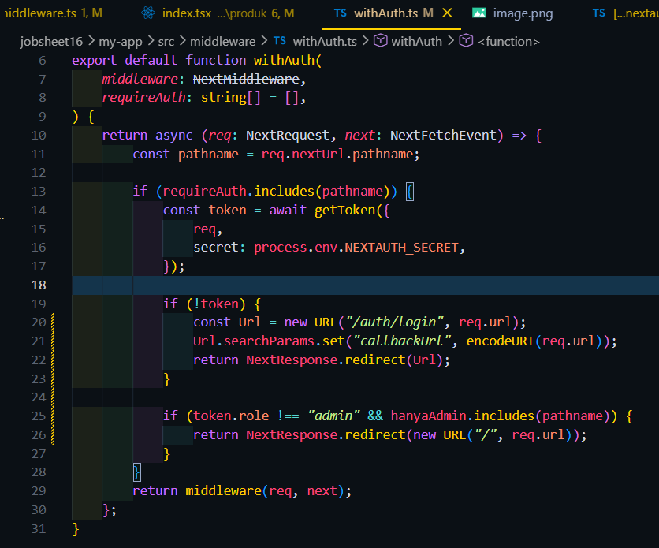 
Hasil jika login role member 
 
Hasil jika login role admin 
  
Pengujian 
Uji 1 – Login Valid 
 
Uji 2 – Password Salah 
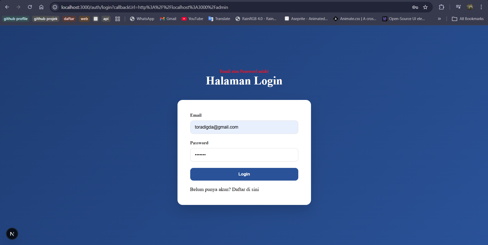 
Uji 3 – Akses Admin sebagai User 
 
Uji 4 – Akses Admin sebagai Admin 

Pertanyaan Analisis
1. Mengapa password harus diverifikasi dengan bcrypt.compare?
 -> password disimpan dalam bentuk hash saat disimpan tidak dalam bentuk teks biasa. bcrypt.compare digunakan untuk mencocokkan input user dengan hash di database
2. Mengapa role disimpan di token?
 -> Dengan menyimpan role di token, middleware bisa langsung membaca data tersebut dari cookie untuk menentukan apakah user boleh mengakses halaman admin atau tidak
3. Apa fungsi callbackUrl?
 -> callbackUrl berfungsi sebagai pengingat alamat asal pengguna.
4. Mengapa middleware penting untuk security?
 -> middleware penting sebagai gerbang utama aplikasi. Jika user tidak punya izin, middleware akan langsung memblokir akses user
5. Apa risiko jika role tidak dicek di middleware?
 -> Jika halaman admin berisi fungsi hapus user atau ubah harga, user biasa bisa merusak  data aplikasi hanya dengan mengetahui alamat URL-nya.