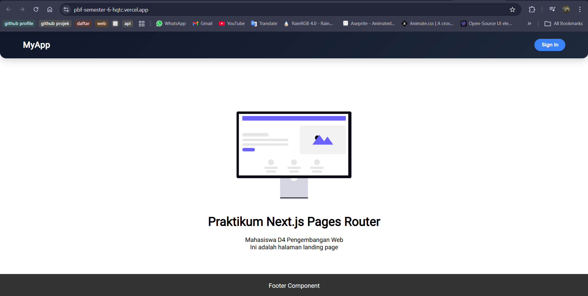
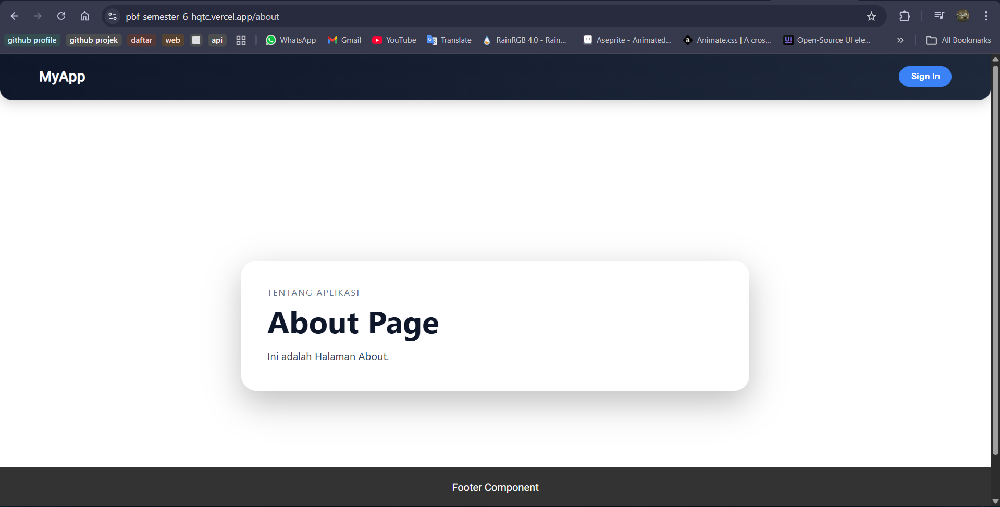
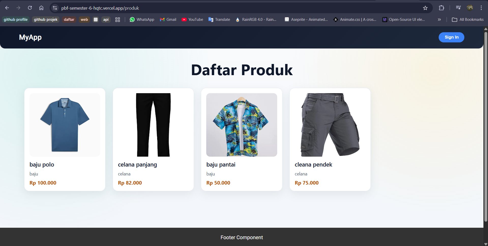
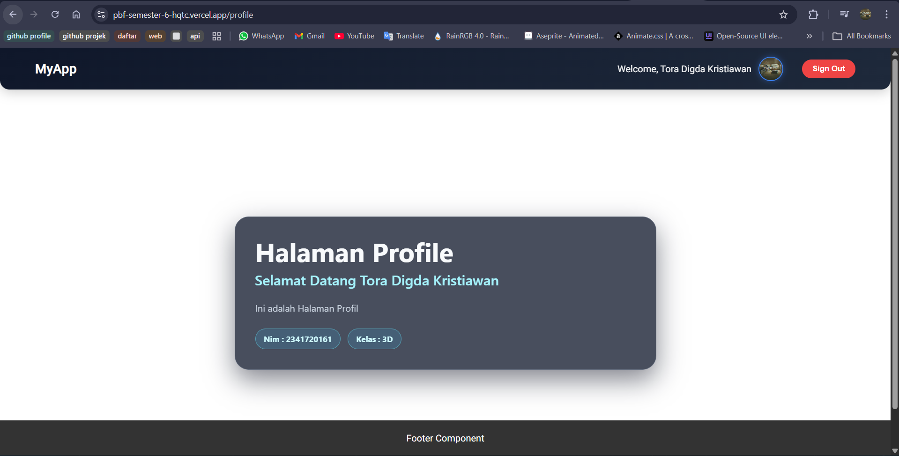

### PRAKTIKUM 1 – Membuat Repository GitHub
 
Saya sudah mengupload setiap jobsheet ke repository mulai jobsheet pertama 

### PRAKTIKUM 2 – Deployment ke Vercel
Login ke Vercel 
 
import Project 
 
 
Memilih root direktori 
  
#### Melakukan konfigurasi untuk mencegah error
Menghapus file static.tsx 
 
Comment pada line yang berhubungan dengan static-site pada file [produk].tsx  
 
Menggunakan SSR untuk produk 
 
Menambahkan variabel baru di .env.local 
 
Mengganti semua hardcode url 
pada file [produk].tsx 
 
pada file server.tsx 
 
commit dan push kode paling baru 
 
melakukkan pengaturan di vercel 
 
Hasil Deploy 
 
 
 

### PRAKTIKUM 3 – Menambahkan Environment Variable di Vercel
Mengimport file env 
 
Mengganti isi variabel NEXT_PUBLIC_API_URL sesuai nama url hasil deploy 
 
Melakukan redeploy 
 
Hasil : 
 

### PRAKTIKUM 4 – Konfigurasi Google OAuth Production
Menambahkan url hasil deploy pada Authorized Origins dan Redirect URI 
 

### PRAKTIKUM 5 – Pengujian Setelah Deployment
Akses / 
 
Akses /about 
 
Akses /product 
 
Akses /profile 
 
Login Google 
 
Login credential biasa 
 

Refleksi & Diskusi 
1. Mengapa localhost tidak boleh digunakan di production? 
-> karena localhost itu berjalan di laptop sendiri bukan di server. Jika kode mengandung localhost:3000, aplikasi yang berjalan di server Vercel akan mencoba mencari data di dalam server Vercel itu sendiri, bukan di laptop sendiri atau di internet. 
2. Mengapa SSG bisa gagal saat build? 
-> SSG membuat halaman HTML statis pada saat proses build. Kegagalan build bisa terjadi karena ada kesalahan tipe data, data tidak lengkap 
3. Apa perbedaan SSR dan SSG saat deployment? 
-> SSG = Waktu render Dilakukan sekali saat build time, Kecepatannya sangat cepat karena server hanya mengirim file HTML yang sudah jadi, Bbeban server sangat rendah, Jika ada data baru maka harus build ulang 
-> SSR = Waktu render selalu dilakukan setiap ada request, kecepatannya lebih lambat karena server harus memproses kode dulu sebelum kirim, Beban server lebih tinggi, Jika ada data baru tidak perlu build ulang karena langsung terupdate 
4. Mengapa perlu redeploy setelah menambahkan environment? 
-> Saat kamu menambahkan variabel baru di Dashboard Vercel, variabel tersebut tersimpan di server tapi belum masuk ke dalam paket aplikasi yang sudah di-deploy 
-> Redeploy diperlukan agar Next.js membaca ulang variabel baru tersebut dan memasukkannya ke dalam kode program yang akan dijalankan. 
5. Apa fungsi redirect URI pada OAuth? 
-> untuk mengarahkan user kealamat yang sudah didaftarkan secara resmi setelah user berhasil login